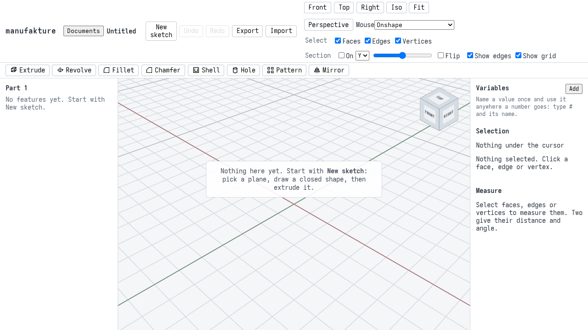
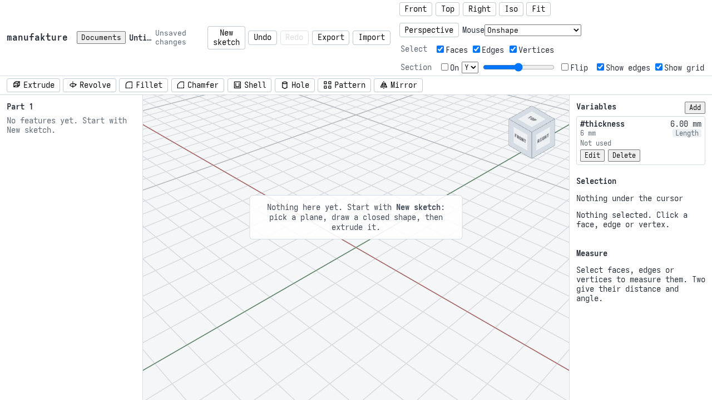
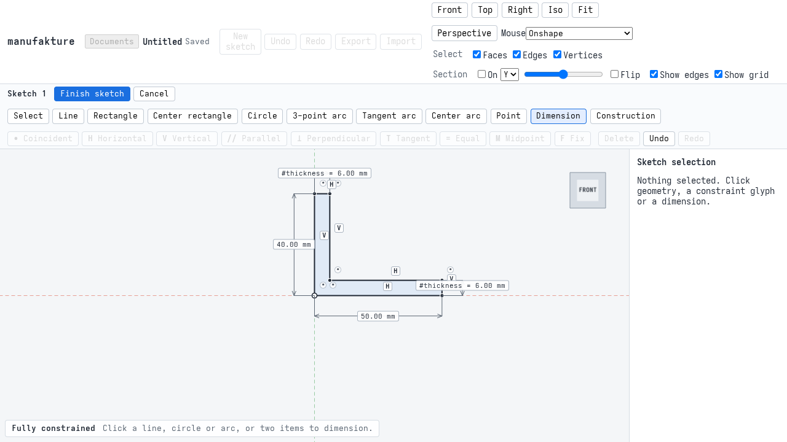
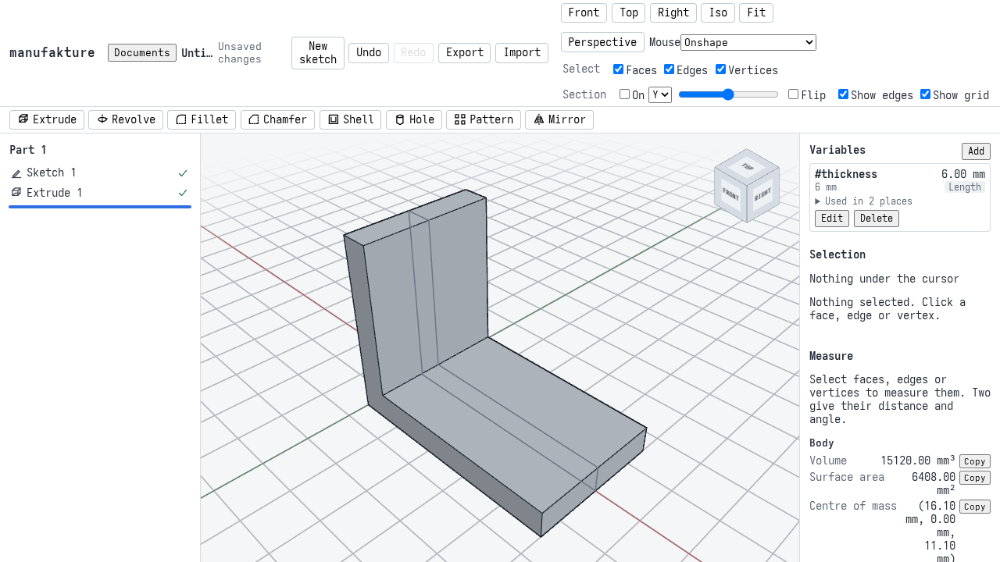
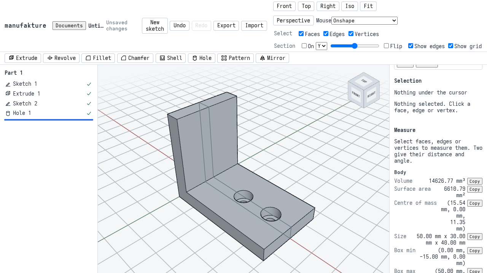
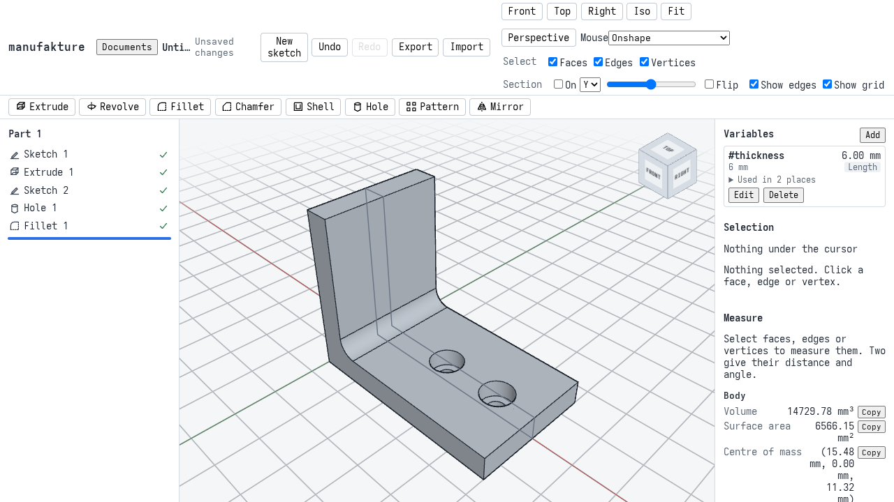
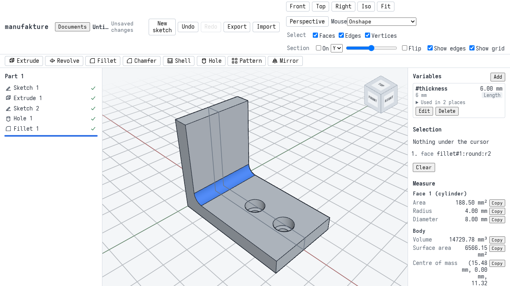

# M1 acceptance: a printable bracket

Milestone 1 is "make a printable bracket": a user who has never seen manufakture starts a document, draws and dimensions a profile, turns it into a part with holes and a fillet, exports it for a slicer, and can come back later and change it. This page walks through that bracket and says which automated checks prove each step. Every step below is done through the UI by `apps/web/e2e/m1-bracket.spec.ts`; the screenshots are taken by that run.

## The bracket

An L-shaped angle bracket: a foot 50 mm long and an upright 40 mm high, both `#thickness` thick (6 mm), 30 mm wide. Two M4 counterbored holes go through the foot, 25 mm and 40 mm from the back, and the inside corner is rounded with a 4 mm fillet.

Its volume, worked out by hand, with t the thickness:

- the L extruded: 30 x (50 t + (40 - t) t), 15120 mm³ at t = 6;
- less two counterbored holes, each pi x (4² x 4.4 + 2.25² x (t - 4.4)) (M4 normal fit: a 4.5 mm hole; counterbore 8 mm across and 4.4 mm deep): 14626.77 mm³;
- plus the fillet, which fills the corner square less a quarter disc along the width, 30 x 4² x (1 - pi/4): **14729.78 mm³** at t = 6, and **19226.16 mm³** at t = 8.

It has 15 faces: 6 sides and 2 ends from the extrusion, 3 per hole (counterbore wall, counterbore floor, hole wall) and the round.

## Walkthrough

1. **A new document.** The kernel loads behind a progress screen, then the empty part suggests a sketch.

   

2. **The variable.** In the **Variables** panel, **Add** `thickness` with the value `6` (it becomes `6 mm`).

   

3. **The profile.** **New sketch**, **Front (XZ)**. With **Line**, click from the origin round the L and back to the origin: the lines chain, the first point is held on the origin and every line is kept horizontal or vertical. With **Dimension**, give the bottom 50, the back 40, and the end of the foot and the top of the upright `#thickness` (type `#` to pick it from the list). The status bar says **Fully constrained**. **Finish sketch**.

   

4. **Extrude.** Select Sketch 1 in the tree, **Extrude**, End **Symmetric**, Depth `30`, OK.

   

5. **Holes.** Click the top of the foot, **New sketch**, **Selected face**. With **Point**, click two points on the sketch's x axis at 25 and 40. **Finish sketch**. Select Sketch 2, **Hole**: both points are ticked; Size **M4**, Fit **Normal**, Head **Counterbore** (8 mm, 4.4 mm deep, from the standard), End **Through all**, OK.

   

6. **Fillet.** **Fillet**, click the inside corner edge in the view, Radius `4`, OK. Every feature has a tick.

   

   Clicking the round shows it in **Measure**: a cylinder of radius 4.00 mm; with nothing selected, the body is 14729.78 mm³.

   

7. **Export.** **Export**, **STL** and **3MF** (Mesh tolerance Normal), and **STEP**. See [Importing and exporting](user/import-export.md) for checking the 3MF in OrcaSlicer or Bambu Studio.

8. **Reload.** The document was saved as you went; reloading the page opens it again and rebuilds the same part.

9. **Change the thickness.** **Edit** `#thickness` to `8`. The walls thicken, the counterbores still start on the (now higher) top of the foot, and the fillet stays in the corner.

   

## What the checks prove

| Check                | Where                                       | What it asserts                                                                                                                                                                                                                                                                                                                                                                                                                                                  |
| -------------------- | ------------------------------------------- | ---------------------------------------------------------------------------------------------------------------------------------------------------------------------------------------------------------------------------------------------------------------------------------------------------------------------------------------------------------------------------------------------------------------------------------------------------------------- |
| Walkthrough          | `apps/web/e2e/m1-bracket.spec.ts` (e2e job) | Each step above through the UI. After each feature: its status, the exact volume (to 0.001 mm³ of the hand-computed value) and the face count (8, 14, 15). The hole sketch is stored on `extrude#1:side:e3` and the fillet on the edge `extrude#1:side:e3\|extrude#1:side:e4`, each resolved `exact` and not fragile, with no warnings. The round measures 4 mm, borders exactly the two walls and both ends, and there are two hole walls and two counterbores. |
| Exports              | same                                        | STL (binary) and 3MF are watertight (every edge shared by two consistently wound triangles), the 3MF is in millimetres with one object named after the part, both within 0.2% of the exact volume (the facets of the curved faces) and within 0.01 mm of the bounding box, 0 to 50 by -15 to 15 by 0 to 40. The STEP is ISO 10303-21 with one product. The files and the expected values go to `apps/web/test-results/m1-bracket/`.                              |
| Reload               | same                                        | The document read back from browser storage is identical; the part regenerates to the same face and edge counts and the same volume (to 1e-6 mm³).                                                                                                                                                                                                                                                                                                               |
| Naming regression    | same                                        | With `#thickness` at 8, every feature is rebuilt (none from the cache), every reference still resolves `exact` on the same faces, the volume is 19226.16 mm³, 15 faces, the same round (same name, radius 4, same four neighbours), two holes, and both counterbore floors at z = 8 - 4.4. One undo brings back the 6 mm bracket and its volume.                                                                                                                 |
| Viewport screenshots | `apps/web/e2e/m1-views.spec.ts` (e2e job)   | The bracket in the iso, top and front views against baselines in `apps/web/e2e/__screenshots__/`.                                                                                                                                                                                                                                                                                                                                                                |
| Performance budgets  | `apps/web/e2e/m1-budget.spec.ts` (e2e job)  | Kernel start-up (first visit and reload) and bracket regeneration (whole, and after `#thickness` changes), written to the e2e job's summary; fails only far past normal.                                                                                                                                                                                                                                                                                         |
| Kernel goldens       | `kernel-goldens` job                        | `vitest run --project kernel-goldens`: volume, face count and bounding box per feature (`packages/kernel/src/features.test.ts`), exact measures (`measure.test.ts`), STEP round trips (`exchange.test.ts`), and the bracket at the kernel for 6 mm and 8 mm walls (`packages/kernel/test/bracket.test.ts`).                                                                                                                                                      |
| Interop              | `interop` job (optional)                    | FreeCAD reopens the bracket's STEP as exported by the app (valid, one solid, 15 faces, the same volume to 1e-6, the same bounding box) and PrusaSlicer slices its 3MF and STL up to the full 40 mm. Each check skips itself when FreeCAD, PrusaSlicer or the bracket export is missing; the job never blocks a merge. OrcaSlicer's CLI takes other options and is checked by hand (see [Importing and exporting](user/import-export.md)).                        |

## Screenshots and SwiftShader

The e2e browser is headless Chromium drawing WebGL with SwiftShader, a software renderer on the CPU. The same Chromium build draws the same pixels on any x86-64 machine in practice, but small rasterization differences between CPUs are possible, so `toHaveScreenshot` allows a colour distance of 0.2 per pixel and 1% of the pixels to differ: noise passes, a changed model, view or shading does not. The view cube is masked, since its labels are text in whatever font the machine has. Baselines carry no platform suffix.

CI only compares: it never writes a baseline (`updateSnapshots: 'none'` under `CI`), so a missing or changed image fails the job. After an intended change to how the viewport draws, refresh them locally and commit the images:

```sh
pnpm --filter @manufakture/web e2e m1-views --update-snapshots
```

The walkthrough screenshots on this page are refreshed with `M1_DOCS=1 pnpm --filter @manufakture/web e2e m1-bracket`.

## Performance

Measured on a desktop PC (a 6-core x86-64 CPU from 2022, 64 GB of memory, Linux), headless Chromium, against `vite preview` on the same machine:

| Measure                                               | Time   | Budget |
| ----------------------------------------------------- | ------ | ------ |
| Kernel ready and first model, empty cache             | 0.59 s | 30 s   |
| Kernel ready and the bracket shown, after a reload    | 0.62 s | 30 s   |
| Regenerating the whole bracket (in the worker)        | 156 ms | 5 s    |
| Regenerating after `#thickness` changes (worker)      | 37 ms  | 5 s    |
| From saving `#thickness` to the new part in the model | 129 ms | 10 s   |

These numbers are not representative of a user's experience. The kernel (42 MB of wasm) comes from localhost, so its download costs next to nothing; over a real connection a first visit is dominated by it. The preview server sends no caching headers, so the reload fetches the kernel again, where real hosting serves it immutable and cached ([ADR 0002](adr/0002-kernel-build-and-loading.md)). SwiftShader makes everything drawn much slower than on a GPU (see `apps/web/e2e/perf.spec.ts` for frame times). CI runners are slower still; the budgets are there to catch large regressions, not to track small ones. Each CI run writes its own numbers to the e2e job's summary.
