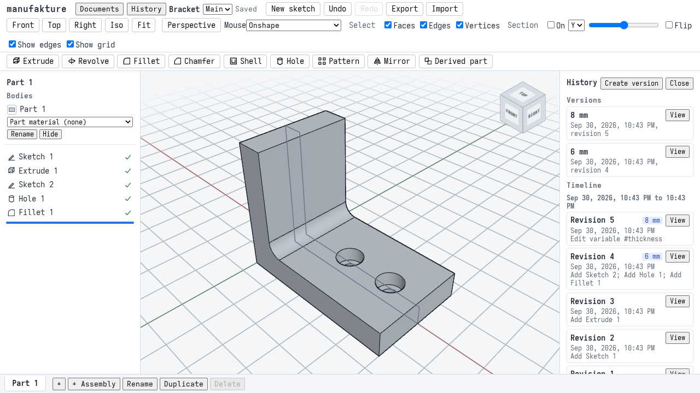
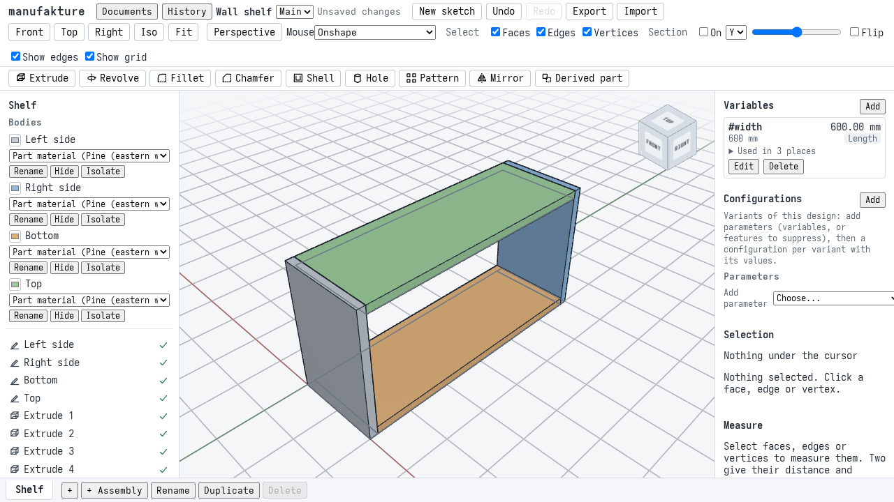
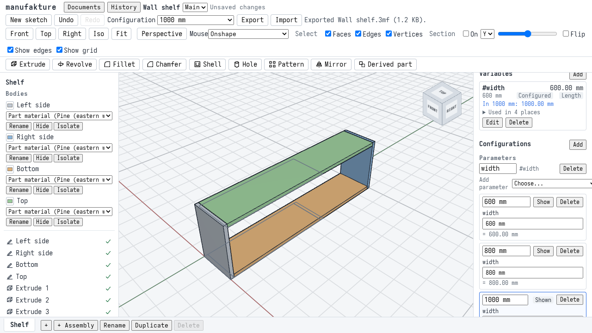
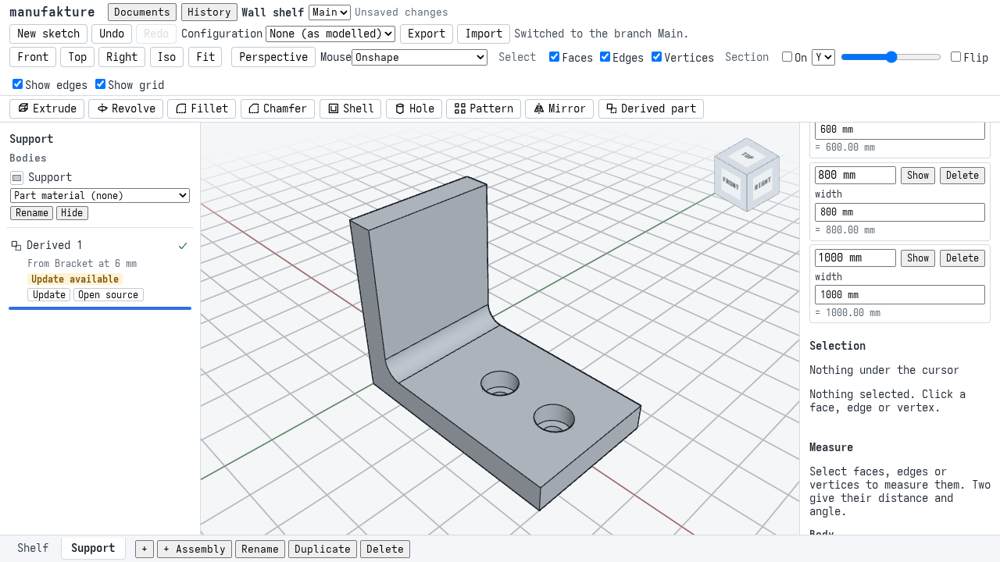
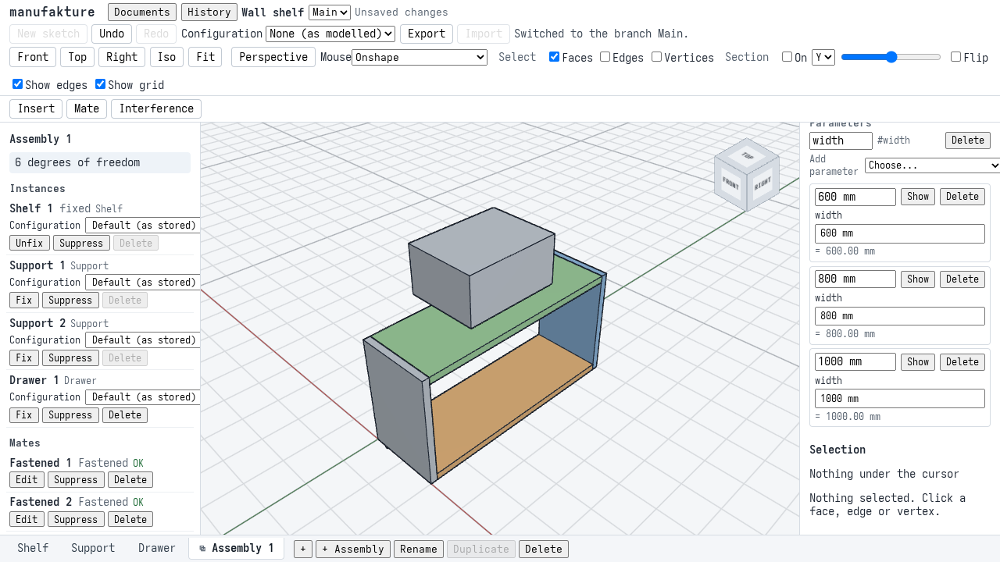
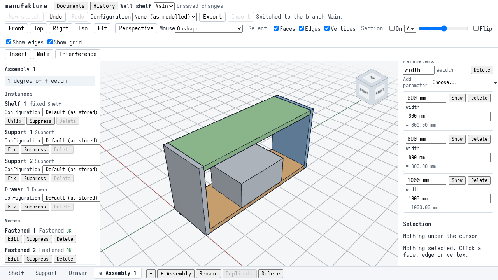
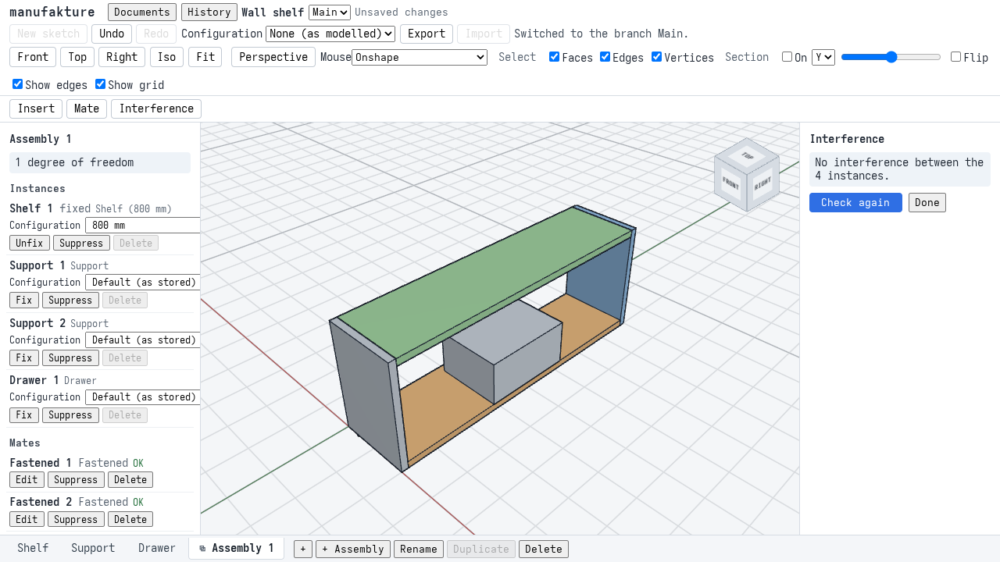
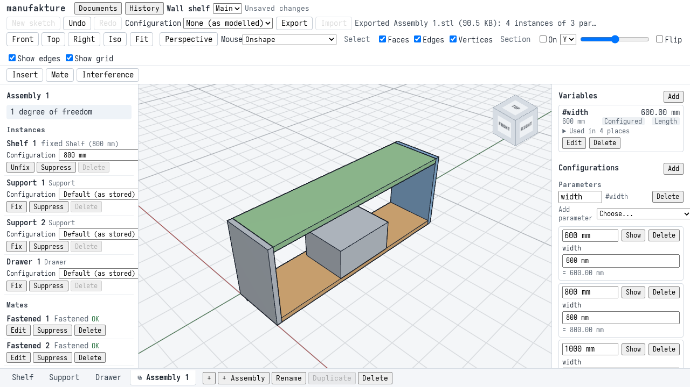
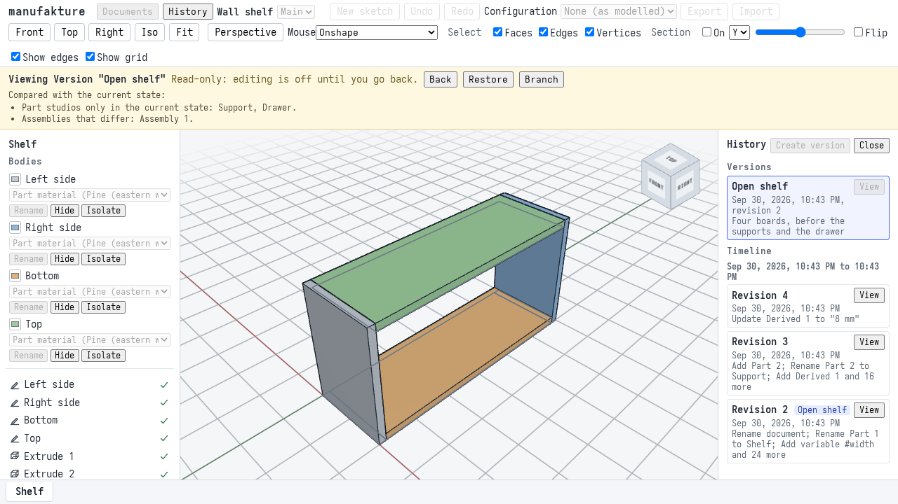

# M2 acceptance: a wall shelf with a derived bracket, assembled

Milestone 2 is "parts made of several bodies, kept in versions, made in variants and put together": a part studio holds several bodies with their own names and materials, a document holds several part studios, its history keeps named versions and branches, a configuration table makes variants, a part of another document can be derived at a version and updated, and an assembly mates instances of parts, drags them, checks them for interference and exports them. This page walks through one model that uses all of it, and says which automated checks prove each step. The walkthrough is `apps/web/e2e/m2-shelf.spec.ts`; the screenshots are taken by that run.

## The model

A small wall shelf of pine, hung on two supports, with a drawer in it. The wall is the plane x = 0: the shelf's depth runs along +X away from the wall, its width W along +Y and its height along +Z.

**The shelf** is one part studio of four bodies, each a rectangle on a horizontal plane extruded upwards, with W = `#width`:

| Body       | Extent (mm)                        | Volume (mm³)            | At W = 600 | Pine, 400 kg/m³ |
| ---------- | ---------------------------------- | ----------------------- | ---------- | --------------- |
| Left side  | x 0..200, y 0..18, z 0..300        | 200 x 18 x 300          | 1080000    | 432.00 g        |
| Right side | x 0..200, y W - 18..W, z 0..300    | 200 x 18 x 300          | 1080000    | 432.00 g        |
| Bottom     | x 0..200, y 18..W - 18, z 0..18    | 200 x (W - 36) x 18     | 2030400    | 812.16 g        |
| Top        | x 0..200, y 18..W - 18, z 282..300 | 200 x (W - 36) x 18     | 2030400    | 812.16 g        |
| **Shelf**  | x 0..200, y 0..W, z 0..300         | 2160000 + 7200 (W - 36) | 6220800    | 2.488 kg        |

The configuration table sets W to 600, 800 and 1000 mm: the shelf is then 6220800, 7660800 and 9100800 mm³. Only the right side and the boards move; the sides' volumes do not depend on W, so the walkthrough also checks where each body lies across the width.

**The support** is the M1 bracket ([M1 acceptance](m1-acceptance.md)), derived from its own document at a named version: 14729.78 mm³ at the version "6 mm" and 19226.16 mm³ at "8 mm".

**The drawer** is a box of 180 x 240 x 120 mm (along X, Y and Z): 5184000 mm³.

**The assembly** places them with mates on named faces, as the Mate dialog makes them:

- Each support: the back of its upright (`derived#1:from/extrude#1:side:e6`, centroid (0, 0, 20) in the bracket) fastened to the back of a side (centroid (0, 9, 150), or (0, W - 9, 150)). Both connectors face -X, so the support starts the same way up as the shelf; the offset turns it half a turn about the connector's z (the wall's normal), so the foot is on top and the upright hangs down, and moves it 170 mm down and 24 mm across (-24 for the right side): the foot's underside meets the shelf's bottom at z = 0, and the support lies at y 18..48 (or W - 48..W - 18), under the bottom board, against the side. So the support sits at (0, 33, 0) and (0, W - 33, 0), turned half a turn about X. The bracket's back face and underside do not depend on its thickness, so updating it to 8 mm moves nothing.
- The drawer: its front face (centroid (180, 120, 60) in the drawer) on a slider on the bottom board's front face (centroid (200, W/2, 9)). The slider's axis is the face normal, +X; the offset moves it 69 mm up (half the drawer's height plus half a board), so the drawer stands on the bottom board, centred in the width at any W. It may slide from flush (0) to 150 mm out: the drawer is at (20 + s, W/2 - 120, 18) for a slide of s.

Every instance is then held but the drawer's slide: 1 degree of freedom. Nothing overlaps: the supports and the drawer only touch the shelf.

## Walkthrough

1. **The bracket document.** The M1 bracket built through the UI (variable, sketch, extrude, holes, fillet), named as version **6 mm** in the **History** panel; `#thickness` made 8 and named **8 mm**.

   

2. **The shelf.** A new document, "Wall shelf"; its part studio tab renamed **Shelf**. **Add** the variable `width`, 600. The four profiles are drawn (with commands: the sketcher is M1's), and each is extruded with **Extrude**, Result **New body**: the sides 300 mm, the boards 18 mm. The **Bodies** list holds four bodies; each is renamed (Left side, Right side, Bottom, Top), and **Part material** in **Measure** is **Pine (eastern white)**, so each body shows its mass. **Export**, **3MF**: four objects, named after the bodies.

   

3. **Widths as configurations.** In **Configurations**, add `#width` as a parameter and three rows, **600 mm**, **800 mm** and **1000 mm**. Choosing a row in the header's **Configuration** list rebuilds the shelf at that width. **Export**, **Every configuration**, **3MF**: three files, one per row.

   

4. **A version and a branch.** **History**, **Create version** "Open shelf" ("Four boards, before the supports and the drawer"). **View** it, **Branch**, "Wide": on the branch, `#width` becomes 900. Back on **Main** in the branch list, the shelf is 600 mm again, and the rest of the work is done there.

5. **The support.** **+** adds a part studio, renamed **Support**. **Derived part**: the document Bracket, **Use version 6 mm**, its part. The support is the bracket at 6 mm; the tree says **From Bracket at 6 mm** and, since "8 mm" is newer, **Update available**.

   

6. **The drawer.** A third part studio, **Drawer**: its profile extruded 120 mm.

7. **The assembly.** **+ Assembly**; **Insert** the shelf (it is fixed), the support twice and the drawer, and set the supports and the drawer aside so each face can be clicked (18 degrees of freedom). **Mate**, **Fastened**: click the back of the left side, then the back of a support; **Offset** X 24, Y 170, **Angle about z** 180; **OK**. The same for the right side with X -24.

   

   **Mate**, **Slider**: click the bottom board's front face, then the drawer's front face; **Offset** Y 69, **Limits** 0 and 150; **OK**. One degree of freedom is left. Drag the drawer out: it slides along X only and stops at 150 mm. Drag it back in: it stops flush.

   

   **Interference**, **Check**: no interference between the 4 instances. In the tree, set the shelf's **Configuration** to **800 mm**: the right support and the drawer follow, and **Check again** still finds nothing.

   

8. **Export.** **Export** in the assembly tab: **STEP**, **3MF** and **STL** of the whole assembly. See [Exporting an assembly](user/import-export.md#exporting-an-assembly).

9. **Update the support.** In the Support tab, **Update**, **Use version 8 mm**. Back in the assembly, both supports are the 8 mm bracket, in the same place, the mates hold and nothing overlaps.

   

10. **Reload, and restore a version.** Reloading opens the document again, on the assembly tab, as it was. **History**, **View** "Open shelf" shows the shelf as it was before the supports and the drawer, with what differs; **Restore** makes the document that again (one part studio, no assembly), and **Undo** brings everything back.

    

## What the checks prove

The walkthrough's chapters share one browser page and its storage, so they run in order and a failing chapter skips the rest. Each M2 feature goes through its UI; the profiles are sketched with commands (the sketcher has its own specs, and M1's walkthrough draws one by hand), and so are the poses that set parts aside before they are mated.

| Check                         | Where                                      | What it asserts                                                                                                                                                                                                                                                                                                                                                                                                                                                                                                                                                                           |
| ----------------------------- | ------------------------------------------ | ----------------------------------------------------------------------------------------------------------------------------------------------------------------------------------------------------------------------------------------------------------------------------------------------------------------------------------------------------------------------------------------------------------------------------------------------------------------------------------------------------------------------------------------------------------------------------------------- |
| Named versions                | `m2-shelf.spec.ts` 1                       | The bracket at 6 mm and at 8 mm (its volume to 0.001 mm³) each named from the History panel, both listed.                                                                                                                                                                                                                                                                                                                                                                                                                                                                                 |
| Multi-body part               | `m2-shelf.spec.ts` 2                       | Four extrusions as **New body** give four bodies (`extrude#1` to `#4`, one solid each, no warnings), each exactly its own volume (to 1e-6 mm³) and across the width where it belongs. Renamed in the Bodies list and of pine from the part material: the stored `bodies` and `material`, each body's heading in Measure and its mass (432.00 g, 812.16 g). The 3MF has four watertight objects named after the bodies, each its volume (to 1e-6) and its bounding box (to 0.001 mm).                                                                                                      |
| Configurations                | `m2-shelf.spec.ts` 3                       | `#width` as a parameter and three rows through the panel; the switcher lists them; each row rebuilds every body to the exact volumes and spans of its width. **Every configuration** exports three 3MF files named after the rows, each of the four named bodies, the shelf's total volume, and a bounding box W wide.                                                                                                                                                                                                                                                                    |
| Branches                      | `m2-shelf.spec.ts` 4                       | A version "Open shelf"; a branch "Wide" made from it in the viewer, 900 mm there (exact volumes and spans); back on Main, 600 mm; both branches listed.                                                                                                                                                                                                                                                                                                                                                                                                                                   |
| Several part studios, derived | `m2-shelf.spec.ts` 5, 6                    | Two more part studios, renamed. The derived part at "6 mm" regenerates (`derived#1` ok, its body `derived#1:from/extrude#1`) to the bracket's exact volume; the tree names its source and offers the update. The drawer is its exact volume.                                                                                                                                                                                                                                                                                                                                              |
| Mates, drag, interference     | `m2-shelf.spec.ts` 7                       | Insert through the panel, the first instance fixed, 18 DOF. Connectors picked in the view are on the named faces above. Each support lands where hand computation puts it (three of its points to 0.001 mm), the drawer slides in square, centred and on the board, 40 mm out where it was set aside; DOF 6 then 1, every mate OK. Dragging moves the drawer along X only, to its 150 mm limit and back to 0 (each an undo step). The interference check finds nothing.                                                                                                                   |
| Configured instance           | same                                       | The shelf instance in "800 mm": its source is the row's own regen, the right support moves to y = 767 and the drawer to y = 280, every mate still OK, DOF 1, and still no interference.                                                                                                                                                                                                                                                                                                                                                                                                   |
| Assembly export               | `m2-shelf.spec.ts` 8                       | STEP: ISO 10303-21, products `Assembly 1`, `Shelf (800 mm)` and its four bodies, `Support`, `Drawer`; occurrences `Shelf 1`, its four bodies by name, `Support 1`, `Support 2`, `Drawer 1`. 3MF: an object per body and per part, a build item per instance (the support's object twice); built, each mesh's bounding box to 0.001 mm and the total volume within 0.2% of the supports' volume of the exact 12874259.56 mm³ (the supports' holes and round are facets). STL: the same volume and the box 0..200 by 0..800 by -40..300. The files go to `apps/web/test-results/m2-shelf/`. |
| Derived update                | `m2-shelf.spec.ts` 9                       | **Update** to "8 mm" is one undo step and regenerates to the 8 mm bracket's exact volume; in the assembly every mate holds, the supports and the drawer are where they were, and there is no interference.                                                                                                                                                                                                                                                                                                                                                                                |
| Reload and restore            | `m2-shelf.spec.ts` 10                      | After a reload the document read back is identical, the assembly tab is open, the mates, poses and the instance's row are back. Restoring "Open shelf" (one undo step) leaves one part studio and no assembly, the shelf at 600 mm; undoing it gives back exactly the document before.                                                                                                                                                                                                                                                                                                    |
| Fixed defects                 | `m2-shelf.spec.ts` 4a, 7a, 8a              | The header fits a 1280 px window with no sideways scroll; an assembly tab draws no part studio's sketches; every occurrence in the assembly STEP is named, the bodies inside the shelf too. See below.                                                                                                                                                                                                                                                                                                                                                                                    |
| Viewport screenshots          | `apps/web/e2e/m2-views.spec.ts` (e2e job)  | The assembled shelf at 600 mm in the iso, front and right views against baselines in `apps/web/e2e/__screenshots__/m2-views.spec.ts/`. It is built quickly (`buildWallShelf` in `apps/web/e2e/m2-fixtures.ts`: the same document, mostly made with commands) and checked solved where the walkthrough's mates put it.                                                                                                                                                                                                                                                                     |
| Performance budgets           | `apps/web/e2e/m2-budget.spec.ts` (e2e job) | Reload, regeneration (whole, after `#width` changes, after a pose changes) and a drag step, written to the e2e job's summary; fails only far past normal. The `#width` edits rebuild exactly the profiles and bodies that read it and leave the left side cached; the drag only slides.                                                                                                                                                                                                                                                                                                   |
| Solver benchmark              | `packages/assembly/src/benchmark.test.ts`  | The mate solver alone, in Node (ADR 0008's budgets; see below).                                                                                                                                                                                                                                                                                                                                                                                                                                                                                                                           |
| Per-feature specs             | `apps/web/e2e/*.spec.ts` (e2e job)         | Each M2 feature in more depth: `bodies`, `part-studios`, `history`, `branches`, `configurations`, `derived`, `assembly`, `assembly-export`, `configured-instances`.                                                                                                                                                                                                                                                                                                                                                                                                                       |

## Defects found and fixed

The walkthrough found three defects, fixed in M2. Each has a chapter that asserts the right behaviour, so they stay fixed:

- **4a. The header was wider than a 1280 px window.** With the Configuration list and the branch switcher in the header, a status message (such as "Switched to the branch Main.", which stays until the next one) pushed the view toolbar (standard views, selection filter, section) past the right edge: the page was 1600 px or more wide and scrolled sideways, and so did a drag that left the window. The header row now wraps, so the view toolbar moves to a second row when it does not fit, and the status message shrinks with an ellipsis.
- **7a. A part studio's sketches were drawn over the assembly.** The part studio open before the assembly tab kept its committed sketches on screen in the assembly (here the drawer's 180 x 240 mm rectangle at the origin, through the shelf's bottom board), belonging to no instance. An assembly tab now draws no part studio's sketches (`App.tsx`; `App.test.tsx` checks it too).
- **8a. A multi-body part's bodies were unnamed occurrences in the assembly STEP.** `writeStepAssembly` (`packages/kernel/src/exchange.ts`) named each instance's occurrence and each body's product, but not the occurrences of the bodies inside a several-body part's product, so they carried OCCT's label entries (`=>[0:1:1:2]`) instead of "Left side". It names them now; `exchange.test.ts` reads them back.

## Screenshots and SwiftShader

As for M1 ([Screenshots and SwiftShader](m1-acceptance.md#screenshots-and-swiftshader)): the viewport baselines are drawn by SwiftShader, compared with a tolerance, the view cube is masked, and CI only compares. The canvas is pinned to 760 x 540 px at the top left of the page for the comparison, since the toolbar's and panels' size (and so the canvas's) follows the machine's fonts. After an intended change to how the viewport draws:

```sh
pnpm --filter @manufakture/web e2e m2-views --update-snapshots
```

The walkthrough screenshots on this page are refreshed with `M2_DOCS=1 pnpm --filter @manufakture/web e2e m2-shelf`.

## Performance

The mate solver, alone in Node (`packages/assembly` README, "Benchmark"; AMD Ryzen 5 7600X, Linux, Node 26.10.0), against the budgets of [ADR 0008](adr/0008-assembly-mate-solver.md):

| Scenario                                  | Median                                               | Budget |
| ----------------------------------------- | ---------------------------------------------------- | ------ |
| Solve a 200-instance tree                 | 0.322 ms                                             | 2 ms   |
| Drag in a 50-instance assembly with loops | 0.204 ms (the crank, in a loop) to 0.373 ms (a leaf) | 8 ms   |

The acceptance assembly in the app (`m2-budget.spec.ts`), measured on the same AMD Ryzen 5 7600X, Linux, headless Chromium, against `vite preview` on the same machine; medians of five (eight drag steps):

| Measure                                                                 | Time   | Budget |
| ----------------------------------------------------------------------- | ------ | ------ |
| Kernel ready and the whole document shown, after a reload               | 0.72 s | 30 s   |
| Regenerating the whole document in the worker (empty cache)             | 182 ms | 10 s   |
| Regenerating after `#width` changes: four bodies and the assembly       | 13 ms  | 5 s    |
| From a `#width` change to the new model                                 | 62 ms  | 10 s   |
| Regenerating after a pose changes (parts cached: the assembly solve)    | 1.3 ms | 1 s    |
| From a pointer move while dragging the drawer to its new pose on screen | 12 ms  | 1 s    |

The whole-document regeneration includes the pinned bracket's own regeneration (its five features) for the derived support, besides the shelf's eight features, the drawer's two and the assembly solve. The same caveats as M1's apply: the kernel comes from localhost, SwiftShader draws, and CI runners are slower still; the budgets are there to catch large regressions. Each CI run writes its own numbers to the e2e job's summary.
