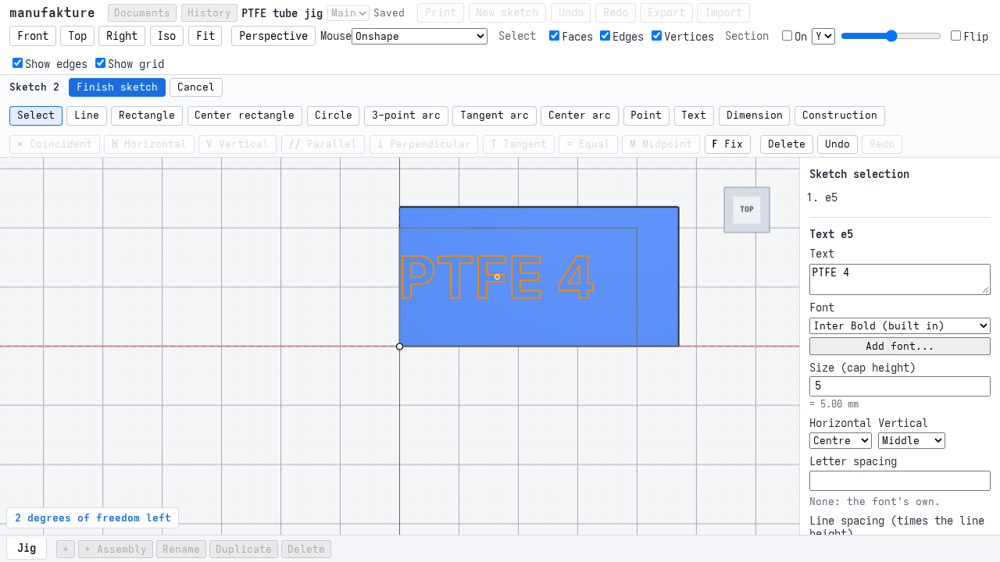
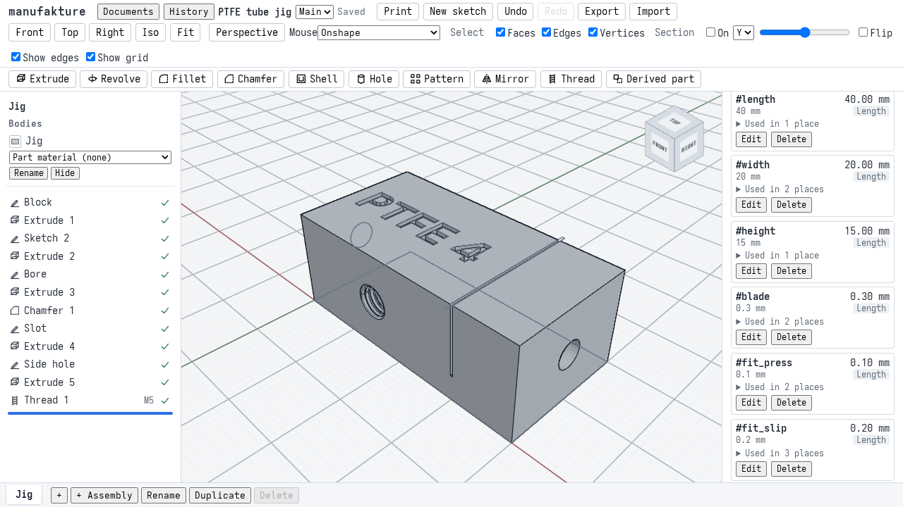
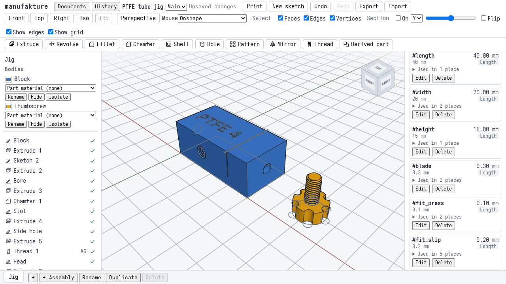
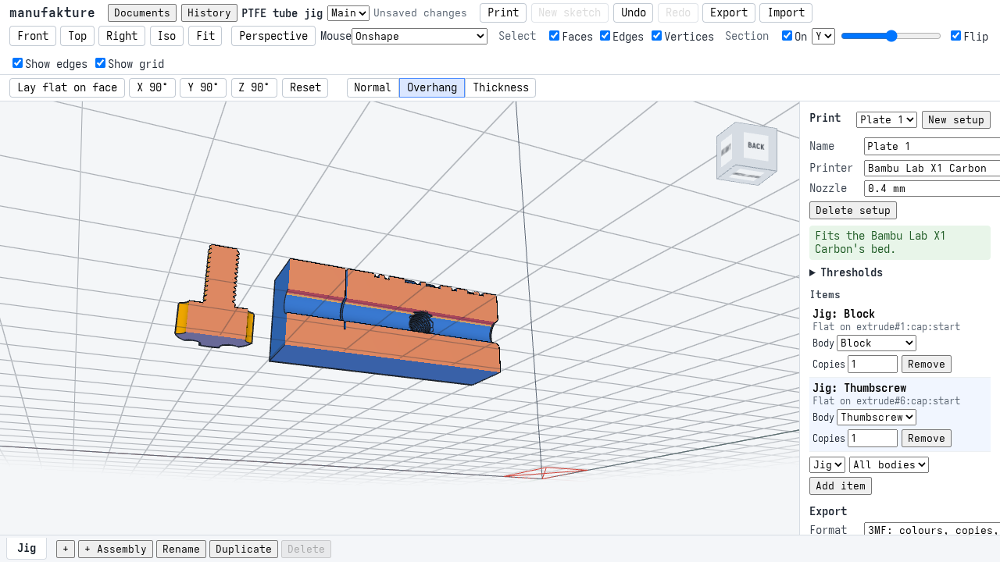
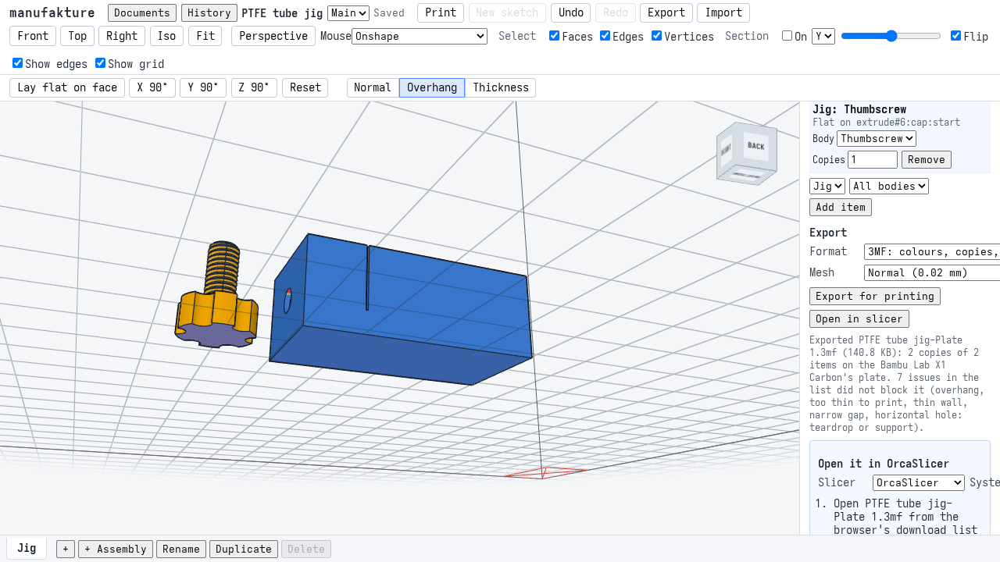

# M3 acceptance: a PTFE tube cutting jig, end to end

Milestone 3 is "parts for an FDM printer": checks for what may print badly (overhangs, thin walls, small and horizontal holes, bed fit), the features printed parts need (text, threads, fits), and a multi-part, multi-colour 3MF that gets into OrcaSlicer or Bambu Studio intact. This page walks through one real part made with all of it, says which automated checks prove each step, and gives the numbers they check, computed by hand. The walkthrough is `apps/web/e2e/m3-jig.spec.ts`; the screenshots are taken by that run. The print itself (T3.4b) is a person's job; see [Printing it](#printing-it).

The printer is the one the part is printed on: a **Bambu Lab X1 Carbon with a 0.4 mm nozzle and an AMS**, so the thumbscrew prints in a second colour without a filament change. It replaces the A1 mini of the [M3 plan](plans/m3.md#t34a-m3-acceptance-the-ptfe-tube-cutting-jig-end-to-end) (the owner's decision, recorded in [ADR 0012](adr/0012-3d-printing.md)), so bed fit and the export are checked against the X1 Carbon's plate and its excluded corner (0 to 18 by 0 to 28 mm).

## The part

A jig for cutting 4 mm outer-diameter PTFE (Bowden) tube square: the tube goes through a bore, a single-edge razor blade goes down a slot across it, and a thumbscrew in a threaded side hole holds the tube while you cut. One part studio, **Jig**, of two bodies. The bore runs along +X, the width along +Y, the height along +Z; the block stands on its base at z = 0.

Variables: `#length` 40 mm, `#width` 20 mm, `#height` 15 mm, `#blade` 0.3 mm (measure your own blade), and the fit variables from **Insert fit variables**: `#fit_press` 0.10 mm, `#fit_slip` 0.20 mm, `#fit_sliding` 0.40 mm (placeholders until the [fit-test coupon](user/fits.md#the-fit-test-coupon) is printed).

**The block** (body `extrude#1`, blue `#3a7bd5`), x 0 to 40, y 0 to 20, z 0 to 15. Each feature, what it removes, and the block's volume after it:

| Feature              | Geometry                                                                                                           | Removes (mm³), by hand                    | Block (mm³) |
| -------------------- | ------------------------------------------------------------------------------------------------------------------ | ----------------------------------------- | ----------- |
| Extrude 1, the block | 40 x 20 x 15                                                                                                       | 12000 (its volume)                        | 12000.000   |
| Sketch 2, Extrude 2  | the label "PTFE 4", Inter Bold, 5 mm cap height, centred at (14, 10) on the top face, debossed 0.6 mm              | 48.1758 mm² x 0.6 = 28.9055               | 11971.095   |
| Bore, Extrude 3      | diameter `4 mm + #fit_slip` = 4.2, through the length at y 10, z 7.5                                               | pi x 2.1² x 40 = 554.1769                 | 11416.918   |
| Chamfer 1            | 0.5 mm on the bore's entry edge at x = 0                                                                           | 2 pi (2.1 + 0.5/3) x 0.5²/2 = 1.7802      | 11415.137   |
| Slot, Extrude 4      | `#blade + #fit_press` = 0.4 wide, centred at x = 30, right across the width, from the top down to z = 4            | 0.4 x 20 x 11 - pi x 2.1² x 0.4 = 82.4582 | 11332.679   |
| Side hole, Extrude 5 | diameter `4.134 mm + #fit_slip` = 4.334, from the front face y = 0 at x 15, z 7.5, 10 mm deep (to the bore's axis) | pi x 2.167² x 10 - 25.8486 = 121.6771     | 11211.002   |
| Thread 1             | M5, modelled, the whole side hole, clearance `#fit_slip`; its mouth chamfered, its end at the bore closed          | 25.0046 (reference, below)                | 11185.997   |

**The thumbscrew** (body `extrude#6`, amber `#f2a900`), standing on its head at (60, 10):

| Feature          | Geometry                                                                                       | Adds or removes (mm³), by hand                      | Thumbscrew (mm³) |
| ---------------- | ---------------------------------------------------------------------------------------------- | --------------------------------------------------- | ---------------- |
| Head, Extrude 6  | 12 across, 5 high, a new body                                                                  | pi x 6² x 5 = 565.4867                              | 565.487          |
| Shank, Extrude 7 | `5 mm - #fit_slip` = 4.8 across, 10 long, added on the head                                    | pi x 2.4² x 10 = 180.9557                           | 746.442          |
| Lobes, Extrude 8 | six circles 3 across centred on the rim, 60 degrees apart, cut through the head                | 6 x 5 x lens(6, 1.5, 6) = 6 x 5 x 3.3465 = 100.3949 | 646.047          |
| Thread 2         | M5, modelled, the whole shank, clearance `#fit_slip`; closed at the head, chamfered at the tip | 33.1932 (reference, below)                          | 612.854          |

How the hand values are made (`apps/web/e2e/m3-fixtures.ts`, `jigVolumes`):

- **The label's area** is read from the bundled font file with opentype.js, not from the app's text code: each glyph's outline is integrated exactly (Green's theorem over its lines and quadratic Beziers) and scaled to the cap height. The letters of "PTFE 4" do not touch, and the counters of P and 4 wind the other way, so the label's area is the sum of its glyphs': 48.1758 mm².
- **The chamfer** is a triangle with 0.5 mm legs revolved about the bore's axis (Pappus: its area times the path of its centroid, at 2.1 + 0.5/3 mm).
- **The side hole** shares a volume with the bore it opens into: at each height z the overlap of the two cylinders (radius a = 2.167 along y, radius b = 2.1 along x, axes meeting, the hole stopping at the bore's axis) is a rectangle 2 sqrt(a² - z²) by sqrt(b² - z²). Integrated with z = b sin t (smooth, so the midpoint rule converges to 1e-12): 25.8486 mm³.
- **The lobes**: a lobe's circle (r = 1.5) centred on the rim (R = 6) overlaps the head in a lens of r² acos((d² + r² - R²)/(2dr)) + R² acos((d² + R² - r²)/(2dR)) - sqrt((-d + r + R)(d + r - R)(d - r + R)(d + r + R))/2 with d = 6: 3.3465 mm².
- **The threads.** T3.2e's reference (`packages/kernel/test/threads.test.ts`) is Cavalieri's: a thread open at both ends is helically symmetric, so its volume is its length times one cross-section. These threads have ends (a 45 degree chamfer at the free end, a closed groove at the other) and the side thread runs into the bore, so `threadReference` integrates what the thread removes over the angle about its axis and the height along it, with the radial part exact: at each point of that grid the groove and the chamfer leave the material beyond one radius, from the ISO 68-1 profile with the clearance (the groove is P/4 wide at an external root and P/8 at an internal one, with 30 degree flanks, swept along the helix from one pitch before a chamfered start to its whole width inside a closed end, per the kernel README's "Threads"), and what the bore removed is left out. 720 by 4000 cells agree with four times as many to 2e-7. The kernel's threads agree with it to 6e-5, against T3.2e's tolerance of 0.5%.

Two choices make every face name and check predictable. The side hole is drilled at M5's basic minor diameter plus the clearance (4.134 + 0.2), which is exactly the crest the thread leaves with that clearance, and the shank is turned to the major diameter less the clearance (5 - 0.2), the external crest; so neither thread trims a crest, the crest strips keep the hole's and the shank's own names, and both follow `#fit_slip` together. With the fits at 0.3 mm the same holds (4.434 and 4.7 mm).

## Walkthrough

1. **Variables.** A new document, "PTFE tube jig"; its part studio renamed **Jig**. **Add** `length` 40, `width` 20, `height` 15 and `blade` 0.3, then **Insert fit variables**: 0.10, 0.20 and 0.40 mm. The block's rectangle is drawn on Top (with a command: the sketcher is M1's), dimensioned by `#length` and `#width`, and extruded `#height` with **Extrude**: 12000 mm³.

2. **The label.** Select the top face, **New sketch**, **Selected face**. **Text**, click at (14, 10); in the **Text** panel type `PTFE 4` and set **Size** to 5 (the cap height; the built-in font's recommended minimum is 4.2 mm, see [Text](user/text.md#size-for-printing)). **Finish sketch**, select it, **Extrude**: **Regions** **The text only**, **Result** **Remove**, 0.6 mm, **Opposite direction**.

   

3. **The bore and its chamfer.** The bore's circle on the end plane x = 0, diameter `4 mm + #fit_slip` (a slip fit for the tube); **Extrude**, **Remove**, **Through all**. **Chamfer**: click the bore's entry edge, 0.5 mm, so the tube finds its way in.

4. **The blade slot.** A rectangle on the top plane, `#blade + #fit_press` wide (a press fit for the blade) at x = 30, across the width; **Extrude**, **Remove**, 11 mm, **Opposite direction**: down to z = 4, through the bore.

5. **The side hole, threaded.** A circle on the front plane y = 0, diameter `4.134 mm + #fit_slip`; **Extrude**, **Remove**, 10 mm, to the bore's axis. **Thread**: click the hole's wall in the view; the dialog says "an internal thread"; **Size** M5, the whole length, **Clearance** `#fit_slip` (the default once the fit variables exist), **Modelled**. The tree shows **Thread 1** with **M5**. See [Threads](user/threads.md).

   

6. **The thumbscrew.** Its head's circle on Top at (60, 10), 12 mm; **Extrude**, **New body**, 5 mm. The shank's circle on the head, `5 mm - #fit_slip`; **Extrude**, **Add**, 10 mm. Six lobe circles on the rim; **Extrude**, **Remove**, 5 mm. **Thread** on the shank: "an external thread", M5, `#fit_slip`, modelled. In the **Bodies** list, colour and rename the bodies **Block** and **Thumbscrew**.

   

7. **The print setup.** **Print**, **New setup**: the Bambu Lab X1 Carbon, 0.4 mm. Add an item for the **Block** and one for the **Thumbscrew** (their own items, so each lies its own way). For each, **Lay flat on face** and click its underside from below the bed: the block on its base, the thumbscrew on its head. The panel says it fits the bed; the **Overhang** shading shows the tops of the bore and the side hole in red. The Issues list is in [Printability](#printability-as-found) below.

   

8. **Into the slicer.** **Open in slicer** downloads `PTFE tube jig-Plate 1.3mf` and shows how to open it in OrcaSlicer (the default; Bambu Studio and PrusaSlicer are in the list). The export's message lists the issues it did not block on. See [Open in slicer](user/printing.md#open-in-slicer).

   

9. **A looser slip fit.** Edit `#fit_slip` to 0.3 mm in the Variables panel (shown under the Print panel): the bore, the side hole, the shank and both threads are rebuilt, and the print checks follow.

10. **Reload.** The document opens again as it was, `#fit_slip` 0.3, the setup with both items laid flat.

## What the checks prove

The walkthrough's chapters share one browser page and its storage, so they run in order and a failing chapter skips the rest. The profiles are sketched with commands, with entity ids of their own so they never meet the ids the UI hands out; every feature on them goes through its dialog, and every M3 feature through its UI.

| Check                | Where                                      | What it asserts                                                                                                                                                                                                                                                                                                                                                                                                                                                                      |
| -------------------- | ------------------------------------------ | ------------------------------------------------------------------------------------------------------------------------------------------------------------------------------------------------------------------------------------------------------------------------------------------------------------------------------------------------------------------------------------------------------------------------------------------------------------------------------------ |
| Fit variables        | `m3-jig.spec.ts` 1                         | **Insert fit variables** adds the three placeholders at a 0.4 mm nozzle; the bore, slot, side hole and shank read them.                                                                                                                                                                                                                                                                                                                                                              |
| Exact volumes        | `m3-jig.spec.ts` 1 to 6                    | After every feature its status is ok with no warning, and the body's volume (the Measure tool's) is the value above: to 1e-6 mm³ for the block, to 0.001 mm³ for the label, bore, chamfer, slot, head, shank and lobes. The side hole to 0.005 mm³: the measure tool integrates the B-spline faces where the two holes cross with a fixed Gauss rule, which is 0.0017 mm³ off.                                                                                                       |
| Text                 | `m3-jig.spec.ts` 2                         | The Text tool on the top face, the panel's string and size, five glyphs drawn, no warning; **The text only** stores the outline entity as the profile; the volume drops by the font file's area times 0.6.                                                                                                                                                                                                                                                                           |
| Threads              | `m3-jig.spec.ts` 5, 6                      | The Thread dialog finds the side (internal, external) from the picked face, offers `#fit_slip` and modelled; each thread acts on its own body (`thread#1` on `extrude#1`, `thread#2` on `extrude#6`), with a chamfered free end and a closed one; the volume each removes is within 0.5% of its reference (measured: 6e-5 and 2e-5).                                                                                                                                                 |
| Bed fit              | `m3-jig.spec.ts` 7                         | Both items fit the X1 Carbon; each laid-flat item is its modelled size on the bed (40 x 20 x 15; the thumbscrew 15 tall, 12 across in y and 11.625 in x, where the lobes at each end meet the rim). No bed-fit issue.                                                                                                                                                                                                                                                                |
| Overhangs            | `m3-jig.spec.ts` 7, 9                      | The block's overhang issue names only faces of the bore, the side hole and its thread, and some of each. Per face, on the meshes the workspace checks: the entry chamfer's steepest line is under 45.5 degrees and none of it is steep; the thumbscrew's thread faces are at most 2% overhang by area and nothing else on it is. The checked meshes are the export-tolerance ones (each body has more than 1.5 times its viewport mesh's triangles).                                 |
| Teardrop             | `m3-jig.spec.ts` 7, 9                      | Exactly one flag, on the block: the bore, 4.20 mm (4.30 at the looser fit), naming every face of it (the slot cuts it in two) and nothing else.                                                                                                                                                                                                                                                                                                                                      |
| Walls and gaps       | `m3-jig.spec.ts` 7, 9                      | Every thin-wall and too-thin face is a thread face, a face of the label's pockets, a piece of the top face inside the label (a counter), or a face of the head's lobes; every narrow gap is on a thread. Nothing on the bore, the chamfer, the slot, the side hole's crest strips or the outer faces.                                                                                                                                                                                |
| Export               | `m3-jig.spec.ts` 8                         | **Open in slicer**: the file name, the status line, the OrcaSlicer help. `validate3mf` finds no problem; two colour groups (`#3A7BD5`, `#F2A900`), two objects (`Jig: Block`, `Jig: Thumbscrew`), two build items; each built mesh on the bed, inside the X1 Carbon's plate, at least 5 mm clear of its excluded corner and of the other part, its volume within 0.2% of the exact one. The file goes to `apps/web/test-results/m3-jig/` and CI uploads it as the artifact `m3-jig`. |
| Parametric fits      | `m3-jig.spec.ts` 9                         | `#fit_slip` 0.3: every feature ok; the threads' radii are the new holes' (2.217 and 2.35 mm); each thread's volume within 0.5% of its reference at the new clearance (measured: 3e-7 and 2e-5); both bodies lighter; the print checks as above with a 4.30 mm teardrop.                                                                                                                                                                                                              |
| Reload               | `m3-jig.spec.ts` 10                        | The same volumes to 1e-6 mm³, `#fit_slip` 0.3, both items laid flat, still fitting.                                                                                                                                                                                                                                                                                                                                                                                                  |
| Viewport screenshots | `apps/web/e2e/m3-views.spec.ts` (e2e job)  | The jig in the iso and front views, and the block on the plate with the overhang shading through a section, against baselines in `apps/web/e2e/__screenshots__/m3-views.spec.ts/`. It is built quickly (`buildJig` in `m3-fixtures.ts`: the same document, made with commands).                                                                                                                                                                                                      |
| Performance budgets  | `apps/web/e2e/m3-budget.spec.ts` (e2e job) | Reload, regeneration (whole, after `#fit_slip` changes, after the label changes) and the print analysis, written to the e2e job's summary; fails only far past normal. A `#fit_slip` edit rebuilds the bore and both threads and keeps the label from the cache; a label edit rebuilds the label and everything after it.                                                                                                                                                            |
| Per-feature specs    | `apps/web/e2e/*.spec.ts` (e2e job)         | Each M3 feature in more depth: `print-checks`, `print-export`, `threads`, `text`, `fits`.                                                                                                                                                                                                                                                                                                                                                                                            |

## Printability, as found

What the Issues list shows for the jig at the default fits, each documented and accepted. The checks say "may print badly", never "will fail" ([Printing](user/printing.md#what-the-checks-look-for)).

| Issue                                         | On         | What and why                                                                                                                                                                                                                                                                                                                                                                |
| --------------------------------------------- | ---------- | --------------------------------------------------------------------------------------------------------------------------------------------------------------------------------------------------------------------------------------------------------------------------------------------------------------------------------------------------------------------------- |
| Overhang, 89.95 degrees, 93.3 mm²             | Block      | The top of the horizontal bore (84.1 mm² of its faces), and the top of the horizontal side hole with its thread (the crest strips 6.0 mm², the thread's root 3.2 mm²). Accepted as modelled; the teardrop flag below says what to do if the bore's top sags.                                                                                                                |
| Horizontal hole: teardrop or support, 4.20 mm | Block      | The bore: horizontal and above the 3 mm teardrop size. One flag listing both faces the slot cuts the bore into. The side hole is not flagged: it is threaded, and holes coaxial with a thread's faces are left out (T3.1c); its top is in the overhang listing instead. The thumbscrew has none (its axis is vertical, and it is a pin). The chamfer is a cone, not a hole. |
| Thin wall, too thin to print                  | Block      | The internal thread's teeth: an M5 tooth is 0.2 mm across at its crest (P/4) and nowhere near two line widths (0.84 mm); every printed thread at this pitch reads thin. And the label: the walls of material left between neighbouring letters (0.66 to 0.79 mm at a 5 mm cap height), and the counters of P and 4, whose corners are knife edges.                          |
| Thin wall, too thin to print                  | Thumbscrew | Its thread's teeth, as above; and the head's lobes, where each lobe meets the rim at an edge (0.05 mm at the tip).                                                                                                                                                                                                                                                          |
| Narrow gap, 0.18 mm                           | Block      | Between the flanks at the internal thread's root, where the groove is P/8 = 0.1 mm wide. 0.0 mm² of it.                                                                                                                                                                                                                                                                     |

Not on the list, and checked not to be: the entry chamfer (its steepest line is 45 degrees from vertical, below the 50 to 60 degree steep band), the slot (vertical walls, a 0.4 mm gap over the 0.2 mm minimum), and any overhang on the thumbscrew. Standing on its head, its thread's axis is vertical and its downward flanks are at 59.92 degrees from vertical (the 30 degree flank, tilted a little by the helix), inside the steep band and under the 60 degree threshold: steep, not overhang, on the export-tolerance mesh. The plan allowed up to 2% of the thread faces' area to read as overhang from facet noise; on the 0.02 mm mesh none does (0 of 194.7 mm²). On the viewport's coarser 0.1 mm mesh the same flanks read 60.01 degrees and 3.5% of them overhang, which is why the meshes checked matter (see below).

## Defects found

- **The print workspace could check a body on its coarse viewport mesh for good** (fixed in task #1043).
  - _As found._ The workspace checked a body on its 0.1 mm viewport mesh, not the 0.02 mm export-tolerance one, while `meshesSettled()` reported the meshes as settled. Clicking **Lay flat on face** right after adding the thumbscrew's item did that in three runs out of four: the thumbscrew was checked on 3490 triangles instead of 6856, and its thread's downward flanks read 60.01 degrees, a false overhang of 6.8 mm².
  - _How the walkthrough exposed it._ Chapter 7 asserts that each body is checked on more than 1.5 times its viewport mesh's triangles, and that the thumbscrew has no overhang beyond facet noise on its thread. Both failed on the runs that fell back, although the workspace said the meshes had settled.
  - _Root cause._ Every document change started a regen, and each regen dropped the tessellation request in flight. The workspace retried a dropped request a fixed number of times (`MAX_TRIES`) and then stored the viewport mesh as the body's final mesh; a fine mesh that arrived after that was ignored, since nothing asked for a re-check. Items sharing a mesh also requested it once each, so one body's mesh was asked for twice per round.
  - _The fix._ A dropped or failed request is now retried with a doubling wait, from 400 ms up to 5 s, and is never made final; only a real kernel answer whose topology does not match settles a body on its viewport mesh. Requests are deduplicated per mesh. A reply that lands late triggers a re-check. `meshesSettled()` is true only when every body is checked on its final mesh. The walkthrough still waits for the meshes before each pick and asserts the finer meshes are the ones checked, so a regression fails the run.

## Deviations from the plan

- **The printer** is the X1 Carbon with a 0.4 mm nozzle and an AMS, not the A1 mini (see the top of this page).
- **Two items, not one**: the block and the thumbscrew lie differently, so each is its own item; the 3MF then holds two single-body objects, which is what the plan's "two objects" counts.
- **The thumbscrew's overhang allowance** was set from the first measured run, as the plan asked: the allowance stays at 2% of its thread faces' area, and the measured value is 0.
- **Sketches by command**, as in M2: the profiles are made with commands, every feature on them through its dialog.
- **The side hole's depth** stops at the bore's axis, so the thumbscrew's tip reaches the tube and the bore's far wall stays whole.

## Screenshots and SwiftShader

As for M1 and M2 ([Screenshots and SwiftShader](m1-acceptance.md#screenshots-and-swiftshader)): the viewport baselines are drawn by SwiftShader, compared with a tolerance, the view cube is masked, and CI only compares. The canvas is pinned to 760 x 540 px at the top left of the page for the comparison, since the toolbars' and panels' size (and so the canvas's) follows the machine's fonts; the committed sketches, drawn over where the canvas was, are hidden while it is pinned. After an intended change to how the viewport draws:

```sh
pnpm --filter @manufakture/web e2e m3-views --update-snapshots
```

The walkthrough screenshots on this page are refreshed with `M3_DOCS=1 pnpm --filter @manufakture/web e2e m3-jig`.

## Performance

The acceptance jig in the app (`m3-budget.spec.ts`), measured on an AMD Ryzen 5 7600X, Linux, Node 26.10.0, headless Chromium with SwiftShader, against `vite preview` on the same machine. The reload and the whole regeneration are one measurement each (the reload that starts the run); the `#fit_slip` and label rows are medians of five edits, each to a value not seen before; the print analysis is the median of five (when the workspace opens, then after each of four quarter turns of the block):

| Measure                                                              | Time   | Budget |
| -------------------------------------------------------------------- | ------ | ------ |
| Kernel ready and the whole jig shown, after a reload                 | 3.0 s  | 30 s   |
| Regenerating the whole jig in the worker (empty cache)               | 2.40 s | 20 s   |
| Regenerating after `#fit_slip` changes, in the worker                | 2.05 s | 10 s   |
| From a `#fit_slip` change to the new model                           | 2.14 s | 15 s   |
| Regenerating after the label's string changes, in the worker         | 2.31 s | 10 s   |
| Wall thickness and gaps of both bodies, in the print-analysis worker | 153 ms | 5 s    |

The two modelled threads are most of every regeneration: in Node (the regen engine on the real kernel, the same machine) the jig regenerates in 0.54 s without them and 2.30 s with them, so each M5 x 10 mm thread takes about 0.9 s. A `#fit_slip` edit rebuilds both, and so does a label edit, since the threads come after the label in the tree. The print analysis covers about 6800 triangles per body at the export tolerance. The same caveats as M1's apply: the kernel comes from localhost, SwiftShader draws, and CI runners are slower still; the budgets are there to catch large regressions. Each CI run writes its own numbers to the e2e job's summary.

## Printing it

The 3MF the walkthrough exports is `apps/web/test-results/m3-jig/ptfe-tube-jig.3mf` (with `expected.json`: the objects, their mesh volumes and the two colours), and the e2e job uploads it as the artifact **m3-jig**. Printing it on the X1 Carbon, and what to record (the slicer's import, the print time, the measured bore, slot and outer sizes, the fits of the tube, the blade and the thumbscrew, a square cut), is T3.4b in the [M3 plan](plans/m3.md#t34b-print-the-jig-on-a-bambu-lab-printer-human-only); its results go in a section here.

CI's OrcaSlicer check (in the `interop` job, which slices the M1 bracket's export and the slicer fixtures) does not read the **m3-jig** artifact yet: the jig's 3MF is validated in the walkthrough (`validate3mf` and the checks in chapter 8), not sliced in CI. Slicing it there is a follow-up.
