# M4 acceptance: a bookshelf, end to end

Milestone 4 is "woodworking": boards cut from real stock (a 1x2 that is 3/4" x 1-1/2", "3/4" plywood" that is 23/32" thick) with a grain, joints that cut boards against each other, a cut list and bill of materials with board feet and sheet layouts that respect the saw kerf, 2D drawings with hidden lines and dimensions, and exploded assemblies. The milestone is accepted when a bookshelf designed in manufakture gives a cut list and a sheet layout that match a hand calculation ([M4 plan](plans/m4.md#t46-m4-acceptance-the-bookshelf-end-to-end), T4.6). This page walks through that bookshelf, works the cut list and the layouts out by hand, and says which automated checks prove each step. The walkthrough is `apps/web/e2e/m4-bookshelf.spec.ts` (its model and the hand calculation in code are in `apps/web/e2e/m4-fixtures.ts`); the screenshots are taken by that run.

## The bookshelf

An inch document, lengths shown as fractions to 1/32". The width W = `#width` runs along +X, the depth along +Y from the front (y = 0) to the back, the height along +Z from the floor. One part studio, **Carcass**, of twelve boards. Sizes below are inches; t = 23/32 is the actual thickness of 3/4" plywood, b = 7/32 that of 1/4" plywood, D = 11-1/4 the sides' depth.

| Board         | Stock        | Where (x; y; z)                                    | Joined by                                   |
| ------------- | ------------ | -------------------------------------------------- | ------------------------------------------- |
| Left stile    | 1x2          | 0..1-1/2; -3/4..0; 0..72                           | pocket screws from both rails               |
| Right stile   | 1x2          | W - 1-1/2..W; -3/4..0; 0..72                       | pocket screws from both rails               |
| Bottom rail   | 1x2          | 1-1/2..W - 1-1/2; -3/4..0; 0..1-1/2                | one pocket screw into each stile            |
| Top rail      | 1x2          | 1-1/2..W - 1-1/2; -3/4..0; 70-1/2..72              | one pocket screw into each stile            |
| Left side     | 3/4" plywood | 0..t; 0..D; 0..72                                  | receives two rabbets, three dados, the back |
| Right side    | 3/4" plywood | W - t..W; 0..D; 0..72                              | the same                                    |
| Bottom        | 3/4" plywood | 15/32..W - 15/32; 0..D - b; 0..t                   | a rabbet at the foot of each side           |
| Top           | 3/4" plywood | 15/32..W - 15/32; 0..D - b; 72 - t..72             | a rabbet at the head of each side           |
| Shelf 1, 2, 3 | 3/4" plywood | 15/32..W - 15/32; 0..D - b; from z = 18, 36, 54, t | a dado in each side                         |
| Back          | 1/4" plywood | 15/32..W - 15/32; D - b..D; 0..72                  | a rabbet along each side's back edge        |

The face frame's four sticks are drawn along the four lines of one sketch on the front plane and turned a quarter turn about their lines, so their 3/4" thickness runs front to back. The panels between the sides start 15/32" in from each side's outside face, so they reach t - 15/32 = 1/4" into the sides: that overlap is what each rabbet and dado cuts away (domain-wood README, "A board's blank includes its joinery"). Their length is therefore W - 2t + 2 x 1/4 = **W - 15/16**, and they stop at the back, **D - b = 11-1/32** deep. The back, also W - 15/16 wide, sits in 1/4"-deep rabbets along the sides' back edges.

`#width` is 30" as modelled; a configuration table makes it **24"**, **30"** and **36"**.

## Walkthrough

1. **The face frame.** A new document, "Bookshelf", in inches with fractions; its part studio renamed **Carcass**. **Add** the variable `width`, 30. The face frame's sketch (four lines, three of them fixed to `#width`) is drawn with a command: the sketcher is M1's and its own specs cover it. For each line: select the sketch, **Board**, **Stick**, stock **1x2**, the line, **Rotation** 90, **Thickness** and **Width** on the positive side; the dialog shows the blank (`Blank: 72" x 1-1/2" x 3/4"`, or `27"` for a rail at 30"). Each board is renamed in the tree (F2).

   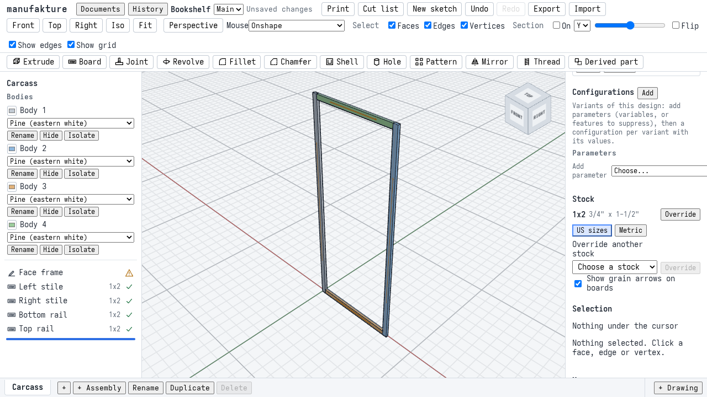

2. **The carcass.** Eight more sketches with commands, one rectangle each. The right side's is on the right stile's outer face, so it moves with `#width` (a sketch plane's position cannot be an expression; a face sketch follows its face). **Board** on each: a panel, **3/4" plywood** by default in an inch document; the back changed to **1/4" plywood**; the right side made on the **Opposite side of the sketch**. Each board's material comes from its stock (pine, plywood).

   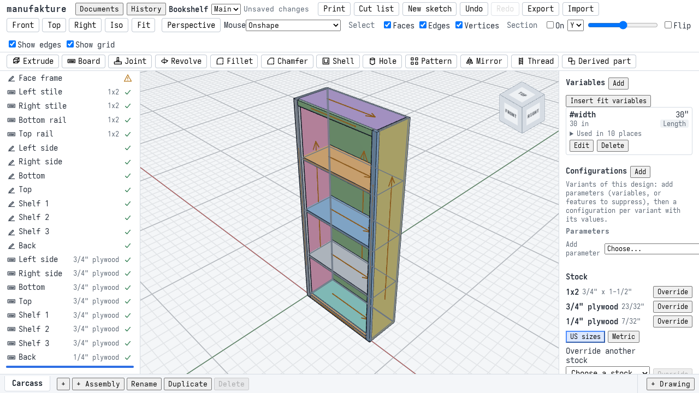

3. **Joints.** **Joint**, sixteen times: **Rabbet** for the bottom and the top into each side and for the back into each side; **Dado** for each shelf into each side; **Pocket screws** for each rail into each stile, pockets on the rail's back face. The dialog says what it cuts: "Cut from Left side (A): a groove", "Groove 23/32" wide and 1/4" deep, 11-1/4" long".

   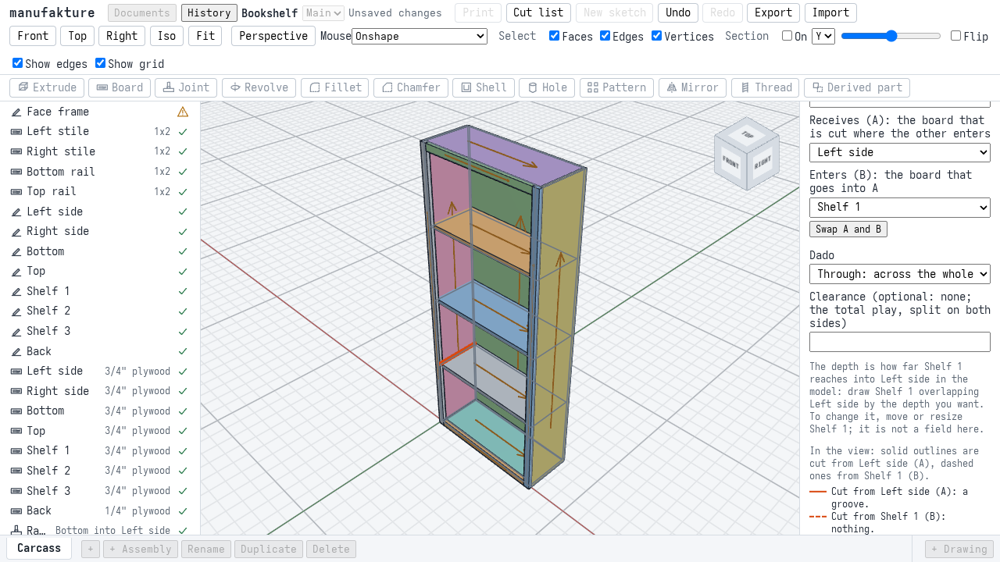

   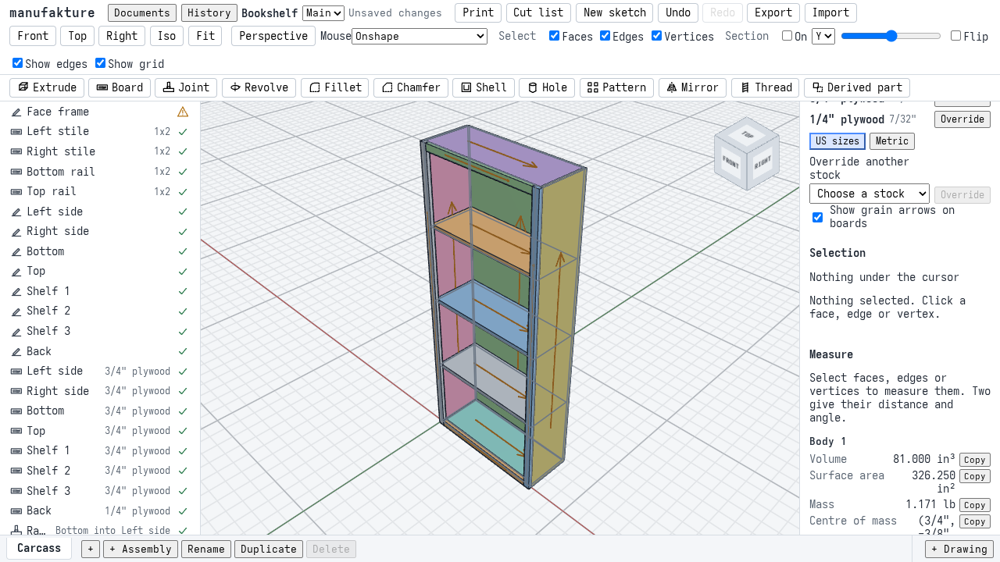

4. **The cut list.** **Cut list**: five rows, the hardware and the totals, exactly as worked out below. **Layouts**: one sheet of each plywood and two sticks of 1x2. **Cut list CSV**.

   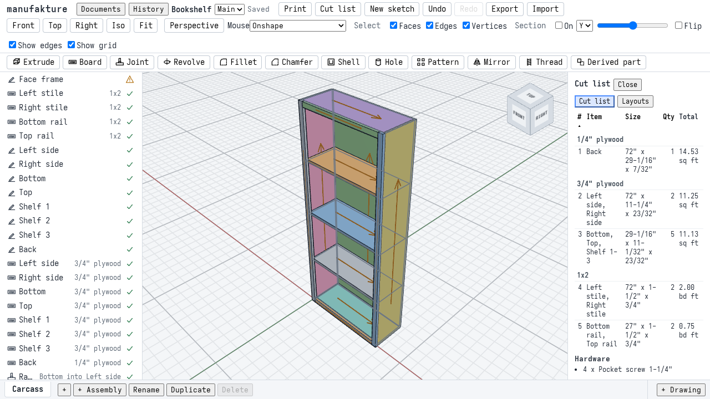

   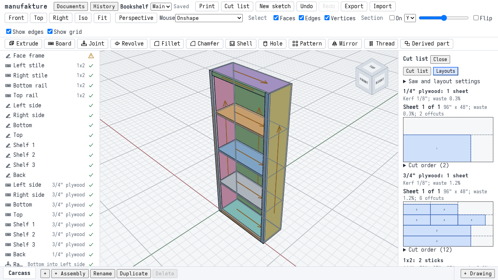

5. **Widths as configurations.** In **Configurations**, `#width` as a parameter and the rows **24 in**, **30 in**, **36 in**. Choosing each in the header's **Configuration** list rebuilds every board where the hand calculation puts it, and the Cut list panel ("For the configuration 36 in.") lists and lays out that row. At 36" the 3/4" plywood needs a second sheet.

   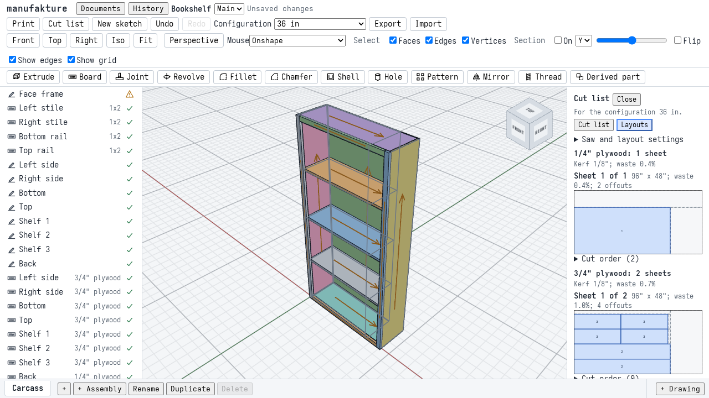

6. **The assembly, exploded.** **+ Assembly** with one instance per board (the part studio inserted twelve times, each showing one board through `Instance.bodies`, fixed where the part studio has it: the M4 plan's decision 5). The instances are made with a command; M2's Insert panel has its own specs. Its **Cut list** is the part studio's, row for row. **Explode**, **New exploded view**, five steps of 12": the top up (+Z), the back out behind (+Y), the four face frame sticks forward (-Y), the left side (-X) and the right side (+X) apart.

   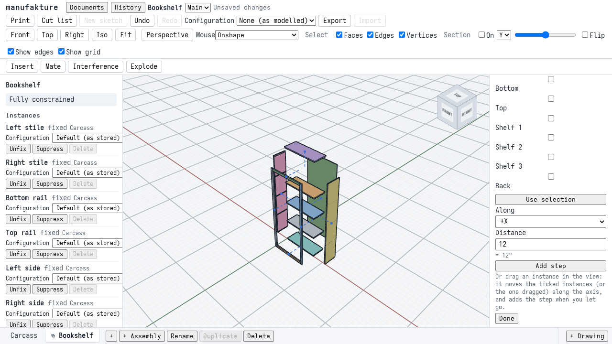

7. **The drawing.** **+ Drawing**, "Bookshelf", Tabloid (11" x 17") landscape. **Insert view**: the part studio, **Front**, 1:12, dragged to the bottom left; then **Top** and **Right** projected from it. **Dimension**: the overall width (horizontal, the stiles' bottom corners) and height (vertical, the right stile's corners) in the front view, the overall depth in the top view (from the stile's front corner to the side's back corner), and Shelf 1's thickness in the front view (its two front edges, between the stiles): `30"`, `72"`, `12"`, `23/32"`. **Insert view**: **Exploded: Bookshelf, Exploded view 1**, **Isometric**, 1:16, dragged to the right.

   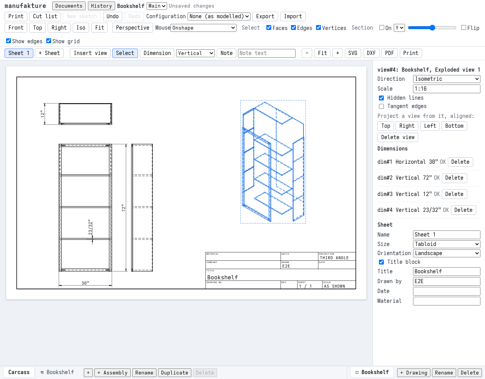

8. **Export.** In the drawing, **SVG**, **DXF** and **PDF**; in the Cut list panel, **Cut list CSV** and **PDF** (the list, then every sheet and stick, numbered as in the list).

9. **Reload.** The document comes back identical: the boards, joints, configurations, the assembly and its exploded view, the drawing and its dimensions.

10. **Measured plywood.** In **Stock**, override 3/4" plywood's thickness to `11/16"` (what a sheet often measures). Every 3/4" board rebuilds 11/16" thick; the dados and rabbets follow (each groove as wide as what it takes, and 7/32" deep, since the panels still start 15/32" in); the cut list's 3/4" rows say 11/16"; the layouts do not change (no blank is longer or wider); the drawing's shelf dimension says `11/16"` and the overall ones do not move.

    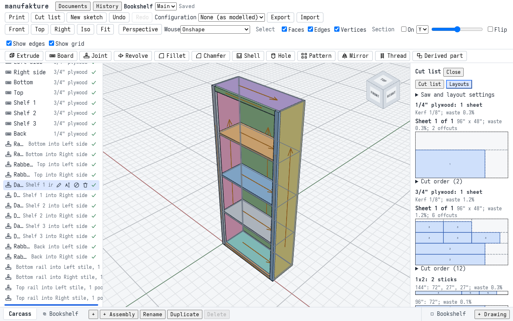

    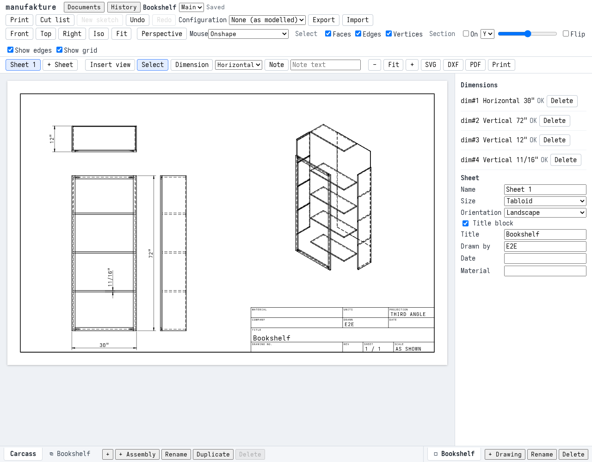

## The cut list, by hand

A board's blank is its stock size before joinery (the M4 plan, T4.3a), so a shelf's blank includes the 1/4" it reaches into each side. Board feet follow the stock's basis: surfaced softwood counts nominal thickness by nominal width by length, here 1" x 2" for the 1x2s, because every stick is the full 1-1/2" width of its stock (a ripped stick would count its actual width; domain-wood README, "Board feet"). Sheet goods count area.

**Blank sizes** (length along the grain x width x thickness). The panels' grain runs along their longest side: 72" for the sides and the back, the length between the sides for the others.

| Row | Boards                  | Blank                           | Qty | Per row                         |
| --- | ----------------------- | ------------------------------- | --- | ------------------------------- |
| 1   | Back                    | 72" x (W - 15/16) x 7/32"       | 1   | 72 (W - 15/16) / 144 sq ft      |
| 2   | Left side, Right side   | 72" x 11-1/4" x 23/32"          | 2   | 2 x 72 x 11.25 / 144 sq ft      |
| 3   | Bottom, Top, Shelf 1-3  | (W - 15/16) x 11-1/32" x 23/32" | 5   | 5 (W - 15/16) 11.03125 / 144    |
| 4   | Left stile, Right stile | 72" x 1-1/2" x 3/4"             | 2   | 2 x 1 x 2 x 72 / 144 bd ft      |
| 5   | Bottom rail, Top rail   | (W - 3) x 1-1/2" x 3/4"         | 2   | 2 x 1 x 2 x (W - 3) / 144 bd ft |

Rows are ordered sheets first, then lumber, each in catalog order (1/4" plywood before 3/4"), then thickest, longest, widest. **Hardware**: one pocket screw per rail end, since the rail's end is a 1-1/2" row and the jig's default leaves 3/4" from each end (one screw in the middle): 4 screws, 1-1/4" long (the Kreg chart's length for 3/4" stock).

Worked out for each width, against what the Cut list panel shows. The spec compares the panel's text to the hand figures character for character, so the two columns are equal by construction of the check, and the run passes:

| Width | Row 1 (Back)                | Row 3 (5 panels)                 | Row 5 (2 rails)                | Sheet goods total  | Lumber total            | App   |
| ----- | --------------------------- | -------------------------------- | ------------------------------ | ------------------ | ----------------------- | ----- |
| 24"   | 72" x 23-1/16": 11.53 sq ft | 23-1/16" x 11-1/32": 8.83 sq ft  | 21": 2 x 42 / 144 = 0.58 bd ft | 31.61 sq ft, 8 pcs | 2.58 bd ft, 186", 4 pcs | equal |
| 30"   | 72" x 29-1/16": 14.53 sq ft | 29-1/16" x 11-1/32": 11.13 sq ft | 27": 2 x 54 / 144 = 0.75 bd ft | 36.91 sq ft, 8 pcs | 2.75 bd ft, 198", 4 pcs | equal |
| 36"   | 72" x 35-1/16": 17.53 sq ft | 35-1/16" x 11-1/32": 13.43 sq ft | 33": 2 x 66 / 144 = 0.92 bd ft | 42.21 sq ft, 8 pcs | 2.92 bd ft, 210", 4 pcs | equal |

Rows 2 and 4 do not depend on the width: the sides are 2 x 72 x 11.25 = 1620 sq in = **11.25 sq ft**, the stiles 2 x 1 x 2 x 72 / 144 = **2.00 bd ft**. In full, at 24": row 3 is 5 x 23.0625 x 11.03125 = 1272.04 sq in = 8.8336 sq ft; the back 72 x 23.0625 = 1660.5 sq in = 11.53125 sq ft; together with the sides 31.6149 sq ft. At 30": 1602.98 sq in = 11.1318 sq ft, and 2092.5 sq in = 14.53125 sq ft; 36.9130 sq ft. At 36": 1933.92 sq in = 13.4300 sq ft, and 2524.5 sq in = 17.53125 sq ft; 42.2112 sq ft. The lumber's linear total is 2 x 72 + 2 (W - 3). The CSV at 30" is checked to the byte:

```csv
#,Item,Stock,Material,Length,Width,Thickness,Quantity,Total,Flags,Bodies
1,Back,"1/4"" plywood",Plywood (birch),"72""","29-1/16""","7/32""",1,14.53 sq ft,,extension#12
2,"Left side, Right side","3/4"" plywood",Plywood (birch),"72""","11-1/4""","23/32""",2,11.25 sq ft,,extension#5 extension#6
3,"Bottom, Top, Shelf 1, Shelf 2, Shelf 3","3/4"" plywood",Plywood (birch),"29-1/16""","11-1/32""","23/32""",5,11.13 sq ft,,extension#7 extension#8 extension#9 extension#10 extension#11
4,"Left stile, Right stile",1x2,Pine (eastern white),"72""","1-1/2""","3/4""",2,2.00 bd ft,,extension#1 extension#2
5,"Bottom rail, Top rail",1x2,Pine (eastern white),"27""","1-1/2""","3/4""",2,0.75 bd ft,,extension#3 extension#4
```

With the plywood measured at 11/16" the same table holds with 11/16" in rows 2 and 3: no blank's length or width depends on the plywood's thickness here (the panels' sketches fix where they start), and areas are length by width.

## The sheet layout, by hand

48" x 96" sheets, a 1/8" kerf (the default), no trims, grain respected: plywood's face grain runs along the sheet's 96", so every plywood part keeps its length along the sheet's length (grain-locked). Parts are ripped into strips across the sheet's 48" and crosscut along its 96".

**3/4" plywood** holds two sides (72" x 11-1/4") and five panels ((W - 15/16) x 11-1/32").

- Across the sheet: two side strips and two panel strips take 2 x 11.25 + 2 x 11.03125 + 3 x 0.125 = **44.9375 <= 48**; a fifth strip would need at least 44.9375 + 0.125 + 11.03125 = 56.09 > 48. So a sheet holds at most four strips.
- **24"** (panels 23-1/16"): beside a side, 72 + 0.125 + 23.0625 = 95.1875 <= 96, so each side strip also takes a panel; a panel strip takes four (4 x 23.0625 + 3 x 0.125 = 92.625 <= 96), and the remaining three fit one. Three strips: **1 sheet**.
- **30"** (panels 29-1/16"): beside a side, 72.125 + 29.0625 = 101.19 > 96, so a side strip holds only its side; a panel strip takes three (3 x 29.0625 + 2 x 0.125 = 87.4375 <= 96; four need 116.375). Five panels need two panel strips (3 and 2). Four strips: **1 sheet**.
- **36"** (panels 35-1/16"): a panel strip takes two (2 x 35.0625 + 0.125 = 70.25 <= 96; three need 105.4375), so five panels need three panel strips; with the two side strips that is five strips, 56.09" across. No other arrangement fits them on one sheet either. A side, 72" long on a 96" sheet, always covers the positions 24" to 72" along the length. A panel 35-1/16" long always covers the position 35" or the position 61": if it starts at or before 35" it reaches past 35", and if it starts after 35" it starts at most 96 - 35.0625 = 60.9375" in, so it reaches past 61". Five panels put at least three across one of those two positions, beside both sides: 2 x 11.25 + 3 x 11.03125 + 4 x 0.125 = 56.09 > 48. So one sheet holds at most four panels: **2 sheets**.

**1/4" plywood** holds the back alone: 72" x (W - 15/16), at most 72" x 35-1/16", within one 96" x 48" sheet at every width: **1 sheet**.

The app's layouts (the nesting worker, T4.3c's guillotine packer) are exactly these:

| Width | 3/4" plywood, as drawn                                                                      | 1/4" plywood |
| ----- | ------------------------------------------------------------------------------------------- | ------------ |
| 24"   | 1 sheet: two side strips, each with a panel beside its side; a strip of three panels        | 1 sheet      |
| 30"   | 1 sheet: two side strips; a strip of three panels and a strip of two                        | 1 sheet      |
| 36"   | 2 sheets: two side strips and two strips of two panels; the fifth panel on the second sheet | 1 sheet      |

The spec checks each layout three ways. It lays out the hand-computed parts itself with `@manufakture/nesting`'s `layoutSheets` and runs the package's own checker, `checkSheetLayout`, on the result (every part placed once, inside the sheet, square to the grain, no two closer than the kerf, and a cut tree that replays). It then reads every part's rectangle back from the sheets drawn in the Cut list panel and requires them to be exactly those placements, sheet by sheet. And it checks the drawn rectangles on their own: each inside its 96" x 48" sheet, each a part's length along the sheet's length, and every two at least 1/8" apart along one axis.

**1x2.** Sold in 8' to 16' lengths. The plan the panel draws is checked by hand from its captions (every piece once, and each stick's pieces plus a kerf between each two no longer than the stick): at 24" one 16' (192") stick, 72 + 72 + 21 + 21 + 3 x 0.125 = 186.375 <= 192; at 30" a 12' stick (72 + 27 + 27 + 2 x 0.125 = 126.25 <= 144) and an 8' stick (72); at 36" the same with 33" rails (138.25 <= 144). Which stick lengths to buy is the packer's choice (least waste); the hand check is that every plan is cuttable.

## The boards' volumes, by hand

Before the joints every board is exactly its blank (the Measure tool's volume against length x width x thickness of the reported frame, to 1e-6). After them, with c = t - 15/32 the depth of every groove in a side (1/4" at t = 23/32):

- a side is t D H - 5 c t D - c b H + 5 c b t: through its whole depth D it loses two rabbets and three dados, each c deep and t wide; along its back edge a rabbet c deep and b wide, 72" long; and the five places where the back's rabbet crosses the others are counted twice, so they are added back. At t = 23/32: 582.1875 - 10.1074 - 3.9375 + 0.1965 = **568.3391 in³** (9313409 mm³). At t = 11/16 (c = 7/32): **545.1347 in³**.
- the bottom, the top, the shelves and the back lose nothing (a dado or a rabbet cuts only A), and neither do the stiles (pocket screws cut only B): a shelf at 30" is 29.0625 x 11.03125 x 23/32 = 230.4282 in³, a stile 72 x 1.5 x 0.75 = 81 in³, the back 72 x 29.0625 x 7/32 = 457.7344 in³.
- each rail loses its two pockets: less than its blank, by under 1%.

## What the checks prove

The walkthrough's chapters share one browser page and its storage, so they run in order and a failing chapter skips the rest.

| Check                | Where                                     | What it asserts                                                                                                                                                                                                                                                                                                                                  |
| -------------------- | ----------------------------------------- | ------------------------------------------------------------------------------------------------------------------------------------------------------------------------------------------------------------------------------------------------------------------------------------------------------------------------------------------------ |
| Boards from stock    | `m4-bookshelf.spec.ts` 1, 2               | The Board dialog in an inch document opens on US stock; sticks of 1x2 along the sketch's lines, panels of 3/4" plywood by default and 1/4" when chosen; each blank's box (from regen's board frame) is where the table above puts it, to 1e-6"; each board is its whole blank before the joints; each board's material is its stock's.           |
| Joints               | `m4-bookshelf.spec.ts` 3                  | Sixteen joints through the Joint dialog, each saying what it cuts from which board; every feature ok with no warning (the face frame sketch's open lines aside); the joints named as the dialog names them; every board's volume equal to the hand figures above to 1e-6 (relative), the rails less than their blanks by under 1%.               |
| Cut list             | `m4-bookshelf.spec.ts` 4, 5               | For the model and for each configuration row: the rows' items, blank sizes, quantities and totals, the hardware line and the totals equal to the hand table, character for character; the panel names the row in force. The CSV at 30" byte for byte.                                                                                            |
| Sheet layout         | `m4-bookshelf.spec.ts` 4, 5, 10           | For each width and each plywood: the hand sheet count; the nesting package's layout of the hand-computed parts passes its checker; the drawn parts are exactly its placements; and each drawn part lies inside its sheet, along the grain, a kerf from every other. Every 1x2 plan holds every piece, each stick long enough with kerfs.         |
| Configurations       | `m4-bookshelf.spec.ts` 5                  | `#width` as a parameter and three rows through the Configurations panel; the switcher lists them; each row rebuilds every board where the hand calculation puts it at that width.                                                                                                                                                                |
| Per-board assembly   | `m4-bookshelf.spec.ts` 6                  | Twelve instances, each showing one board; the assembly's cut list (counted through the instances) is the part studio's row for row, the same hardware, and the same CSV but for the Bodies column (which names each body through its instance): nothing counted twice.                                                                           |
| Exploded view        | `m4-bookshelf.spec.ts` 6                  | Five steps through the Explode panel, several instances in one; regen's resolved moves are 12" (304.8 mm) along each axis; eight trails drawn; the stored poses never move.                                                                                                                                                                      |
| Drawing              | `m4-bookshelf.spec.ts` 7                  | Front, top and right views (the last two projected from the front), four dimensions picked in the views, read as `30"`, `72"`, `12"` and `23/32"`; an isometric view of the exploded view through the Insert view panel; every view drawn; no warning on the sheet (nothing reaches outside the frame).                                          |
| Exports              | `m4-bookshelf.spec.ts` 8                  | SVG: a Tabloid sheet (431.8 x 279.4 mm), the four views and four dimensions, their values as text. DXF (dxf-parser): the visible, hidden, dimension and text layers, the dimension values. PDF (pdfjs-dist): one 1224 x 792 pt page with the values. The cut list PDF: the rows, and "1/4" plywood: sheet 1 of 1", "3/4" plywood: sheet 1 of 1". |
| Reload               | `m4-bookshelf.spec.ts` 9                  | The document read back is identical; every board's volume; the cut list's rows; the drawing's four dimensions.                                                                                                                                                                                                                                   |
| Measured stock       | `m4-bookshelf.spec.ts` 10                 | A thickness override of `11/16"` in the Stock panel: every board where the table puts it with t = 11/16; the volumes by hand at 11/16; the Dado dialog says "Groove 11/16" wide and 7/32" deep"; the cut list with 11/16"; the same layouts; the shelf dimension `11/16"` and the others unchanged.                                              |
| Viewport screenshots | `apps/web/e2e/m4-views.spec.ts` (e2e job) | The bookshelf in the iso and front views, and the per-board assembly exploded, against baselines in `apps/web/e2e/__screenshots__/m4-views.spec.ts/`. It is built quickly (`buildBookshelf` in `m4-fixtures.ts`: the same document, made with commands).                                                                                         |
| Per-feature specs    | `apps/web/e2e/*.spec.ts` (e2e job)        | Each M4 feature in more depth: `boards`, `joints`, `cutlist`, `drawings`, `exploded`.                                                                                                                                                                                                                                                            |

## Findings

No product defect blocked a chapter, and nothing in the product was changed for this acceptance. Small things the walkthrough ran into, none of them wrong results:

- **The drawing's Fit fits the width only.** `apps/web/src/drawing/DrawingWorkspace.tsx`: **Fit** ("Fit the sheet") sets the zoom to 1, which makes the sheet as wide as the canvas. A Tabloid landscape sheet in a 1280 x 800 window is then about 610 px tall in a canvas about 510 px tall, so its bottom fifth is off screen until you scroll. The walkthrough uses a 1280 x 1000 window for the drawing chapters.
- **A view is inserted where it may not fit.** The first view goes in at a fixed place; the bookshelf's front view at 1:12 reached past the frame, and the sheet said so ("view#1 reaches outside the frame") until it was dragged into place.
- **The Board dialog opens a sketch of several open lines as a panel.** The face frame's sketch has no region, so a panel cannot be made from it; the dialog still opens on **Panel** and the user picks **Stick**. (A sketch of one line opens on **Stick**, as `boards.spec.ts` checks.)
- **A sketch plane cannot follow a variable.** An explicit plane's origin is numbers, so a right side whose plane must move with `#width` has to be sketched on a face that does (here the right stile's outer face). This is how sketch planes are specified, not a defect; a datum plane at an expression would make it simpler.

## Deviations from the plan

- The top and the bottom are in rabbets at the sides' ends (the plan names dados for the shelves and rabbets for the back, and leaves the top and bottom open).
- One pocket screw per rail end, the joint's default for a 1-1/2" row with 3/4" from each end; two would need a narrower edge distance.
- No performance budget spec (`m4-budget.spec.ts`): the plan asks for timings labelled as estimates, given below.
- The optional check, a person cutting the layout on a saw, is not part of this task.

## Screenshots and SwiftShader

As for M1 ([Screenshots and SwiftShader](m1-acceptance.md#screenshots-and-swiftshader)): the viewport baselines are drawn by SwiftShader, compared with a tolerance, the view cube is masked, and CI only compares. The canvas is pinned to 760 x 540 px at the top left of the page for the comparison, and the layers drawn over it (committed sketches, the exploded view's trails) are hidden. After an intended change to how the viewport draws:

```sh
pnpm --filter @manufakture/web e2e m4-views --update-snapshots
```

The walkthrough screenshots on this page are refreshed with `M4_DOCS=1 pnpm --filter @manufakture/web e2e m4-bookshelf`.

## Timings (estimates)

One run of the walkthrough on an AMD Ryzen 5 7600X, Linux, Node 26.10.0, headless Chromium with SwiftShader, against `vite preview` on the same machine. These are single measurements of each chapter as the test runner reports it, waits and checks included, not benchmarks:

| Chapter                                           | Time  |
| ------------------------------------------------- | ----- |
| 1. The document and the face frame (4 boards)     | 3.1 s |
| 2. The carcass (8 boards)                         | 2.3 s |
| 3. Sixteen joints                                 | 3.1 s |
| 4. The cut list and layouts as modelled           | 1.0 s |
| 5. Three configurations, each listed and laid out | 2.7 s |
| 6. The assembly and its exploded view             | 1.4 s |
| 7. The drawing                                    | 3.4 s |
| 8. Exports                                        | 0.7 s |
| 9. Reload                                         | 2.9 s |
| 10. Measured plywood                              | 1.8 s |

The whole walkthrough takes about 23 s there. CI runners are slower; the e2e job's timeout per chapter leaves wide room.
