# M5 acceptance: a plywood sign, end to end

Milestone 5 is "2.5D CAM for the Shapeoko": a tool library, stock and a work coordinate system, 2.5D operations (facing, profile, pocket, drill, V-carve), a toolpath preview with a material-removal simulation, and G-code from a GRBL post and the other posts the Shapeoko family needs. The milestone is accepted when a plywood sign designed in manufakture is cut on a GRBL machine, and CI proves every G-code file the fixtures produce stays inside its stock and machine ([M5 plan](plans/m5.md#t57a-m5-acceptance-the-plywood-sign-end-to-end-with-checks), T5.7a). This page walks through that sign, from the model to the exported files, works its volume out by hand, and says which automated checks prove each step. The walkthrough is `apps/web/e2e/m5-sign.spec.ts` (its model, tools, stock and the hand calculation in code are in `apps/web/e2e/m5-fixtures.ts`); the screenshots and the numbers are taken by that run. The cut itself is T5.7b, done by a person at the machine; its results will be added to this page after the cut.

## The sign

A millimetre document, one part, one body. The sign lies on Top (XY) with its front left corner on the origin, X along its width, Y along its height, Z up through the sheet from z = 0 (the side on the spoilboard) to z = `#thickness` (the face that is carved).

- **The plate**: 400 x 200 mm with 15 mm rounded corners (one sketch, **Outline**, of four lines and four arcs), extruded `#thickness`. `#thickness` is 11.6 mm: a sheet of 12 mm plywood as measured, which is what the variable is for.
- **The border**: a groove 6 mm wide and 3 mm deep, from 10 mm to 16 mm in from the edge, its corners rounded (a ring between two rounded rectangles in a sketch on the top face, cut).
- **Two mounting holes**: 8 mm, through all, a hole feature on two points of a sketch on the top face, at (40, 160) and (360, 160).
- **The lettering**: "WOODSHOP", from `packages/io/src/fixtures/svg/word.svg` (Inter Bold converted to paths), imported through the SVG import dialog (T5.8) into a sketch on the top face at twice its size (40 mm capitals, 8.2 mm stems), centred on the sign, and cut 2 mm deep with straight walls.

The plan's example is 300 x 150 mm. At that size the letters were too thin for a 1/8" end mill to clear the V-carve's flat floors, so the sign is 400 x 200 mm and the lettering is larger.

## The machine, the tools and the cut

The machine is the **Shapeoko 5 Pro 4x4** in its default configuration (the Shapeoko 5 Pro 4x4 and the Shapeoko 4 XXL, both in their default configurations, are M5's target machines). Its default post is **Carbide Motion**. The material is **plywood**.

The stock is the part's box with 10 mm margins at the four sides and none above or below (sheet stock as it comes, so no facing): 420 x 220 x 11.6 mm. The work zero is the stock's top front left corner.

Three tools from the built-in Carbide 3D library, each loaded once:

| Tool | What it is         | Cuts                                    |
| ---- | ------------------ | --------------------------------------- |
| #102 | 1/8" flat end mill | Pocket 1, Drill 1, V-carve 1's clearing |
| #301 | 90 degree V-bit    | V-carve 1                               |
| #201 | 1/4" flat end mill | Profile 1                               |

The operations in cut order, as they stand in the Manufacture panel:

1. **Pocket 1**, #102: the border groove's floor.
2. **Drill 1**, #102: both holes of **Mounting holes**, each to its own depth (through), bored with a tool smaller than the hole.
3. **V-carve 1**, #301: the regions of **Lettering**, at most 2 mm deep; its flat floors cleared first by #102, which cuts as a row of its own before the tool change.
4. **Profile 1**, #201: outside the regions of **Outline**, through the stock, with tabs.

## Walkthrough

1. **The plate.** A new document; **Add** the variable `thickness`, `11.6 mm`. The plate and the border and hole sketches on its top are made with commands, as the M3 and M4 walkthroughs do: the sketcher is M1's and its own specs cover it.

2. **The lettering.** Click the plate's top face in the view, **New sketch**, **Selected face**. **Import SVG**, choose `woodshop.svg`: the dialog imports it as **One outline** and counts "8 shapes as one outline". Scale `2`, Place **The artwork's centre** at X `200`, Y `100`; the summary gives the lettering's size as placed, 333.13 mm by 41.13 mm. The dialog opens below the sketch toolbar at its right end, wholly in the window.

   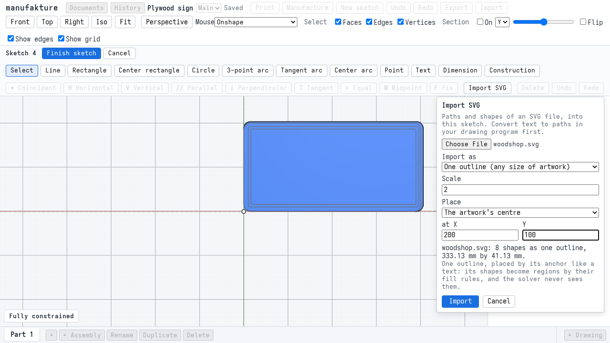

   **Import**: the sketch holds one SVG artwork entity, filled as eight regions. **Finish sketch**.

   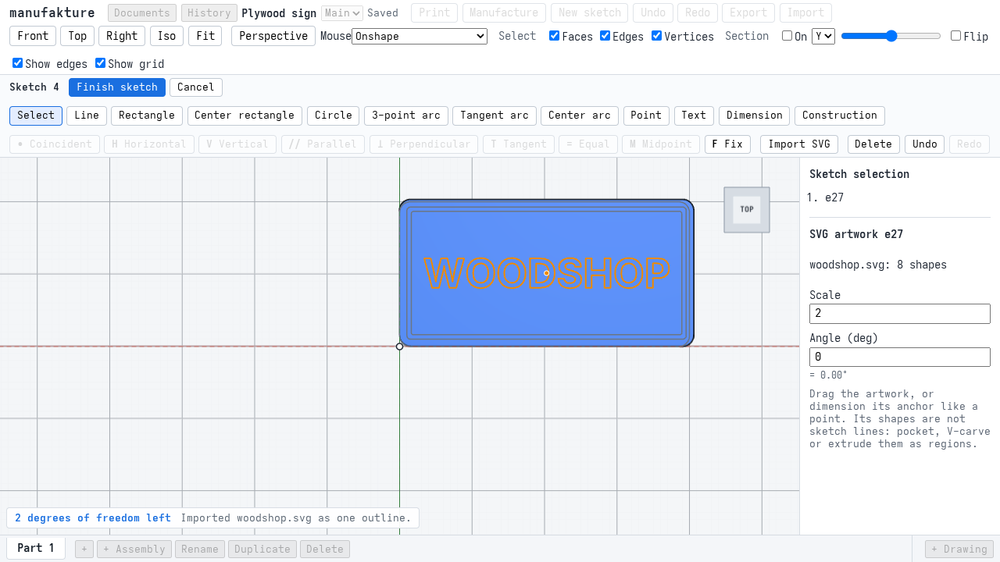

3. **The cuts.** The lettering's sketch is renamed **Lettering**, then three features, again by command: **Border recess** (the groove, 3 mm), **Mounting holes** (8 mm, through all) and **Lettering recess** (2 mm). Every feature has a tick.

   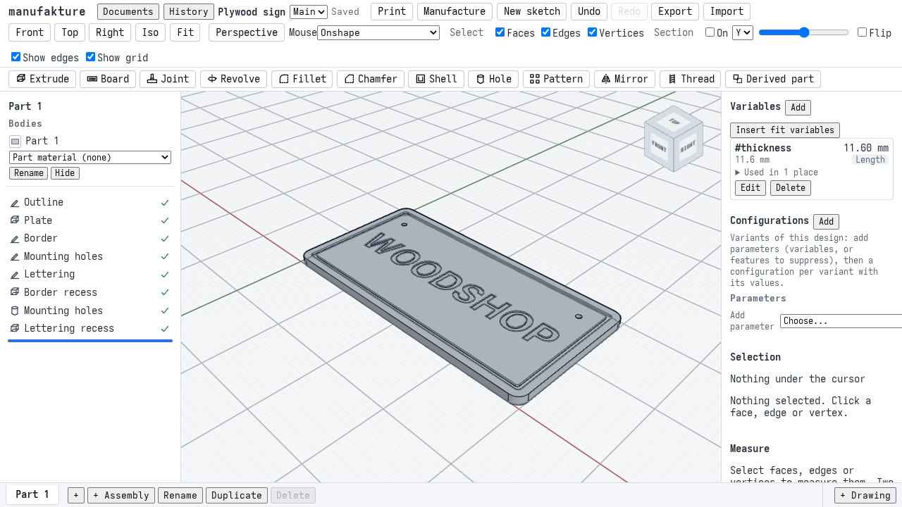

4. **Tools.** **Manufacture**, **Tools**: in **Built-in tools (Carbide 3D)**, **Use in document** for #301, #102 and #201, in that order. Each is copied into the document, as its tools 1, 2 and 3, each titled by its name ("#301 90 deg V-bit"), the number not repeated in front of it. The picture is taken in a taller window (1280 x 1000) so that all three, with their notes on the numbers not checked against Carbide 3D's figures, fit.

   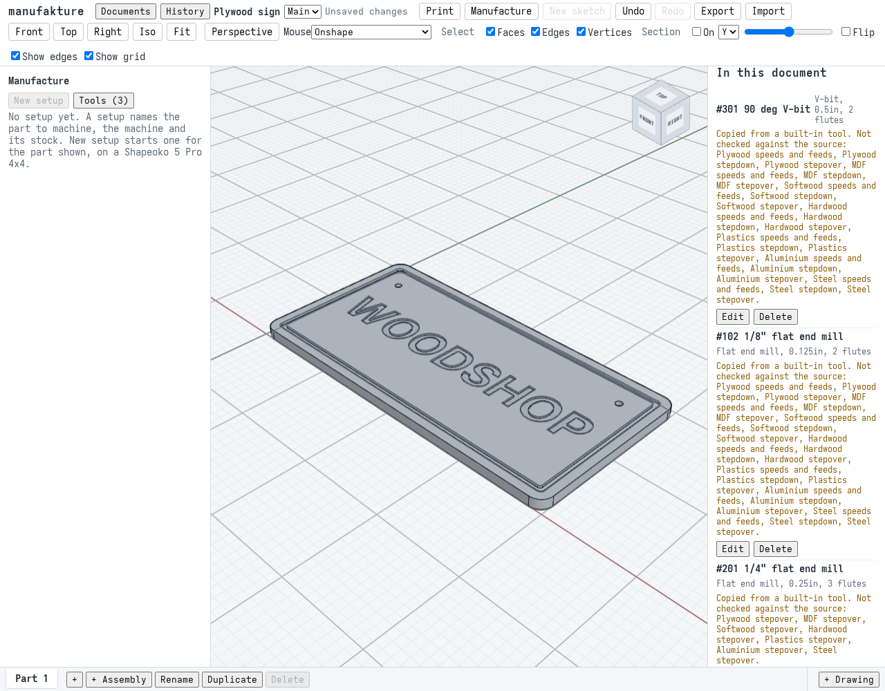

5. **The setup.** **New setup**: the machine is the Shapeoko 5 Pro 4x4 and the post Carbide Motion, by default. Material **plywood**. The WCS is the stock's front left corner at its top, and the stock comes from the part, both by default. Margins left, right, front and back `10 mm`, above and below `0 mm`; **Apply stock and heights**.

   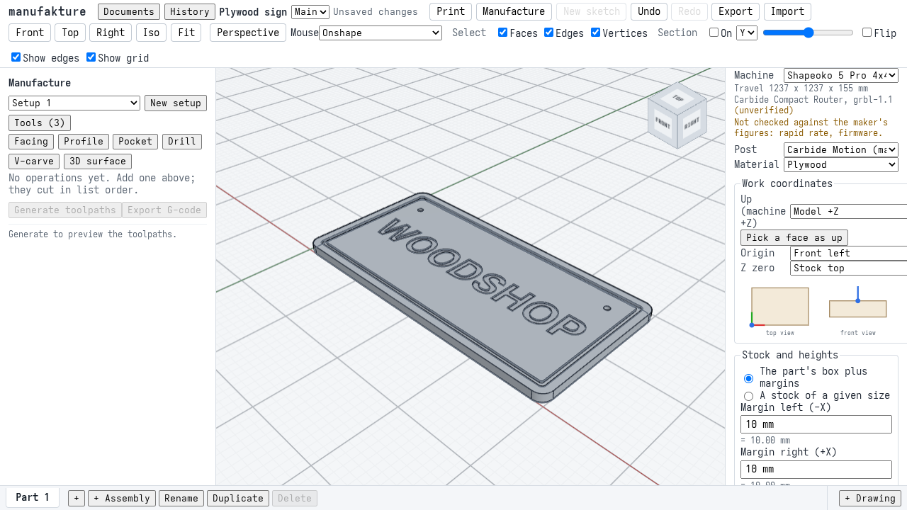

6. **Pocket the border.** **Pocket**, tool #102. The border's floor is picked in the view: **Top** view, zoomed in on the left side of the groove, and **Edges** and **Vertices** unticked in the view's Select filter so the click lands on the floor and not on an edge next to it. The dialog lists one source, a face of the border recess. OK.

7. **Bore the holes.** **Drill**, tool #102, the hole feature **Mounting holes**, **Add**: one source, "Holes of Mounting holes", each to its own depth. OK.

8. **V-carve the lettering.** **V-carve**: the V-bit is the default tool. The sketch **Lettering**, **Add its regions**. Maximum depth `2 mm`; tick **Clear the flat floor with an end mill first**, clearing tool #102.

   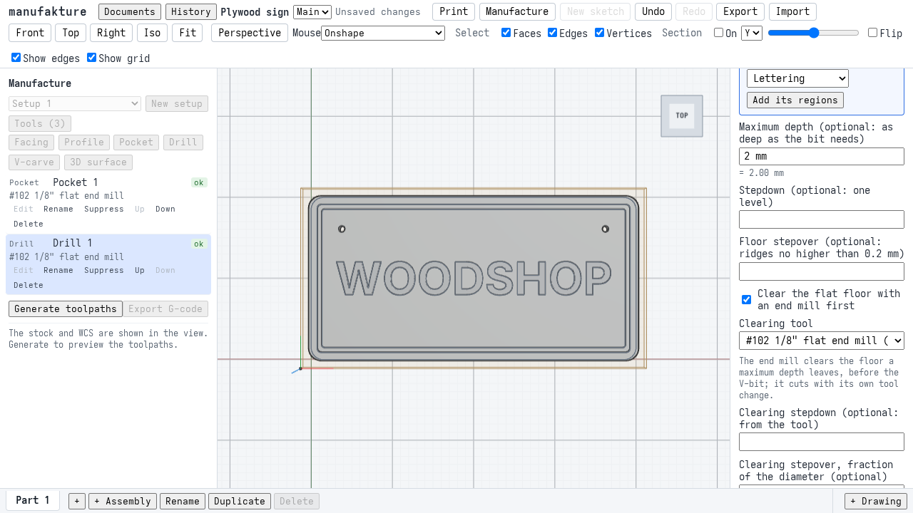

9. **Profile the outline.** **Profile**, tool #201, the sketch **Outline**, **Add its regions**. The side is **outside** and the depth **Through the stock** by default (0.2 mm below the stock bottom); tick **Tabs** (the defaults: 4 per loop, 6 mm wide, 2 mm high).

   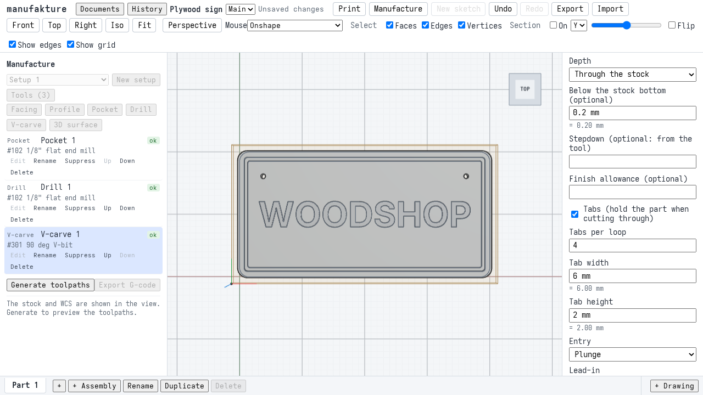

   Every operation shows **ok**.

10. **Generate.** **Generate toolpaths**: "Generated 4 of 4 operations." No operation has a warning. The V-carve has one note, from its clearing: "A helix does not fit in part of the pocket (room for a 0.29 mm radius); the tool ramps along the ring there instead." The letters' floors are a few millimetres wide, and the clearing's default helical entry does not fit in the narrowest of them, so it ramps there. The preview table gives each operation's cut length and estimated time, and the job's: 16,996 mm of cutting, 3,750 mm of rapids, 9,718 moves, 3 tool changes, an estimated 19:26.

    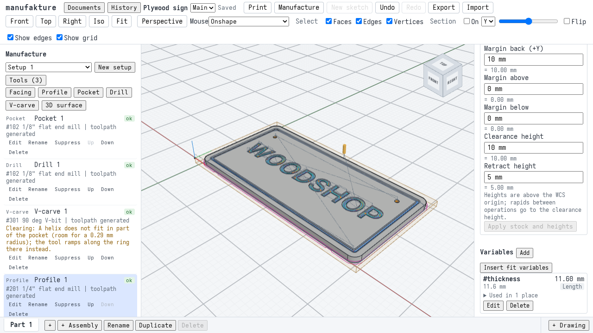

11. **Simulate.** Tick **Simulate material removal**: the whole program, 9,718 moves, on a heightmap of 2,761 x 1,447 cells of 0.15 mm, compared with the part's own heightmap. "No gouge"; "No rapid runs through material." Material is left on the part in 148,915 cells, up to 1.94 mm high, and all of them lie within the lettering's box: none on the border, the holes or the outline.

    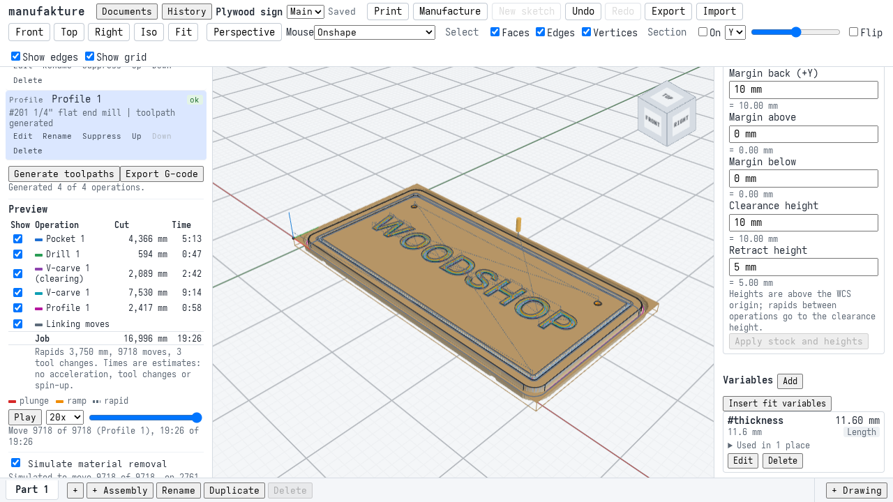

    Close up from above, the toolpaths hidden: the letters' walls are sloped where the V-bit cut them and straight in the model, which is where the material is left; their floors are cleared flat. A mounting hole is bored through, and the border's groove is cut.

    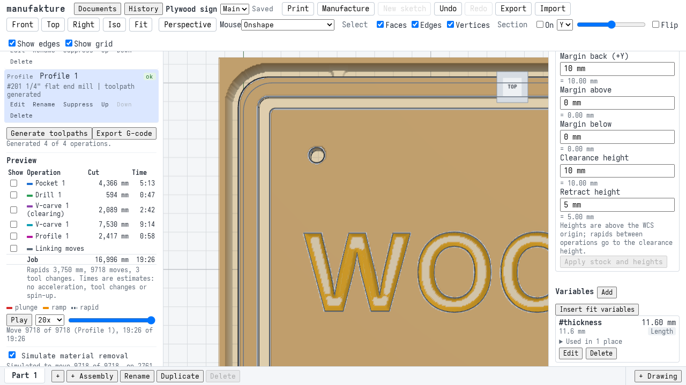

12. **Export, Carbide Motion.** **Export G-code**: the post is **Carbide Motion (machine default)**, one file with M6 at each tool change. The summary lists the tools in order (T102 for Pocket 1, T301 for V-carve 1, T201 for Profile 1), the estimated time 19:26, and two warnings: the clearing's note from step 10, and "Carbide Motion: 1 arc was written as straight lines (too small, or would fail the controller's arc check)." The setup sheet below it, dated with the computer's own date, gives the stock (420 x 220 x 11.6 mm, plywood), the work zero (stock top, front left corner) and how to zero it, and every tool change; it scrolls in its own frame, so the buttons stay in view. **Save G-code**.

    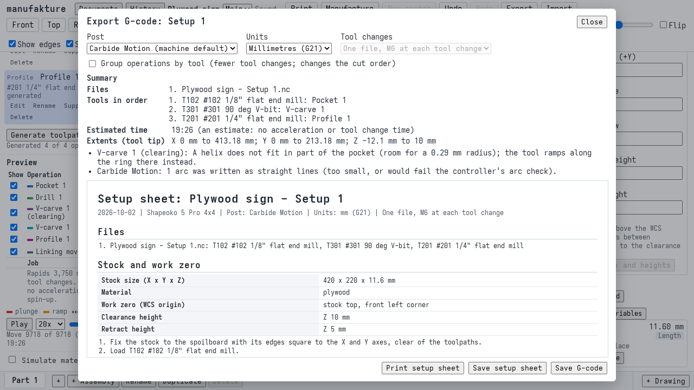

13. **Export, GRBL.** Post **GRBL**: tool changes default to one file per tool. The same two warnings, the second "Grbl 1.1: 1 arc was written as straight lines". **Save G-code**: a zip of three files, in cut order, and the setup sheet.

## The sign's volume, by hand

The plate, less the corners' squares plus their quarter discs, times the thickness: (400 x 200 - (4 - pi) x 15²) x 11.6 = **925,759.56 mm³**. Less:

- the groove: the ring between the rounded rectangle 380 x 180 (corner radius 5) and the one 368 x 168 (corner radius 3), times 3 mm: (68,378.54 - 61,816.27) x 3 = **19,686.80 mm³**;
- the holes: 2 x pi x 4² x 11.6 = **1,166.16 mm³**;
- the lettering: its area times 2 mm. The spec reads each glyph of "WOODSHOP" from the bundled Inter Bold with opentype.js, at a 40 mm cap height, and integrates its outline exactly (Green's theorem over its lines and quadratic Beziers).

That leaves 904,906.60 mm³ less the lettering. The app's body measures **891,956.92 mm³**, so the letters take about 12,950 mm³: about 6,475 mm² of letters, 2 mm deep. The spec requires the measured volume to equal the hand figure to 1 part in 10,000.

## The G-code files

| Post           | File                                                           | Size      | Lines | Tool changes |
| -------------- | -------------------------------------------------------------- | --------- | ----- | ------------ |
| Carbide Motion | `Plywood sign - Setup 1.nc`                                    | 221,489 B | 9,978 | 3 (M6)       |
| GRBL           | `Plywood sign - Setup 1 - 1 of 3 - #102 1_8_ flat end mill.nc` | 54,768 B  | 2,134 | none         |
| GRBL           | `Plywood sign - Setup 1 - 2 of 3 - #301 90 deg V-bit.nc`       | 166,103 B | 7,792 | none         |
| GRBL           | `Plywood sign - Setup 1 - 3 of 3 - #201 1_4_ flat end mill.nc` | 969 B     | 63    | none         |

The Carbide Motion file has exactly three tool changes, `M6 T102`, `M6 T301` and `M6 T201`, in that order, so Carbide Motion prompts for each tool (and a BitSetter measures it). The GRBL files have no M6 at all: each is run on its own after changing the tool by hand. The first GRBL file holds the pocket, the bores and the V-carve's clearing, all with #102.

Every file goes through the G-code verifier (`packages/cam/test/verify-gcode.ts`, T5.4d) with no issue: only the dialect's words, Grbl's arc rule on the rounded numbers, tool changes in the dialect's style, every move inside the machine's travel from the work zero, every cut inside the stock grown by the tool's radius, and nothing deeper than the stock bottom less 0.5 mm (the bores' breakthrough; the profile goes 0.2 mm below). The files are written to `apps/web/test-results/m5-sign/` (`carbide-motion/` and `grbl/`, with the zip and `numbers.json`); CI uploads that directory as the `m5-sign` artifact, and the optional `gcode-validate` job runs the GRBL files through Grbl's own parser (`gvalidate` from grbl-sim) and grblHAL's (`grblHAL_validator`). The Carbide Motion file is not given to them: `gvalidate` rejects its M6, and the grblHAL validator crashes on it.

## What the checks prove

The walkthrough is one test in one browser page: a failing step stops the rest.

| Check               | Where                           | What it asserts                                                                                                                                                                                                                                                                                        |
| ------------------- | ------------------------------- | ------------------------------------------------------------------------------------------------------------------------------------------------------------------------------------------------------------------------------------------------------------------------------------------------------ |
| The model           | `m5-sign.spec.ts`               | `#thickness` reads `11.60 mm`; the plate's volume is the hand figure; a click on the top face selects `extrude#1:cap:end`; every feature regenerates ok.                                                                                                                                               |
| SVG import          | `m5-sign.spec.ts`               | The dialog lies wholly in the window, defaults to one outline and counts "8 shapes as one outline"; the sketch then holds one outline entity, filled as 8 regions.                                                                                                                                     |
| The cuts            | `m5-sign.spec.ts`               | The body's volume is the plate less the groove, the holes and the lettering (its area from the font itself), to a relative 1e-4.                                                                                                                                                                       |
| Tools               | `m5-sign.spec.ts`               | #301, #102 and #201 from the built-in library become the document's tools 1, 2 and 3, each titled by its name alone (the number not shown twice).                                                                                                                                                      |
| Setup               | `m5-sign.spec.ts`               | A new setup defaults to the Shapeoko 5 Pro 4x4, the Carbide Motion post, the WCS at the top front left corner and stock from the part; the margins apply.                                                                                                                                              |
| Operations          | `m5-sign.spec.ts`               | Each has only its own source: the border's floor picked in the view, the hole feature (each hole to its own depth), the lettering's regions (the V-bit by default), the outline's regions (outside and through by default); all four ok.                                                               |
| Generate            | `m5-sign.spec.ts`               | "Generated 4 of 4 operations."; every toolpath generated; no message but the V-carve's one, the clearing's helix note; the preview plays every move with no error.                                                                                                                                     |
| Simulation          | `m5-sign.spec.ts`               | Every move simulated, no simulation error, "No gouge" and no gouge cell, "No rapid runs through material."; the material left is never higher than the letters' 2 mm depth, and every leftover cell lies within the lettering's box (as placed, widened by a cell and the 0.07 mm sideways allowance). |
| Export summary      | `m5-sign.spec.ts`               | Carbide Motion is the default post, nothing refused, exactly two warnings for each post: the clearing's note and the arcs-as-lines note, for 1 to 4 arcs (1 in this run, for both posts); the setup sheet's stock and work zero, and its tool changes in cut order.                                    |
| Carbide Motion file | `m5-sign.spec.ts`               | One file whose tool changes are exactly `M6 T102`, `M6 T301`, `M6 T201`; it passes the G-code verifier with no issue.                                                                                                                                                                                  |
| GRBL files          | `m5-sign.spec.ts`               | A zip of a setup sheet and three `.nc` files, 1 of 3 (#102), 2 of 3 (#301), 3 of 3 (#201); none has M6; each passes the verifier for its tool.                                                                                                                                                         |
| No page errors      | `m5-sign.spec.ts`               | No uncaught error in the page during the run.                                                                                                                                                                                                                                                          |
| Firmware parsers    | `gcode-validate` job (optional) | Grbl 1.1h's parser (`gvalidate`) and the grblHAL validator read the GRBL files from the `m5-sign` artifact; never blocks a merge.                                                                                                                                                                      |
| Per-feature specs   | `apps/web/e2e`, `packages/cam`  | Each M5 piece in more depth: operations, posts and their golden files, the simulation (`sim.test.ts`), SVG import.                                                                                                                                                                                     |

## Findings

One defect was fixed during this acceptance, in the simulation (`packages/cam/src/sim/part.ts`): it reported a gouge at the bored through holes that was not there. The part's heightmap is rastered from its mesh, whose chords stand inside the true circle of a hole, and a through bore goes 0.5 mm into the spoilboard; cells between a chord and the circle were taken to be part. Now a vertical wall that reaches the part's bottom (a through hole's, the outline's) sets no lower limit, since there is no part under it. `sim.test.ts` covers it ("a through hole bored past its bottom is not a gouge where the chords stand into it").

Four smaller defects in the app, seen in the screenshots, were fixed too:

- **The Import SVG dialog ran off the window's right edge.** It opened under its button, which sits near the right end of the sketch toolbar, and its 22rem ran past a 1280 px window; its Y field also overflowed the dialog. It now opens below the toolbar at its right end, never wider than the toolbar (`apps/web/src/sketcher/sketcher.css`), and the spec checks it lies in the window.
- **The Tools panel showed a built-in tool's number twice** ("#201 #201 1/4" flat end mill"): the built-in names start with the vendor's number, and the panel put the number in front again. A tool's title now gets its number only when the name does not already start with it (`numberedName`, `apps/web/src/cam/toolForms.ts`).
- **The setup sheet was dated in UTC.** The export dialog took the date from `toISOString()`, a day off in the evening west of Greenwich and the morning east of it. It now uses the computer's own date (`localDate`, `apps/web/src/cam/export/export.ts`).
- **The export dialog's buttons were below the fold in a 720 px tall window**, inside the dialog's scroll. The setup sheet's frame now takes the room left and scrolls itself, so the buttons stay in view (`apps/web/src/cam/export/export.css`).

The spec reads the simulation's leftover cells through a test hook added to the simulation panel (`window.__manufakture.camSim`, on only in development and e2e builds).

Found and not fixed, none of them a wrong cut:

- **The "sources lie at different heights" warning prints raw floating point.** `packages/regen/src/cam.ts` puts the lowest and highest heights into the message unrounded, so it can show float noise (a long tail of digits) where a millimetre value is meant.
- **A new operation's dialog starts with whatever faces are selected in the view.** After the pocket's floor is picked, the next operation's dialog would start with that floor as a source; the walkthrough clears the selection after the pocket.
- **The setup panel's fields are wider than the panel.** In the Manufacture workspace's side panel the machine and post selects and the work coordinate fields run past its right edge (see the setup picture), so a long machine name is cut off.
- **The arcs-as-lines warning names no arc.** The Carbide Motion export warns that 1 arc was written as straight lines, but not which operation it is in, so the user cannot judge whether it matters. The file is correct either way: the verifier passes it.

## Deviations from the plan

- The sign is 400 x 200 mm, not the plan's example of 300 x 150, so that the letters' floors are wide enough for the 1/8" end mill (see [The sign](#the-sign)).
- The GRBL export is three files, one per tool. The plan says two, but its own operations use three tools.
- The firmware parsers check only the GRBL files; the Carbide Motion file is checked by the G-code verifier alone (see [The G-code files](#the-g-code-files)).
- The physical cut (T5.7b) is not part of this task.

## Running it

```sh
pnpm --filter @manufakture/web e2e m5-sign
```

The run writes the files and `numbers.json` to `apps/web/test-results/m5-sign/`. With `M5_DOCS=1` it also refreshes the screenshots in `docs/m5-acceptance/` and writes `numbers.json` there:

```sh
M5_DOCS=1 pnpm --filter @manufakture/web e2e m5-sign
```

The screenshots are drawn by SwiftShader, as for M1 ([Screenshots and SwiftShader](m1-acceptance.md#screenshots-and-swiftshader)); they are documentation, not baselines, and nothing compares them.

## Numbers (estimates)

One run of the walkthrough on an AMD Ryzen 5 7600X (12 threads), Linux, a production build in headless Chromium with software WebGL. Timings are wall-clock times of that run, single measurements, not benchmarks; the cut time is the app's estimate from the feeds and the machine's rapid rate, ignoring acceleration, tool changes and spin-up. All of them are in `docs/m5-acceptance/numbers.json`.

| Measure                                      | Value  |
| -------------------------------------------- | ------ |
| Generating the four operations (9,718 moves) | 2.3 s  |
| Simulating the whole program                 | 10.0 s |
| Estimated cut time, the whole job            | 19:26  |

| Operation            | Cut length | Estimated time |
| -------------------- | ---------- | -------------- |
| Pocket 1             | 4,366 mm   | 5:13           |
| Drill 1              | 594 mm     | 0:47           |
| V-carve 1 (clearing) | 2,089 mm   | 2:42           |
| V-carve 1            | 7,530 mm   | 9:14           |
| Profile 1            | 2,417 mm   | 0:58           |

The rest of the 19:26 is rapids and linking moves. CI runners are slower; the spec's timeouts leave wide room.

## The cut (T5.7b)

Not done yet. A person cuts these files on a Shapeoko through Carbide Motion (and the GRBL files through another sender if one is at hand), first as an air cut above the stock, and records the machine, firmware and sender versions, the sheet's actual thickness, what happened at each tool change, any controller error, the cut time against the 19:26 estimate, and the sign's outer dimensions, hole positions, tab and pocket depths against the model. The results will be added here after the cut.
