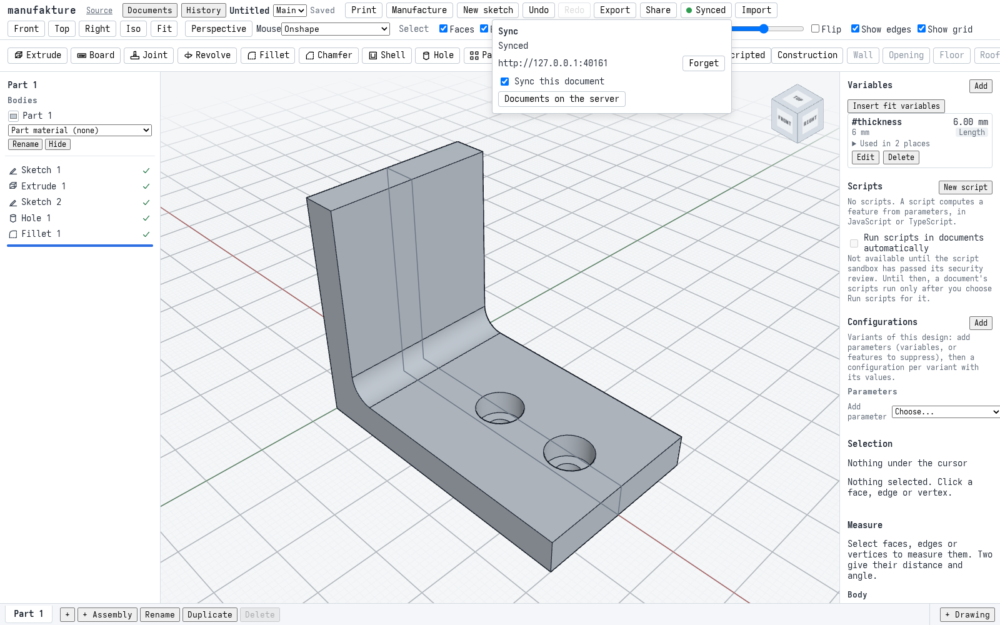
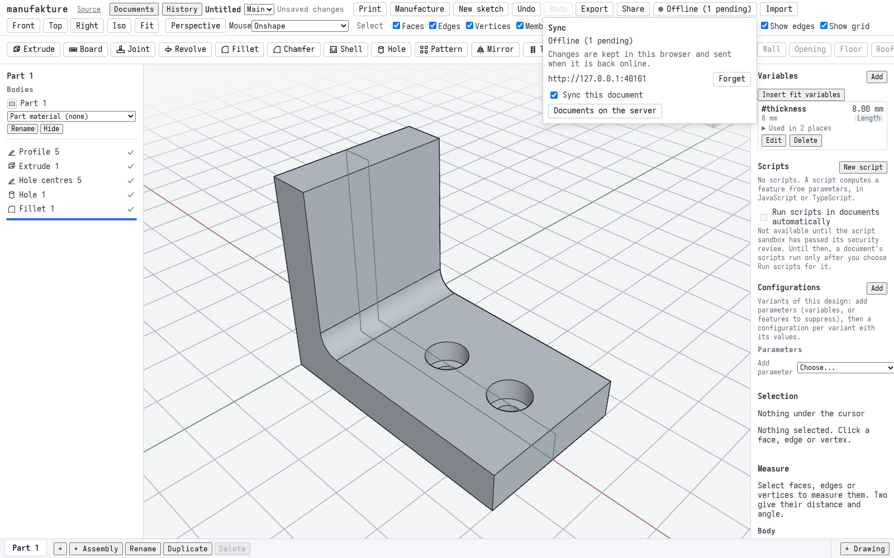
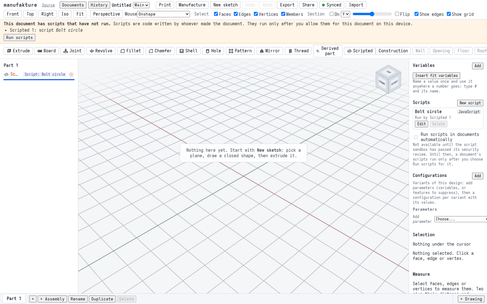
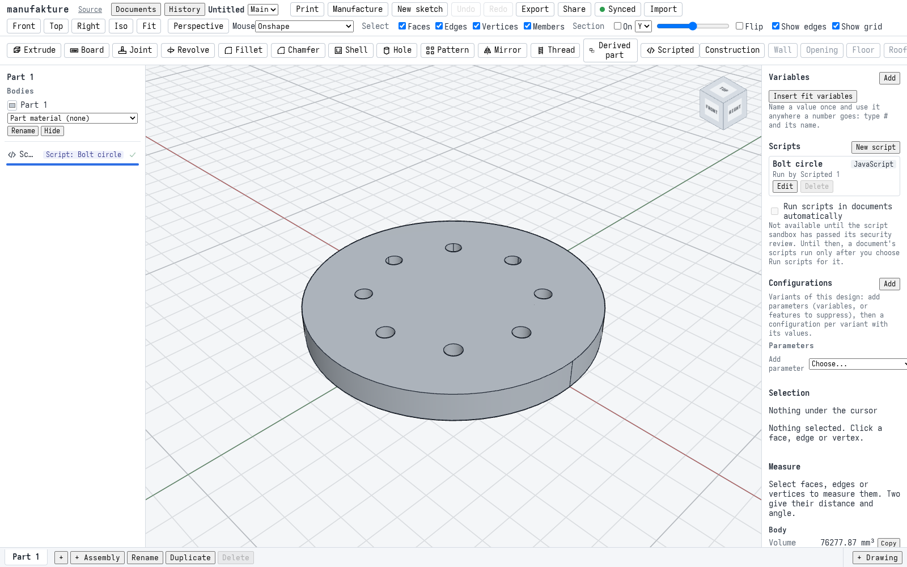
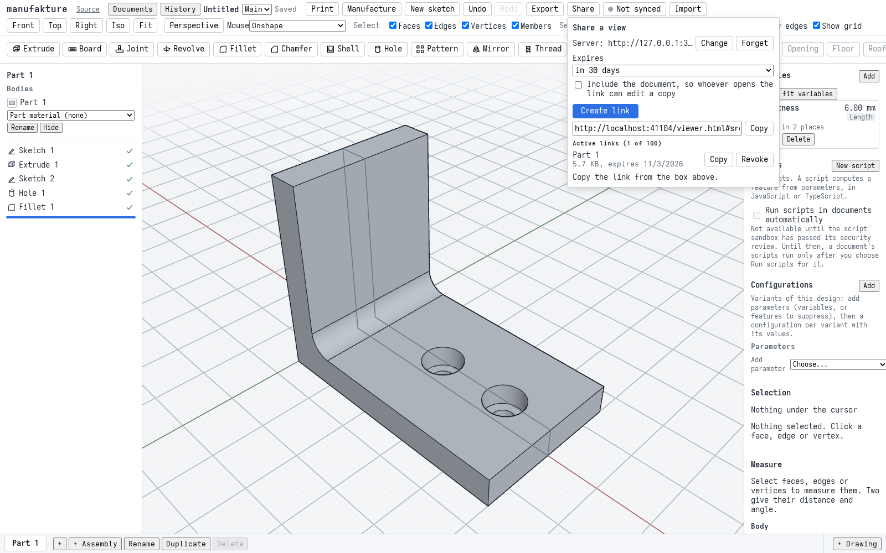
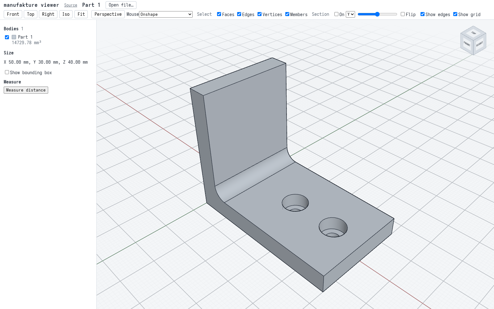

# M7 acceptance: sync, scripts, sharing and offline

Milestone 7 is "sync, scripting and sharing": a self-hosted server that keeps one user's documents in step across their browsers, scripted features that compute geometry from parameters, read-only share links, and an installed app that keeps working offline. The milestone is accepted when the M1 bracket syncs between two browsers that edit it online and offline, a scripted bolt circle regenerates identically in both, the bracket opens by link in a third browser with no credentials, and the installed app starts and edits offline ([M7 plan](plans/m7.md#t75-m7-acceptance-end-to-end-suite-and-docs), T7.5). This page walks through those four chapters, says which automated checks prove each step, and gives the measured budgets.

The suite is four specs with shared fixtures ([`m7-fixtures.ts`](../apps/web/e2e/m7-fixtures.ts)), so that one slow or failing chapter does not take the others with it:

1. **Sync**, [`m7-sync.spec.ts`](../apps/web/e2e/m7-sync.spec.ts): two browsers, one of them going offline.
2. **Scripts**, [`m7-scripts.spec.ts`](../apps/web/e2e/m7-scripts.spec.ts): two browsers.
3. **Sharing**, [`m7-share.spec.ts`](../apps/web/e2e/m7-share.spec.ts): one browser that publishes, three fresh ones that view.
4. **Offline**, [`m7-offline.spec.ts`](../apps/web/e2e/m7-offline.spec.ts): one browser, installed, then offline with the host down.

A "browser" here is a Playwright browser context: it has storage of its own (IndexedDB, localStorage, service worker), so as far as the app can tell it is a separate device. The screenshots and the numbers on this page are from one run of the suite.

## What is being tested against

**The server is self-hosted, for one user.** Chapters 1 to 3 start a real manufakture server ([`apps/server`](../apps/server/README.md)) in the test process, on a free port of `127.0.0.1`, over a temporary SQLite file, with share links on. That is the shape [product decision 0001](decisions/0001-m7-hosting-accounts-and-sharing.md) chose for M7: one instance, one bearer token, no accounts, SQLite. A hosted service is deferred, not ruled out. The server README says to keep the server on localhost or a private network behind a TLS reverse proxy, since the token is its only protection, and whoever runs an instance is responsible for what it stores and serves; the project operates no service of its own.

**Share links** use the server's defaults (`DEFAULT_SHARE_CONFIG` in [`apps/server/src/shares.ts`](../apps/server/src/shares.ts)): a link expires after 30 days unless the user picks another number of days or never (a server can refuse never with `MANUFAKTURE_SHARE_ALLOW_NEVER=off`); a bundle may be at most 50 MiB; one token may have 100 active links. The download route is the only public one, needs no token and answers only the viewer's origins under CORS.

**Scripts** in a document that arrived by sync do not run on a device until they are allowed there: the feature reports "Scripts not run" and a banner offers **Run scripts** for that document (T7.2d). A script the user writes or edits in the script editor is allowed as saved, in that document. The setting **Run scripts in documents automatically** is locked off, whatever storage holds, until the security sign-off T7.6b is recorded (`SCRIPTS_SECURITY_SIGNED_OFF` in [`apps/web/src/scripts/policy.ts`](../apps/web/src/scripts/policy.ts)). T7.6b is a human task; its input is the [M7 threat model](security/m7-threat-model.md).

## Chapter 1: sync

1. **Browser 1 builds and syncs the bracket.** An empty document; the M1 bracket built through the UI as `m1-bracket.spec.ts` does (`#thickness` 6 mm, extrude, two counterbored holes, the inside fillet); saved. In the **Sync** panel: the server's address and token, **Save**, then **Sync this document**. The upload is the document as it is, a snapshot: the server's log for it has no entries yet. The header reads **Synced**.

   

2. **Browser 2 opens it from the server.** In its own Sync panel, the same server and token, **Documents on the server**, and the bracket. Its features equal browser 1's, `#thickness` reads 6.00 mm and the body's volume is the bracket's at 6 mm.

3. **Edits travel both ways.** Ten renames, alternating: browser 1 renames Sketch 1 ("Profile 1" to "Profile 5"), browser 2 renames Sketch 2 ("Hole centres 1" to "Hole centres 5"). Each is timed from the edit until the other browser's document has the new name (the [sync round trip](#budgets)). Then both are synced with nothing pending and have the same features.

4. **Browser 2 edits offline.** Browser 2's context goes offline and its sync status becomes `offline`. It sets `#thickness` to 8 mm and regenerates to the 8 mm bracket; meanwhile browser 1 renames the extrusion "L profile" and syncs it. Browser 2 has its edit pending. Back online, both are synced, have the same features (the extrusion is "L profile" in both) and both show the 8 mm bracket.

   

5. **100 commands queued offline rebase.** Browser 2 goes offline again and makes 100 renames of Sketch 1 ("Offline 1" to "Offline 100"), each its own undo step and so its own pending entry: 100 pending. Browser 1 renames the hole feature "M4 counterbores" and syncs, which puts one entry on the server that browser 2 has not seen. Browser 2 comes back online and is timed until nothing is pending (the [rebase of 100 pending commands](#budgets)). The server's log then ends with browser 2's 100 entries in their order, and both browsers have Sketch 1 named "Offline 100" and the holes named "M4 counterbores".

6. **A conflict keeps the refused work on a branch.** The suite's server holds back browser 1's push messages for 2 seconds (a test hook of the server, `testReplyDelay`), so browser 1 does not hear of what browser 2 does next. Browser 2 deletes the fillet, and the server takes it; browser 1, not knowing, renames the fillet "Inside round". The server refuses that rename, since the fillet is gone, and browser 1 gets one notice that names the edit and a branch "Kept from sync ..." that holds its work as it was. The branch list in the header has **Main** and that branch. Both browsers converge on the server's document, with no fillet and 8 mm walls (the volume of the 8 mm bracket with holes and no fillet). Choosing the kept branch in browser 1 brings back the fillet, named "Inside round".

   

## Chapter 2: scripts

The script is the bolt-circle example of [`docs/user/scripting.md`](user/scripting.md) (held by the T7.2e determinism examples, `apps/web/e2e/script-examples.ts`): a disc 100 mm across and 10 mm thick with `count` holes of 6 mm through it on a circle, whose exact volume is pi x 10 x (50² - count x 3²).

1. **Automatic running is locked off.** In both browsers, **Run scripts in documents automatically** is unticked and disabled. The Scripts panel says why: "Not available until the script sandbox has passed its security review. Until then, a document's scripts run only after you choose Run scripts for it."

2. **Browser 1 writes and inserts it.** A synced document; **New script** in the Scripts panel, the name "Bolt circle" and the example's source in the editor, saved and closed. **Scripted** on the Features toolbar: the dialog shows the script's own parameter `count`, 6 by default; it is set to 8 and confirmed with **OK**, timed until the feature is built. The feature regenerates ok, no banner shows (the script was written here, so it is allowed here), and the volume is the bolt circle's with 8 holes.

   

3. **Browser 2: "Scripts not run".** Browser 2 opens the document from the server. A banner says "This document has scripts that have not run. Scripts are code written by whoever made the document. They run only after you allow them for this document on this device." and lists "Scripted 1: script Bolt circle". The feature's mark reads "Script: Bolt circle"; its result is an error with the script code `not-allowed` and a message that starts "Scripts not run". Browser 2's regen worker has run no script at all, before and after the document arrived.

   

4. **Run scripts.** Browser 2 clicks **Run scripts**, timed until the feature is built: the banner goes, the worker has now run the script, and the volume is the 8-hole one. The body is identical to browser 1's: the same body id, face, edge and triangle counts and measured volume, and the feature's regen cache key equals browser 1's.

   

5. **A change regenerates identically in both.** Browser 1 edits the feature to 12 holes. Both browsers regenerate it ok, with the 12-hole volume and equal cache keys, and the same body summary. Browser 2 is not asked again: the edit came from sync, but the choice to run this document's scripts on browser 2 stands. Neither browser had a page error.

## Chapter 3: sharing

1. **Publish.** Browser 1 builds the bracket and saves it. **Share**: the server's address and token, **Save**. The panel reads "Active links (0 of 100)" and **Expires** is "in 30 days". **Create link**, timed until the link shows. The link is the app's viewer page with the bundle's address on the server after `#src=`, ending in a 22-character share id, and one active link is listed.

   

   The header in this shot reads **Not synced**: sharing does not need the document to be synced. **Include the document** is left unticked, so the link carries a view only.

2. **A third browser opens it.** The link is opened three times, each in a new browser context with nothing stored and no token, as someone without the app would open it. Each time the viewer shows one body of 15 faces, sized "X 50.00 mm, Y 30.00 mm, Z 40.00 mm" (the bracket), with no viewer error. The viewer has no Share or Sync button; localStorage does not hold the token; and no request the viewer makes to the server carries an `Authorization` or `Cookie` header. Each opening is timed until the body is shown (the [viewer load](#budgets)).

   

## Chapter 4: offline

This chapter uses the switchable static host of [`pwa-host.ts`](../apps/web/e2e/pwa-host.ts), as `offline.spec.ts` does, rather than the preview server: it serves the e2e build with COOP and COEP and can go down, refusing and recording every request. The service worker is opted in.

1. **Install.** One visit, so the service worker precaches the app. The bracket is built and saved.
2. **Offline, host down.** The context goes offline and the host goes down too (Playwright's offline mode does not cover the service worker's own update checks). The app is opened afresh, timed until the stored bracket is regenerated (the [offline start](#budgets)): the same document comes back, all five features regenerate ok, the volume is the 6 mm bracket's, the page is cross-origin isolated, and the indicator reads **Offline**.
3. **Edit offline.** `#thickness` to 8 mm: the bracket regenerates to 8 mm and is saved. After another offline reload it is still 8 mm.

   

4. **Nothing reached the host.** While it was down, the only requests the host saw were the browser's own update checks of `/sw.js`, which fail harmlessly. No page error.

## What the checks prove

The sync and scripts chapters share their browsers and server across their tests, so they run in order and a failing test skips the rest of its chapter.

- **Sync and open from the server** (`m7-sync.spec.ts`, test 1): the first upload is a snapshot (no log entries); browser 2 opens the document from the server with the same features, `#thickness` 6.00 mm and the bracket's volume.
- **Edits both ways** (`m7-sync.spec.ts`, test 1): ten renames, five each way, each seen by the other browser; afterwards both synced, nothing pending, equal features.
- **Offline edit converges** (`m7-sync.spec.ts`, test 2): status `offline` and work pending in browser 2; after reconnecting, both synced with equal features, browser 1's rename and browser 2's 8 mm walls in both, and the 8 mm volume in both.
- **Rebase of 100** (`m7-sync.spec.ts`, test 3): 100 pending entries; exactly one other entry on the server meanwhile; after reconnecting, nothing pending, the server's log ends with browser 2's 100 entries in order, and both browsers have both edits.
- **Conflict and branch** (`m7-sync.spec.ts`, test 4): one notice naming the refused edit; a branch "Kept from sync ..." on the server and in the branch list; both converge with no fillet; the branch holds the fillet as browser 1 renamed it. No page errors in the chapter.
- **Automatic running locked off** (`m7-scripts.spec.ts`): the setting is disabled and unticked in both browsers.
- **Scripts not run until allowed** (`m7-scripts.spec.ts`): in browser 2, before Run scripts, the banner names the feature and the script, the result is `not-allowed` with "Scripts not run", and the regen worker ran no script.
- **Identical regeneration** (`m7-scripts.spec.ts`): after Run scripts, and again at 12 holes, status ok, the exact bolt-circle volume, equal regen cache keys and equal body summaries (id, faces, edges, triangles, volume) in both browsers. No page errors.
- **Publish** (`m7-share.spec.ts`): "Active links (0 of 100)", expiry 30 days by default, a link to the viewer with the server's share address, one active share.
- **Read-only view, no credentials** (`m7-share.spec.ts`): three fresh contexts each show the bracket (15 faces, 50 x 30 x 40 mm); no Share or Sync button; no token in storage; no `Authorization` or `Cookie` header on any request to the server; no page errors.
- **Offline after install** (`m7-offline.spec.ts`): the stored document reopens with every feature ok and the right volume, the Offline indicator shows, an 8 mm edit is saved and kept across an offline reload, and no request but `/sw.js` reaches the host while it is down. No page errors.

Each M7 piece also has specs of its own in more depth: `sync.spec.ts`, `sync-history.spec.ts`, `branches.spec.ts` and `merge.spec.ts` (sync, versions and branches), `scripting.spec.ts` and `scripting-cross-browser.spec.ts` (scripts, including Firefox and WebKit with `E2E_CROSS_BROWSER=1`), `share.spec.ts` and `viewer.spec.ts` (sharing), `offline.spec.ts` and `offline-skew.spec.ts` (the installed app), `csp.spec.ts` (the Content-Security-Policy); and the server's own tests ([`apps/server/README.md`](../apps/server/README.md#tests)).

## Budgets

One run in headless Chromium with SwiftShader (software WebGL), against the e2e production build. These are wall-clock measurements, estimates and not benchmarks; they are in [`m7-acceptance/numbers.json`](m7-acceptance/numbers.json). They move between runs: another run of the same suite measured, for example, 54 ms for the rebase of 100 and 980 ms for the offline start. CI runners are slower; the specs' timeouts leave wide room, and no budget fails the run.

| Budget                         | Measured                                  |
| ------------------------------ | ----------------------------------------- |
| Sync round trip                | median 54 ms, max 82 ms (10 renames)      |
| Rebase of 100 pending commands | 76 ms                                     |
| Script regen, 8 holes          | 130 ms (browser 1), 137 ms (browser 2)    |
| Script regen, 12 holes         | 78 ms (browser 1), 79 ms (browser 2)      |
| Click to built body            | 256 ms after OK, 245 ms after Run scripts |
| Edit to new volume             | 218 ms                                    |
| Publish                        | 63 ms                                     |
| Viewer load                    | median 153 ms (159, 153, 152)             |
| Offline start                  | 967 ms                                    |

What each one times:

- **Sync round trip**: a rename in one browser until the other browser's document has it (push, server, push to the other browser), five renames each way.
- **Rebase of 100 pending commands**: back online with 100 queued commands until the server has confirmed all of them. This is end to end (reconnect and hello, rebase over the one remote entry, push all 100), not the rebase step alone.
- **Script regen**: the scripted feature's own regen time as the model reports it, first in each browser at 8 holes (browser 2's after **Run scripts**), then at 12 holes.
- **Click to built body**: wall clock from the click until the scripted feature is built, browser 1 inserting it (**OK**) and browser 2 allowing it (**Run scripts**).
- **Edit to new volume**: browser 1's **OK** on 12 holes until its measured volume is the 12-hole one.
- **Publish**: **Create link** until the link shows.
- **Viewer load**: a new context opening the link until the bracket is shown (page load, download from the server, unpack, first render), three times. Measured in the page from navigation start, the median is 150 ms.
- **Offline start**: the installed app opened offline with the host down until the stored bracket is regenerated.

## Running it

From `apps/web`, against a production build that the Playwright config makes and serves with `vite preview` (pick a free port: an existing server on that port is reused as it is):

```sh
E2E_PORT=<port> ./node_modules/.bin/playwright test e2e/m7- --reporter=list
```

With `--reporter=list` the budgets are printed as `M7 budget <name>: {...}`, and every run merges them into one JSON file, `$M7_BUDGETS` or `/tmp/mfk-m7-budgets.json` (the system's temporary directory). With `M7_DOCS=1` the run also takes the screenshots in `docs/m7-acceptance/` in a 1600 x 1000 window and merges the numbers into `docs/m7-acceptance/numbers.json`:

```sh
M7_DOCS=1 E2E_PORT=<port> ./node_modules/.bin/playwright test e2e/m7- --reporter=list
```

The screenshots are drawn by SwiftShader, as for M1 ([Screenshots and SwiftShader](m1-acceptance.md#screenshots-and-swiftshader)); they are documentation, not baselines, and nothing compares them.

## Findings

Seen in the screenshots and not fixed (follow-ups, none of them a wrong result):

- **Browser 2's view says "Nothing here yet"** while the scripts have not run (shot 5): the empty-document hint "Start with New sketch" shows over a document that has a feature, only one that has not been built. The banner above says the right thing; the hint should not show then.
- **The Offline indicator covers the first part tab** (shot 9): it sits at the bottom left over the "Part 1" tab.
- **The conflict notice is cramped** (shot 3): the message, the branch sentence and **Dismiss** share one row of the Sync panel, so both texts wrap into narrow columns.
- **A scripted feature's name is cut to "Sc..."** in the tree (shots 4 to 6), where its "Script: Bolt circle" mark takes the room.

## Not covered by this suite

- **The security sign-off, T7.6b.** A human decision on the [threat model](security/m7-threat-model.md): whether the server and share links may be exposed beyond localhost and private networks, and whether scripts may run automatically. Until it is recorded, the server is documented for localhost and private networks only and **Run scripts in documents automatically** stays locked off. The suite checks the lock; it does not stand in for the review.
- **The agent surface.** Driving manufakture from an agent with a review gate is not part of M7; it is planned as its own milestone, M8 ([plan](plans/agent-surface.md)).
- **Postgres and a multi-user server** (T7.1g and T7.1h) were not built: product decision 0001 chose self-hosted, single-user SQLite for M7. Nor is there a hosted service; it is deferred.
- **Real deployments.** The suite runs the server in-process on `127.0.0.1` without TLS or a reverse proxy; the deployment recipes are in [`docs/hosting.md`](hosting.md) and the server README, and the container and headers are checked by CI separately.
