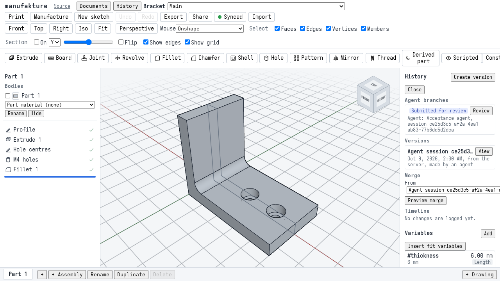
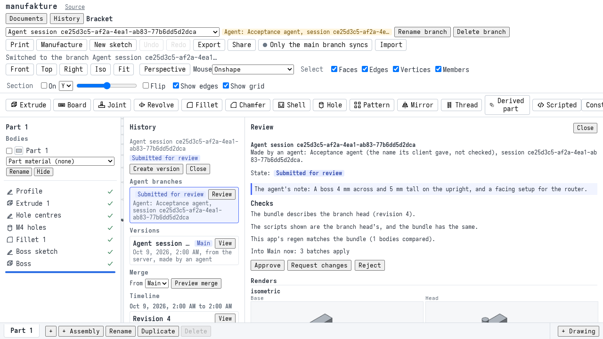
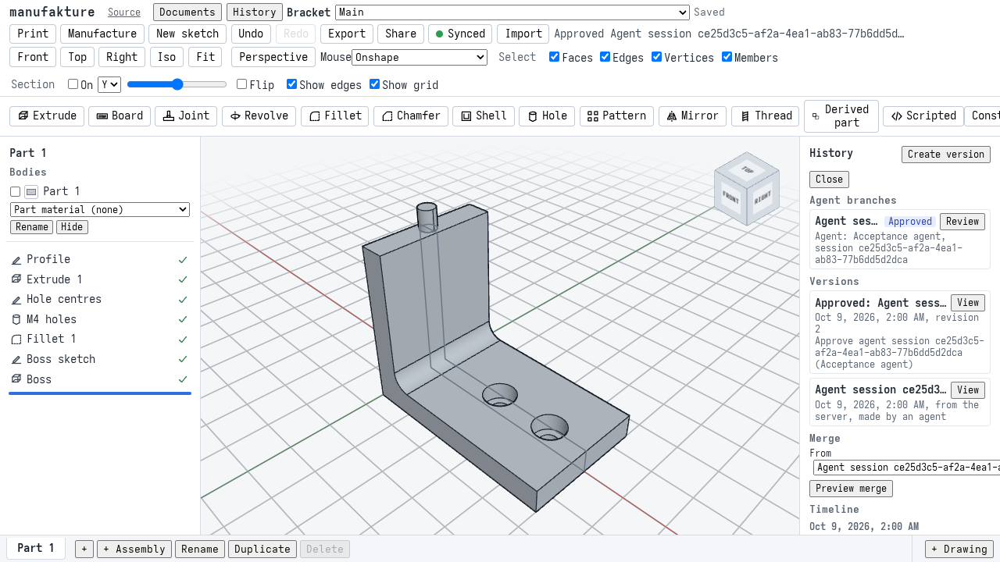
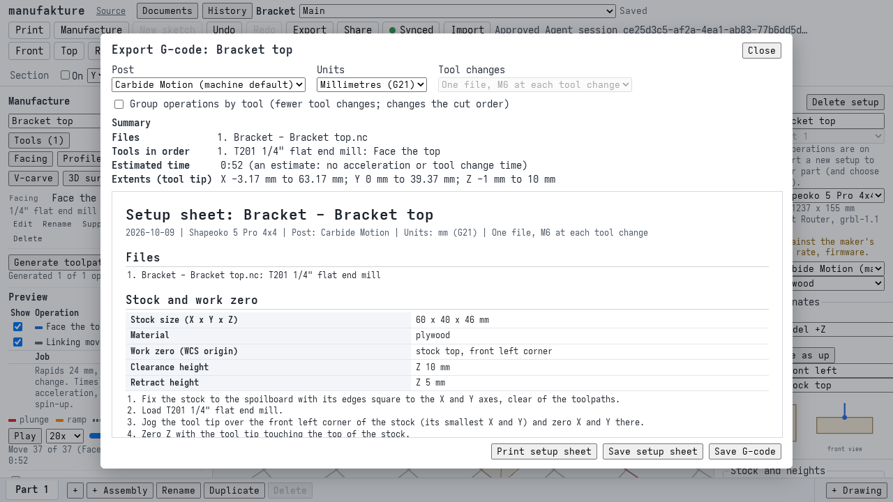

# M8 acceptance: the agent surface

Milestone 8 lets a person task an AI agent with driving manufakture while they stay at the wheel: the agent works through the MCP server on a branch of its own, and nothing it does reaches Main until the person has reviewed it in History and approved it ([agent surface plan](plans/agent-surface.md#t88-m8-acceptance-end-to-end-suite-and-docs), T8.8; [ADR 0016](adr/0016-agent-sessions.md)). The milestone is accepted when one suite takes the M1 bracket from a sync server through an MCP session (three batches, one of them refused and corrected), a review and an approval in a browser, to G-code exported from Main whose version names the review it came from; and when the three scenarios have been run against real requests and their gaps written down. This page walks through the suite, says which checks prove each step, summarises the scenarios and gives the measured budgets.

The suite is one spec with its own fixtures: [`m8-agent.spec.ts`](../apps/web/e2e/m8-agent.spec.ts) and [`m8-fixtures.ts`](../apps/web/e2e/m8-fixtures.ts). Its three tests run in order and share one server, one agent and one browser context: the agent's work, the review, and the export from Main.

## What is being tested against

**A real sync server and a real MCP server, as a person runs them.** The suite starts a manufakture server ([`apps/server`](../apps/server/README.md)) in the test process, on a free port of `127.0.0.1`, over a temporary SQLite file, with agent tokens on and CORS for the app's origin. The owner creates the M1 bracket there (`bracketDocument()` from `packages/session`'s fixtures, the document every M8 test starts from) and issues an agent token scoped to it through the server's API (`POST /api/agent-tokens`). The MCP server ([`apps/mcp`](../apps/mcp/README.md)) is then started the way an MCP client starts it: a child process, `node --expose-gc --import packages/session/src/worker/ts-hooks.ts src/main.ts`, over stdio, configured from the environment with `MANUFAKTURE_SYNC_URL`, the agent token in `MANUFAKTURE_SYNC_TOKEN` and a temporary `MANUFAKTURE_OUTPUT`. Sessions use the default worker engine. The owner's token never reaches the agent.

**The suite is the agent.** It talks to the MCP server with the MCP SDK's own client (`Client` and `StdioClientTransport` from `@modelcontextprotocol/sdk`, from apps/mcp's install), calling the tools a model would call, with fixed arguments. That makes it repeatable; how real models behave with the same tools is what the [scenarios](#the-scenarios) are for.

**The reviewer is a browser.** One Playwright browser context, Chromium with SwiftShader, on the e2e production build, opens the bracket from the server with the owner's token, as a person does in the Sync panel.

**Exports are not gated.** At ADR 0016's acceptance the maintainer dropped the export gate: every export is allowed from any branch, an unreviewed agent branch included, in the app and through the MCP `export` tool. The suite checks that an agent branch exports G-code, and it has no case that expects an export to be refused. What review guards is Main.

## The walkthrough

### 1. The agent works the bracket and submits it

1. **The agent connects.** The MCP server starts and initializes; `list_documents` returns the bracket and no branches. The time from the spawn until `open_session` answers is the [session cold start](#budgets).
2. **It opens a session.** `open_session` on the bracket answers a session id, a new agent branch named "Agent session `<id>`", review state `open` and revision 1. The branch lives on the sync server.
3. **Batch 1, a boss.** `apply` with the label "Add a boss on the upright": a sketch with one circle 4 mm across on the upright's top and a 5 mm extrude of it, written with symbolic ids (`sketch#$bossSketch`, `extrude#$boss`, `e$circle`). It answers revision 2, no errors, and the measured bounding box now reaches 45 mm.
4. **Batch 2, refused.** `apply` with the label "Face the stock top": a CAM setup (plywood stock with 5 mm margins and 1 mm on top, on the default machine with its Carbide Motion post) and a facing that cuts with `tool#1`, a tool the document does not have. Core refuses the whole batch, as data: `{ ok: false, error: { kind: 'core', error: { code: 'dependency', blockers: ['tool#1'] } } }`, "... cuts with tool tool#1, which is not in the CAM tools". Nothing is written: the server's log of the branch never sees it.
5. **Batch 2, corrected.** The same batch with a 1/4" flat end mill (#201, a plywood preset) added first by a symbol, `tool#$mill`, and the facing cutting with it. It answers revision 3 and the symbol table `$mill: tool#1`, `$top: setup#1`, `$face: facing#1`.
6. **Batch 3, a name.** `apply` "Name the setup": `editCamSetup` with the real id from that table, naming it "Bracket top". Revision 4.
7. **The server holds the three batches.** The server's log of the agent branch has exactly "Add a boss on the upright", "Face the stock top", "Name the setup", in that order.
8. **Dry runs.** Five dry runs of batch 1 (applied, regenerated and put back; nothing written) give the second half of the [batch round trip](#budgets).
9. **G-code from the unreviewed branch.** `export` with `format: 'gcode'` and the setup: one file, `branch.nc`, with `(Setup: Bracket top)` and `M6 T201`, and the result says `reviewed: false` and review `open`. No export is refused.
10. **Submit.** `submit_for_review` with a note to the reviewer builds the review bundle in Node (the four fixed views of the base and the head, measurements, quantities, the batches) and stores it with the branch on the server: `{ ok: true, revision: 4, review: 'submitted' }`. Its time is the [bundle build](#budgets). `get_review` reads it back as submitted, with the client's name. The session is closed (its branch stays), and the token never appears in the server's log lines on stderr.

### 2. The owner reviews and approves in the browser

1. **The bracket from the server.** The browser opens the app, sets the server and the owner's token in the Sync panel, lists the server's documents and opens the bracket. It is synced, with nothing pending.
2. **History shows the agent branch.** Under **Agent branches**: "Submitted for review", made by "Acceptance agent", with the session id.

   

3. **The Review view.** **Review** opens the bundle: the agent's client name and note, the three batches by label, and eight renders (base and head of four views), each shown only after its SHA-256, size and PNG header check out. The checks: the bundle describes the branch head (revision 4); this app compares its own regen only with the branch open, so the reviewer chooses **Open the branch**, the branch becomes the open one, and the app's regen matches the bundle (the [review budget](#budgets) times this); a merge into Main now applies all three batches.

   

4. **Approve.** "Approved and merged". The branch is **Approved**, Main is open again with the boss and the "Bracket top" setup, and History has a version of Main named "Approved: Agent session `<id>`". The browser syncs it: on the server the branch's review state is `approved` and the version is in Main's list.

   

### 3. G-code from Main, and the review it came from

1. **Main's work names its review.** The library's `reviewOf` for the document (the latest version of Main at or before its head that records a review) returns the version "Approved: Agent session `<id>`" and its review record: the agent branch, the session id, the client's name and bundle revision 4.
2. **Export from Main.** On Main, the **Manufacture** workspace shows the agent's setup, "Bracket top". **Export G-code** generates the facing first and summarises: the Carbide Motion post, one tool "T201 1/4" flat end mill: Face the top", the time and extents, and the setup sheet. **Save G-code** downloads "... - Bracket top.nc", with `(Job: Bracket)`, `(Setup: Bracket top)`, `M6 T201` and the operation "(Face the top)".

   

3. **A new session starts from that version.** The agent opens another session on the bracket: its base version is the approval version (an agent branch starts from Main's head version when there is one), and its tree has the boss. The session is closed. No page error was raised in the browser at any point.

## What the checks prove

| Requirement (T8.8)                          | Where it is checked                                                                                                                                         |
| ------------------------------------------- | ----------------------------------------------------------------------------------------------------------------------------------------------------------- |
| A suite that starts a sync server           | `startServer` in `m8-fixtures.ts`: apps/server in process, agent tokens, CORS for the app                                                                   |
| Opens the M1 bracket through the MCP server | `startAgent` spawns apps/mcp over stdio with an owner-issued agent token; `list_documents`, `open_session`                                                  |
| Three batches, one refused and corrected    | Test 1: the boss, the CAM batch refused as a `CoreError` (`dependency`) and then applied, the rename; the server's log holds exactly the three              |
| Submits                                     | Test 1: `submit_for_review` answers `submitted` at revision 4; `get_review` agrees                                                                          |
| Reviews and approves in a browser context   | Test 2: History, the Review view's checks (fresh, regen match, 3 batches apply), Approve; Main has the work; the server says `approved`                     |
| Exports G-code from Main                    | Test 3: the Manufacture workspace on Main, Export G-code, the saved file's contents                                                                         |
| Whose version names the review it came from | Test 3: `reviewOf` returns "Approved: Agent session ..." with the session, branch, client and bundle revision; a new session's base version is that version |
| No export is refused on the branch          | Test 1: `export` of G-code from the agent branch, before any review, succeeds with `reviewed: false`                                                        |

The pieces the suite runs through are tested on their own as well: the MCP tools ([`apps/mcp/test`](../apps/mcp/test), including `sync.test.ts` and `stdio.test.ts`), sessions and their limits (`packages/session`), the bundle builder (`packages/review`), the server's authorization of agent tokens (`apps/server/test/agents.test.ts`), the browser's following of agent branches (`apps/web/src/sync/agents.integration.test.ts`) and the Review view's request-changes, stale and mismatch cases ([`agent-review.spec.ts`](../apps/web/e2e/agent-review.spec.ts)).

## The scenarios

Three requests a person might really make, each with a scripted test that checks what the tools can and cannot do today, and a live run in which an agent was given the request and the MCP server. The live runs were done headless with Claude Code by the pipeline agent: Claude Code driving manufakture through the MCP server, the way the maintainer would task an agent and stay at the wheel. Only Claude Code was run live; no other MCP client was tried. Each write-up has the full account and the transcripts' whereabouts (kept outside the repository).

| Scenario                                                      | Request                                                                                                         | Live run                                                                                                                                                                      |
| ------------------------------------------------------------- | --------------------------------------------------------------------------------------------------------------- | ----------------------------------------------------------------------------------------------------------------------------------------------------------------------------- |
| [Drawer slides](m8-acceptance/drawer-slides.md) (T8.6a)       | A drawer in a cabinet's bottom opening on 18" side-mount slides, 1/2" clearance each side, check it opens fully | Run A on the guide's 11-1/4" deep cabinet: stopped and asked, rightly (an 18" slide does not fit). Run B on a 22" deep copy: built and submitted in 4 min 43 s, 28 tool calls |
| [Heat-set inserts](m8-acceptance/heat-set-inserts.md) (T8.6b) | M3 heat-set inserts in the four lid bosses of a printed enclosure, and clear lid screw holes                    | Done and submitted in 86 s, 20 tool calls, two batches; it sized the insert hole from memory and flagged the thin 1.5 mm wall                                                 |
| [Remodelling a frame](m8-acceptance/remodel-frame.md) (T8.6c) | On the shed, move the door 2' right, add a 3' window on the back wall, show the new lumber                      | The edits right in 70 s; the "new lumber" answer was a net difference of two takeoffs, read with its own shell because `get_quantities` was too large for the client          |

### Gaps, all three scenarios

Each write-up has the full table with evidence and a suggested follow-up per row. In short (P: a hypothesis from the plan; F: found while running):

| Gap                                                                               | Scenario         | From | Status                       |
| --------------------------------------------------------------------------------- | ---------------- | ---- | ---------------------------- |
| No purchased-part catalog (slides as components with sizes, fit data, BOM lines)  | Drawer slides    | P    | Confirmed                    |
| Interference checked at one pose, not over a mate's travel                        | Drawer slides    | P    | Confirmed                    |
| Variables cannot take a measured value                                            | Drawer slides    | P    | Confirmed                    |
| The cut list does not separate hardware lines                                     | Drawer slides    | P    | Not confirmed                |
| Solved instance poses and slider values not readable; clamps to limits are silent | Drawer slides    | F    | Confirmed                    |
| `render` draws the part studio only, never an assembly at a pose                  | Drawer slides    | F    | Confirmed                    |
| Mate connector frames are not readable                                            | Drawer slides    | F    | Confirmed                    |
| No distance between faces of two bodies                                           | Drawer slides    | F    | Partly                       |
| Faces of an opening split by joints have fragile names                            | Drawer slides    | F    | Partly                       |
| Insert, clearance and thread tables not served to agents                          | Heat-set inserts | P    | Partly                       |
| No hole type for inserts                                                          | Heat-set inserts | P    | Confirmed                    |
| No wall thickness check around a hole                                             | Heat-set inserts | P    | Confirmed                    |
| Section renders show hole depth                                                   | Heat-set inserts | P    | Not confirmed                |
| `find_geometry` lacks boss hints (axis point, coaxial query)                      | Heat-set inserts | P    | Partly                       |
| Caps of one extrude of several regions have fragile names                         | Heat-set inserts | F    | Confirmed                    |
| Blind holes always end in a drill point                                           | Heat-set inserts | F    | Confirmed                    |
| No construction phases (existing, new, demolish)                                  | Remodel frame    | P    | Confirmed                    |
| An as-built frame off the layout cannot be modelled (no added members)            | Remodel frame    | P    | Partly                       |
| A layout change renumbers studs and silently re-targets per-member changes        | Remodel frame    | P    | Confirmed, and worse         |
| `setDomainData` replaces a whole namespace                                        | Remodel frame    | P    | Not confirmed (for the diff) |
| Two branches touching one wall or the domain data conflict as a whole             | Remodel frame    | P    | Confirmed                    |
| `get_quantities` is too large for an agent to read                                | Remodel frame    | F    | Confirmed                    |
| No way to list a feature's members                                                | Remodel frame    | F    | Confirmed                    |
| The construction drawing set is app-only                                          | Remodel frame    | F    | Confirmed                    |

As the plan expected, the gaps are mostly about what agents need to know (catalogs, tables, measured variables, readable poses and members, phases) rather than missing tools. M8 accepts with them written down; the write-ups list follow-ups ready to file, none of them filed by this task. The heat-set write-up marks one of them, fixing the authoring guide's advice on inserts, as done.

Live runs also showed the same environment note three times: `--allowedTools "mcp__manufakture__*"` alone did not keep Claude Code from its other tools in a headless run (it ran harmless shell commands, and in the remodel run used its shell to read an oversized result). A stricter run would also pass `--disallowedTools`.

## Budgets

Measured by the suite (the numbers below are from one run, in [`m8-acceptance/numbers.json`](m8-acceptance/numbers.json); a second run gave the same to within about 10 percent, except the regen check, 255 ms). Wall-clock times, estimates and not benchmarks; no budget fails the run.

**Machine:** AMD Ryzen 5 7600X (6 cores, 12 threads), 62 GiB of memory, Linux x64, Node 26.10.0 (CI runs Node 24). The MCP server ran with worker engines, the sync server in the test process on the same machine, the browser was headless Chromium 153 with SwiftShader.

| Budget                | Measured                                                                                                    |
| --------------------- | ----------------------------------------------------------------------------------------------------------- |
| Session cold start    | 3.86 s: the process ready in 2.00 s, then `open_session` in 1.86 s                                          |
| Batch round trip      | 43 ms (the boss), 12 ms (the CAM batch), 6 ms (the rename); 4 ms for the refused one; dry runs median 25 ms |
| Bundle build          | 2.40 s (`submit_for_review`, the bundle with 8 renders, uploaded)                                           |
| Review in the browser | 172 ms from Open the branch until its regen matches; 233 ms from Approve until merged and recorded          |

What each one times:

- **Session cold start**: from spawning the MCP server's process until `open_session` answers. "Process ready" is the spawn until the client is initialized: Node starting, the TypeScript sources transpiled by the loader hooks, the server reading its configuration. `open_session` then lists the server's document, makes the agent branch and its start version on the server, starts a session worker, loads the kernel and the solver in it and runs the first regen.
- **Batch round trip**: one `apply` call as the client sees it, over stdio: the commands checked and applied by core, the regen (cached by input hash, so only what changed is rebuilt), the entry written to the server's log, and the report back. The first batch builds a sketch and an extrude; the CAM batches touch no geometry. A dry run of the boss regenerates and puts everything back without writing; the first of the five is the slowest in every run (44 to 51 ms).
- **Bundle build**: `submit_for_review` as the client sees it: base and head regenerated, eight PNG renders (the four fixed views of each, rendered in Node by `packages/render`), measurements, quantities and the batches, then the bundle and its images uploaded to the server. The parts were not timed separately; the renders are likely most of it.
- **Review in the browser**: the app's own regen of the branch head and its comparison with the bundle, and the approval (compare-and-set on the server, the merge by replay into Main, the version that records the review).

## Running it

From `apps/web`, against the production build the Playwright config makes and serves with `vite preview`. Pick a free port: an existing server on that port is reused as it is, even another checkout's.

```sh
E2E_PORT=<port> ./node_modules/.bin/playwright test e2e/m8-agent.spec.ts --reporter=list
```

The suite needs the workspace's install (the MCP server runs from apps/mcp's sources, with its dependencies). With `--reporter=list` the budgets are printed as `M8 budget <name>: {...}` and merged into one JSON file, `$M8_BUDGETS` or `/tmp/mfk-m8-budgets.json` (the system's temporary directory). With `M8_DOCS=1` the run also takes the screenshots in `docs/m8-acceptance/` (1280 x 720) and merges the numbers, with the machine, into `docs/m8-acceptance/numbers.json`:

```sh
M8_DOCS=1 E2E_PORT=<port> ./node_modules/.bin/playwright test e2e/m8-agent.spec.ts --reporter=list
```

On a machine without Chromium's shared libraries, point `PLAYWRIGHT_BROWSER_LD_LIBRARY_PATH` at an unpacked copy (see the Playwright config). The whole suite takes about 20 seconds after the build.

The screenshots are drawn by SwiftShader, as for M1 ([Screenshots and SwiftShader](m1-acceptance.md#screenshots-and-swiftshader)); they are documentation, not baselines, and nothing compares them.

## Security review: sign-off pending

The written review of everything M8 exposes is [docs/security/m8-threat-model.md](security/m8-threat-model.md) (T8.7a): attackers, mitigations with code and tests, and what is accepted or open (among them O1, exports are not gated; O11, agent tokens kept in plaintext by the client; N-1, the Review view shows the bundle's account of the commands without recomputing it; N-2, no per-token cap on log storage). **The maintainer's sign-off is pending; it is owed by the maintainer and no agent may record it.** What it gates is documenting agent tokens for use beyond localhost, not this acceptance: the suite runs on `127.0.0.1`, and until the sign-off [docs/user/agents.md](user/agents.md) keeps "Use it on localhost only for now".

## Findings

Seen while building the suite and in its screenshots; none is a wrong result, and nothing was changed in the product:

- **The regen check waits for the reviewer.** The Review view compares the app's regen with the bundle only with the branch open; a reviewer who opens Review from Main sees "not open" and must choose **Open the branch** before Approve is possible. That is by design (the check needs the branch's model), but a first-time reviewer may not expect the extra step.
- **Session ids crowd the UI.** The branch name "Agent session" plus a full UUID fills the branch selector and is cut short in History's lists and version names ("Agent ses...", "Approved: Agent sess...", shots 2 and 3). A short form of the id, or the client's name, would read better.
- **The header says "Only the main branch syncs"** while an agent branch is open (shot 2), although that branch did come from the server. It is right about this browser's edits (they are not pushed on an agent branch), but reads oddly next to a branch that is plainly on the server.

## Not covered by this suite

- **A live model in the loop.** The suite calls the tools with fixed arguments; how real agents use them is the scenarios' job, and their live runs are one or two runs each, of one client.
- **The maintainer's security sign-off** (above), and any use of agent tokens beyond localhost.
- **Request changes and resubmission, a stale bundle, a measurement mismatch, update from Main and resuming in another process.** Checked elsewhere: [`agent-review.spec.ts`](../apps/web/e2e/agent-review.spec.ts), `apps/mcp/test/sync.test.ts` and `apps/web/src/sync/agents.integration.test.ts`.
- **A live browser tab driven by the agent**, a command-line interface, and the gap follow-ups: later phases in the plan.
