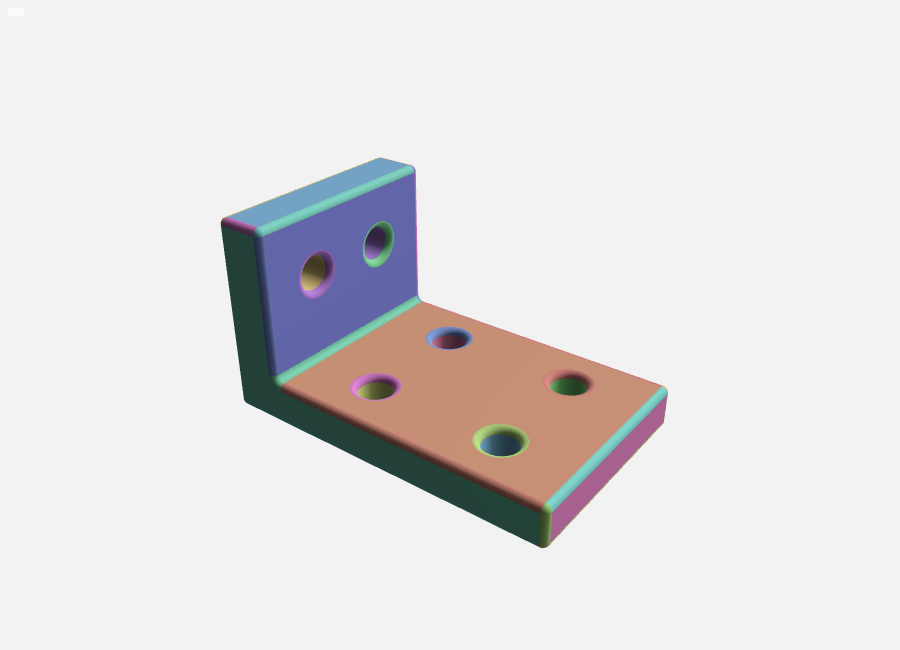

# T0.2 spike: OpenCASCADE (libcascade) in a Web Worker

- Status: done
- Date: 2026-09-26
- Code: [`spikes/occt-worker/`](../../spikes/occt-worker/)
- Raw results: [`spikes/occt-worker/results/`](../../spikes/occt-worker/results/) (every number below comes from these files)

## Summary

OpenCASCADE compiled to WebAssembly is viable as the geometry kernel in a browser worker, with one serious caveat about memory.

- `libcascade` 3.0.2 (OCCT 8.0.1) loads in a module Web Worker behind Comlink, builds and fillets solids, meshes them, and hands per-face triangle data to three.js as transferred typed arrays. It works under both the Vite dev server and a production build, single and multi-threaded.
- Download: the `.wasm` is 40.7 MiB raw, 11.6 MiB gzip, 7.8 MiB brotli. Cold start in Chromium is about 355 ms (single) and 418 ms (multi) from `new Worker()` to a usable kernel, measured on localhost, so network time is not included.
- Speed is fine for interactive work: a 30-edge fillet on a bracket with holes takes 17.5 ms; a whole regen of that part (booleans, fillet, mesh, extraction) takes 74 ms.
- **Memory: libcascade's `delete()` frees nothing for 2102 of the 5298 classes it binds**, including `TopoDS_Shape`, `gp_Pnt`, `TopLoc_Location` and every builder we use. The destructor it registers with embind is an empty wasm function. The spike deletes every object it creates (proved by instrumentation), yet the heap still grows by 2.2 MiB per bracket regen, the same as when nothing is deleted at all. Releasing owned data before `delete()` cuts that to 0.49 MiB per regen, and recycling the instance bounds it. This is an upstream bug ([taucad/opencascade.js#40](https://github.com/taucad/opencascade.js/issues/40), open, symptom only); this spike identified the cause.

Recommendation for M1: single-threaded prebuilt libcascade, pinned, behind a coarse-grained kernel API in a worker that applies the release-before-delete rules and recycles the instance at a heap threshold; in parallel, prototype a custom build with C++ helpers (see [Recommendation](#recommendation-for-m1)).

## Environment

| Item                  | Value                                                                                                        |
| --------------------- | ------------------------------------------------------------------------------------------------------------ |
| Machine               | Ryzen 5 7600X desktop (6 cores, 12 threads), 62 GiB RAM, Linux x64                                           |
| Browser               | Playwright headless Chromium 153.0.8010.12 (Chrome for Testing headless shell), software WebGL (SwiftShader) |
| Node                  | v26.10.0                                                                                                     |
| Kernel package        | `libcascade` 3.0.2 from npm (taucad's maintained fork of opencascade.js), OCCT 8.0.1, Emscripten 6.0.5       |
| Page and worker       | Vite 8.3.1 production build served by `vite preview` with COOP/COEP headers, Comlink 4.4.2, three.js 0.186.1 |
| Cross-origin isolated | yes in every browser run (`crossOriginIsolated: true`, `hardwareConcurrency: 12`)                            |

Build settings of the prebuilt binaries, from the package's `opencascade_*.provenance.json`: `-O3` with `wasm-opt -O4`, no LTO, SIMD, native wasm exceptions, `-sMALLOC=mimalloc`, `INITIAL_MEMORY=128MB`, `MAXIMUM_MEMORY=4GB`, `ALLOW_MEMORY_GROWTH`, 8 MiB stack, `EVAL_CTORS=2`, 4496 bound symbols. The multi build adds `-pthread`, `SHARED_MEMORY` and `PTHREAD_POOL_SIZE=navigator.hardwareConcurrency`.

## What the spike does

```
spikes/occt-worker/
  src/pipeline.ts   build part, fillet, mesh, extract (runs in the worker and in Node)
  src/worker.ts     Comlink API: init (timed load phases), run, heapTrace
  src/main.ts       three.js viewer, one material per B-rep face; window.spike for the scripts
  src/track.ts      leak-check instrumentation (records every embind object handed to JS)
  src/cases.ts      the benchmark cases
  scripts/          measure.ts (driver), node-child.ts, destructor-audit.ts
  results/          raw JSON and screenshots
```

The pipeline, per run:

1. **Build.** Either a 40 x 30 x 20 mm box, or an L bracket: an 80 x 50 x 10 plate fused with a 12 x 50 x 45 upright, `ShapeUpgrade_UnifySameDomain`, then six `BRepAlgoAPI_Cut` holes (four through the plate, two through the upright).
2. **Fillet** every edge that borders two different faces (cylinder seam edges excluded): 12 edges on the box (2 mm), 30 on the bracket (1.5 mm).
3. **Mesh** with `BRepMesh_IncrementalMesh` (0.1 mm linear, 0.5 rad angular deflection; the "fine" case uses 0.01 mm and 0.1 rad).
4. **Extract** each face's `Poly_Triangulation` into one `Float32Array` of positions, one of normals, a `Uint32Array` index buffer and a `Uint32Array` of per-face `[firstIndex, indexCount]` ranges. Reversed faces flip normals and winding. The buffers are transferred (zero copy) to the page.
5. **Render**: the page builds a `BufferGeometry` with one group and one colour per B-rep face.



To reproduce: `pnpm --filter @manufakture/spike-occt-worker measure` (all sections, about 7 minutes), or name sections: `measure sizes`, `measure audit`, `measure node`, `measure browser`. `pnpm --filter @manufakture/spike-occt-worker dev` opens the viewer (`?variant=multi`, `?part=box`). `pnpm --filter @manufakture/spike-occt-worker test` runs the pipeline test in Node. The spike is a workspace member that typechecks and lints with the repo but is excluded from the root `build` and `test`.

## Method

- **Sizes**: Node `zlib` on the files shipped in the npm package; gzip levels 6 and 9, brotli quality 5 and quality 11 with a 24-bit window.
- **Cold start (browser)**: each sample uses a fresh browser context (empty HTTP and code caches), loads the page, then times `spike.start()` on the main thread (from `new Worker()` to the worker's `init()` resolving). Inside the worker, Emscripten's `instantiateWasm` hook takes over loading so each phase is timed: download plus compile, instantiate, and "runtime init" (everything after instantiation until the instance is usable: static constructors, embind registration of 5298 classes, pthread pool start-up). Three load modes: `streaming` (`WebAssembly.compileStreaming(fetch())`), `arraybuffer` (`fetch().arrayBuffer()` then `WebAssembly.compile()`), and `glue` (Emscripten's own `instantiateStreaming`, total only). Then a reload in the same context gives the warm number, and terminating and restarting the worker in the same page gives the recycle cost. 5 samples each, medians reported.
- **Cold start (Node)**: 5 fresh processes per build, same phase split.
- **Pipeline timings**: 1 first run (reported separately), then 10 runs; medians. Browser timings are taken inside the worker; the round trip adds the Comlink call and transfer.
- **Memory**: see [Memory and the leak check](#memory-and-the-leak-check).

## Results

### Download size

| File                      | Raw bytes  | gzip -9    | brotli -11 | brotli / raw |
| ------------------------- | ---------- | ---------- | ---------- | ------------ |
| `opencascade_single.wasm` | 42,691,285 | 12,154,297 | 8,223,986  | 19.3 %       |
| `opencascade_single.js`   | 66,865     | 24,840     | 22,213     | 33.2 %       |
| `opencascade_multi.wasm`  | 42,674,572 | 12,185,026 | 8,210,601  | 19.2 %       |
| `opencascade_multi.js`    | 74,007     | 27,881     | 24,628     | 33.3 %       |

The small `init.single.js` / `init.multi.js` loaders are 2.4 and 3.0 KB raw. The spike's own page bundle (three.js plus viewer) is 557 KB raw, 113 KB brotli, and the worker chunk 13 KB raw.

Computed, not measured: the single build (wasm plus glue, brotli) would take about 6.6 s to download at 10 Mbit/s, 1.3 s at 50 Mbit/s and 0.66 s at 100 Mbit/s. It is a one-off cost if the asset is served with a content hash and long-lived caching.

In the production build Vite emits each `.wasm` as its own hashed asset (`?url` import), and copies the Emscripten glue verbatim, so OCCT stays a separately loaded, replaceable module as the product decisions require.

### Cold start

Browser, main thread from `new Worker()` to a usable instance, median of 5. The phase columns are measured inside the worker for the cold load. Worker restart is terminate plus start again in the same page (warm HTTP cache).

| Build  | Load mode   | Cold   | Download + compile            | Instantiate | Runtime init | Warm (reload) | Worker restart |
| ------ | ----------- | ------ | ----------------------------- | ----------- | ------------ | ------------- | -------------- |
| single | streaming   | 356 ms | 54 ms (overlapped)            | 11 ms       | 281 ms       | 320 ms        | 315 ms         |
| single | arraybuffer | 371 ms | 64 ms (40 fetch + 24 compile) | 8 ms        | 286 ms       | 338 ms        | 336 ms         |
| single | glue        | 353 ms | not split                     |             |              | 315 ms        | 327 ms         |
| multi  | streaming   | 418 ms | 62 ms (overlapped)            | 9 ms        | 337 ms       | 377 ms        | 376 ms         |
| multi  | arraybuffer | 431 ms | 75 ms (51 fetch + 24 compile) | 8 ms        | 339 ms       | 387 ms        | 392 ms         |
| multi  | glue        | 418 ms | not split                     |             |              | 376 ms        | 375 ms         |

Node, median of 5 fresh processes: single 481 ms (runtime init 421 ms), multi 560 ms (runtime init 484 ms). Reading the file takes 4 to 17 ms and `WebAssembly.compile` about 37 to 45 ms.

What this shows:

- **Compile is not the bottleneck.** `WebAssembly.compile` returns after about 24 ms for 42 MB in the browser, far too fast for a full compile, so V8 is deferring the work (lazy compilation: functions are compiled on first call). The real compile cost is spread over runtime init and the first pipeline run. Runtime init (static constructors plus embind registering 5298 classes) is about 80 % of the cold start (78 to 81 % across builds and modes).
- **`compileStreaming` saves little here**: 15 ms single, 13 ms multi against the arraybuffer path, because on localhost the download is only about 40 ms. Over a real network the overlap of download and compile matters more, and streaming is the right default anyway; the glue's own path already streams (`glue` matches `streaming`).
- **Warm starts save only 33 to 43 ms**, since the dominant cost (runtime init) is paid again every time. `vite preview` also sends `Cache-Control: no-cache`, so the warm load still revalidates the asset.
- **Multi costs about 60 ms more** at start-up, mostly in runtime init (spawning 12 pthread workers).
- **First run after init is slow**: 44 ms for the box against 11 ms steady state, 197 ms for the bracket against 74 ms, as lazy compilation catches up.

### Pipeline timings

Browser, inside the worker, single build, median of 10 runs after a first run:

| Case         | Filleted edges | Triangles | Build (booleans) | Fillet   | Mesh     | Extract  | Total    | First run | Round trip |
| ------------ | -------------- | --------- | ---------------- | -------- | -------- | -------- | -------- | --------- | ---------- |
| box          | 12             | 628       | 0.05 ms          | 4.91 ms  | 3.31 ms  | 3.02 ms  | 11.37 ms | 43.96 ms  | 11.55 ms   |
| bracket      | 30             | 6,058     | 16.39 ms         | 17.53 ms | 17.16 ms | 21.95 ms | 73.59 ms | 197.27 ms | 74.84 ms   |
| bracket fine | 30             | 115,998   | 15.72 ms         | 16.88 ms | 403.9 ms | 285.9 ms | 722.7 ms | 801.6 ms  | 723.5 ms   |

Node gives the same picture (single build): box 12.13 ms total, bracket 68.34 ms (fillet 15.6 ms), bracket fine 767.6 ms.

Mesh extraction:

- **Time** is dominated by embind call overhead, not by copying. The extraction calls `Node(i)`, `Normal(i)` and `Triangle(i)` once per node or triangle, and each call returns a new embind object: 241,873 objects for one fine-bracket run (see the tracker table below). That costs about 2.5 microseconds per triangle (computed: 285.9 ms / 115,998). A C++ helper that copies the arrays in one call would remove this (not measured, see [custom build](#custom-build-and-trimming)).
- **Memory, JS side**: the transferred buffers are 20,608 bytes (box), 171,400 bytes (bracket) and 2,897,560 bytes (fine bracket), 25 to 33 bytes per triangle. They are transferred, not copied, so the worker keeps nothing.
- **Memory, WASM side**: a single run of any case fits inside the initial 128 MiB heap (heap size unchanged after the first run of each case in Node); the leak is covered below.

Render (geometry upload plus one frame) took 4 to 16 ms, but on SwiftShader software GL, so it says nothing about a real GPU.

### Single vs multi-threaded

Multi build in the browser, `parallel: true` sets `BOPAlgo_Options.SetParallelMode(true)` and meshes faces in parallel:

| Case         | Single, total | Multi parallel, total | Multi parallel, mesh     | Multi parallel, first run |
| ------------ | ------------- | --------------------- | ------------------------ | ------------------------- |
| box          | 11.37 ms      | 7.65 ms               | 1.17 ms (single: 3.31)   | 935.1 ms                  |
| bracket      | 73.59 ms      | 52.82 ms              | 4.13 ms (single: 17.16)  | 59.4 ms                   |
| bracket fine | 722.7 ms      | 379.7 ms              | 55.79 ms (single: 403.9) | 394.5 ms                  |

With `parallel: false` the multi build performs like the single build (bracket 72.36 ms, fine 704.3 ms in the browser); in Node its extraction is a little slower (bracket 31.4 ms against 22.1 ms).

- **Only meshing speeds up**: 4.2x on the bracket and 7.2x on the fine bracket. Fillet (about 17 ms) and the small booleans (about 15 ms) do not change; filleting is sequential in OCCT, and two-solid booleans are too small to split.
- **Extraction is the limit.** On the fine bracket, extraction (291 ms) is now 77 % of the parallel run, and it runs on one thread.
- **Costs**: about 60 ms more cold start; COOP/COEP on every page (already set, but it blocks third-party embeds that do not opt in); 12 extra workers; a first parallel call of 935 ms in the browser (1159 ms in Node), which only happens once per instance; and the first parallel run grows the linear memory from 128 MiB to 318.6 MiB (Node), which is never returned (per-thread stacks and allocator arenas).
- libcascade's own guide reports similar magnitudes: 1.06x for incremental meshing alone and 1.81x for a boolean grid with 12 workers, 188 ms of thread spawn, about 96 MB of stacks ([multi-threading guide](https://libcascade.xyz/docs/package/guides/multi-threading); not measured here).

## Memory and the leak check

### How the numbers behave

- WebAssembly linear memory starts at `INITIAL_MEMORY` (128 MiB here; `heapBytesAfterInit` is 134,217,728 bytes in every run) and grows when the allocator runs out. Emscripten grows by at least 20 % (capped at the request plus 96 MiB), which gives the steps seen below: 128, 153.6, 184.4, 221.3, 265.5, 318.6, 382.4, 458.9, 550.7 MiB. **It never shrinks**: a `WebAssembly.Memory` cannot give memory back, so the only way to return it is to drop the instance.
- `buffer.byteLength` is therefore reserved memory, not live data. Right after init only **39.6 MiB** of the 128 MiB is in use (single; 39.7 MiB multi), which includes the 8 MiB stack and the static data. The rest is free space the allocator (mimalloc) hands out before the memory has to grow.
- Three different things move these numbers, and they must not be confused:
  1. **Initial memory**: 128 MiB reserved at start, of which about 40 MiB used. A fixed cost.
  2. **Growth from the peak working set**: if one operation needs more than the free space, memory grows once and stays grown, even after everything is freed. A single run of every case here fits in the initial heap, but the first parallel run in the multi build grows it to 318.6 MiB.
  3. **Leak**: bytes that stay in use after a run. This shows as steady growth over many runs. Because of the free space, byteLength stays flat for dozens of leaking runs before it moves, so a before/after byteLength over a few runs proves nothing.
- To measure the leak itself, `node-child.ts leakprobe` runs the pipeline N times in a fresh process, then asks the allocator for 64 KiB blocks until the memory would have to grow. Bytes in use = byteLength minus what could still be allocated. The difference between N = 10 and N = 60, divided by 50, is the leak per run. The probe is deterministic (two separate measurement runs gave identical values), and its resolution is one 64 KiB block over 50 runs, about 1.3 KiB per run.

### Every created object is deleted

`src/track.ts` wraps every embind class on a dedicated instance and records each object handed to JS (from `new`, a static call or a method call, including multi-value returns). After a run, any recorded object whose `isDeleted()` is false is one the code forgot to delete. Node, single build ([`results/node.json`](../../spikes/occt-worker/results/node.json), `memory.tracker`):

| Case                                 | Memory mode | Objects created          | Live after the run |
| ------------------------------------ | ----------- | ------------------------ | ------------------ |
| box                                  | strict      | 1,871                    | 0                  |
| bracket                              | strict      | 14,693                   | 0                  |
| bracket fine                         | strict      | 241,873                  | 0                  |
| box                                  | mitigated   | 1,871                    | 0                  |
| bracket                              | mitigated   | 14,700                   | 0                  |
| bracket fine                         | mitigated   | 241,880                  | 0                  |
| box, fillet radius 50 (fillet fails) | mitigated   | 64                       | 0                  |
| box, deflection 0 (OCCT throws)      | mitigated   | 65                       | 0                  |
| box / bracket / fine (control)       | none        | 1,871 / 14,693 / 241,873 | all                |

Memory modes: `strict` deletes every object and nothing more (the documented embind contract); `mitigated` releases what an object owns before deleting it (see below; the 7 extra objects are the empty lists used for that); `none` deletes nothing and is the control. All deletion goes through try/finally scopes, so the error paths free everything too. The same checks run as a unit test (`src/pipeline.test.ts`).

### The heap still grows: empty destructors in libcascade

Heap size (byteLength) after each of 200 bracket runs, single build. Node and the browser worker give the same sizes; the multi build (browser) is identical.

| Memory mode | After run 1 | Run 10 | Run 50 | Run 100 | Run 200 | Runs at which memory grew (Node)  |
| ----------- | ----------- | ------ | ------ | ------- | ------- | --------------------------------- |
| strict      | 128 MiB     | 128    | 153.63 | 318.63  | 550.69  | 45, 51, 65, 80, 94, 122, 150, 164 |
| mitigated   | 128 MiB     | 128    | 128    | 128     | 184.38  | 162, 188                          |
| none        | 128 MiB     | 128    | 153.63 | 318.63  | 550.69  | 44, 51, 65, 79, 93, 122, 148, 164 |

Leak per run, from bytes in use after 10 and after 60 runs (Node, single build, `memory.leakRate`):

| Case    | strict (delete everything) | mitigated         | none (delete nothing) |
| ------- | -------------------------- | ----------------- | --------------------- |
| box     | 188.2 KiB per run          | 125.4 KiB per run | 188.2 KiB per run     |
| bracket | 2,237.4 KiB per run        | 499.2 KiB per run | 2,249.0 KiB per run   |

**Deleting every object recovers almost nothing** (0.5 % on the bracket, nothing on the box). The cause, found with [`scripts/destructor-audit.ts`](../../spikes/occt-worker/scripts/destructor-audit.ts) ([`results/destructor-audit.json`](../../spikes/occt-worker/results/destructor-audit.json)):

- embind registers each class through a JS import that receives a function-table index for the class's raw destructor, which is what `delete()` calls. The audit intercepts that import, resolves every destructor to its wasm function, and reads the function body from the `.wasm` code section.
- For **2102 of the 5298 classes** (both builds, the same list) that function is `00 0b`: no locals, no instructions. In the shipped symbol map it is named `raw_destructor<APIHeaderSection_MakeHeader>`, folded with all the others. A working one, such as the destructor registered for `OCJS`, is `if (p) mi_free(p)`.
- Of the 19 classes this spike creates, 13 are affected: `TopoDS_Shape`, `TopoDS_Face`, `TopoDS_Edge`, `TopLoc_Location`, `gp_Pnt`, `gp_Dir`, `gp_Ax2`, `Poly_Triangle`, `BRepPrimAPI_MakeBox`, `BRepPrimAPI_MakeCylinder`, `BRepAlgoAPI_Fuse`, `BRepAlgoAPI_Cut` and `BRepFilletAPI_MakeFillet`. Unaffected: `Poly_Triangulation`, `BRepMesh_IncrementalMesh`, `ShapeUpgrade_UnifySameDomain` (handle types) and the `NCollection` list and maps. Beyond the spike, the list includes `TopExp_Explorer`, `BRep_Builder`, `STEPControl_Reader`, `STEPControl_Writer`, and all 44 bound `BRepBuilderAPI_Make*`, `BRepPrimAPI_Make*`, `BRepAlgoAPI_*`, `BRepFilletAPI_*` and `BRepOffsetAPI_Make*` classes.
- Why it matters so much: a `TopoDS_Shape` holds a reference-counted handle to its `TShape`, the whole B-rep including triangulations. When its destructor never runs, the count never drops and the entire solid leaks, not just the 20-byte wrapper.
- Checked by hand (not in the results files): the 3.0.0 package has the same 2102 empty destructors, so pinning an older 3.x does not help. The root cause inside libcascade's binding generator was not investigated.
- Upstream: [taucad/opencascade.js#40](https://github.com/taucad/opencascade.js/issues/40) (opened 2026-09-25, open) reports the symptom for `NCollection_Array1`, `BRepAlgoAPI_Cut` and `BRepFilletAPI_MakeFillet`, and says custom builds with `@libcascade/toolchain` 3.0.2 are affected too. A similar report exists for replicad's own build ([sgenoud/replicad#282](https://github.com/sgenoud/replicad/issues/282), about 200 KB per boolean). The audit above is the missing root cause and should be added to #40.

### Mitigation: release before delete

The `mitigated` mode (the pipeline default) calls a public method that drops what the object owns, then `delete()`s it:

| Object                     | Released with                                                          | Effect                                                   |
| -------------------------- | ---------------------------------------------------------------------- | -------------------------------------------------------- |
| any `TopoDS_*`             | `Nullify()`                                                            | drops the `TShape` handle and location                   |
| `TopLoc_Location`          | `Clear()`                                                              | drops the location chain                                 |
| `BRepAlgoAPI_*`            | `Clear()`, then `SetArguments` / `SetTools` with an empty list         | frees the pave filler, builder, history and input shapes |
| `BRepFilletAPI_MakeFillet` | `Reset()`                                                              | clears contours and stripes                              |
| meshed result              | `BRepTools.Clean(shape, true)`                                         | removes the triangulation from the B-rep                 |
| `TopExp_Explorer`          | not used; an `NCollection_IndexedMap` (working destructor) replaces it |                                                          |

This brings the bracket from 2,237 to 499 KiB per run. It cannot reach zero with the stock bindings:

- Builders keep their result in `BRepBuilderAPI_MakeShape::myShape`, which has no public reset, and `Shape()` returns a copy, so `builder.Shape().Nullify()` does not clear it (tested). Each builder therefore leaks its result B-rep.
- Extraction creates one `gp_Pnt`, one `gp_Dir` and one `Poly_Triangle` per node or triangle, all with empty destructors and no data inside to release. No bound API returns node coordinates as plain numbers or a raw buffer pointer, so about 60 bytes per node leak.

### Recycling bounds the heap

Dropping the instance is the one thing that returns all its memory. `node-child.ts recycle` runs 60 bracket regens, then creates a new instance from the already compiled `WebAssembly.Module`, 8 times over, and registers each old `WebAssembly.Memory` with a `FinalizationRegistry` (Node with `--expose-gc`, `memory.recycle`):

- the heap never left 128 MiB (60 mitigated runs leak about 29 MiB, which fits in the free space);
- a new instance took 343 to 366 ms;
- every old memory was garbage collected (the finalizer count trails by one, the memory dropped in the same cycle);
- process RSS stayed flat at 764 to 773 MiB from the second cycle on (720 MiB after the first).

In the browser, terminating and restarting the worker (which also ends the pthread pool of the multi build) takes 315 ms single and 376 ms multi (table above). At the mitigated rate, a 1 GiB threshold would allow roughly 2,000 bracket-sized regens between recycles (computed, not measured).

## Custom build and trimming

Research only: building needs a Docker-compatible container engine, and none was available on the measurement machine, so nothing in this section is measured.

- **Tooling**: [`@libcascade/toolchain`](https://www.npmjs.com/package/@libcascade/toolchain) 3.0.2 drives digest-pinned Docker images. A `libcascade.config.ts` lists `bindings` (the classes to bind; base classes and `NCollection_*` members are found automatically), Emscripten `settings`, compiler flags and variants; `npx libcascade build`, `assemble` and `check` (a CI guard that referenced symbols are bound). Source: the package README.
- **Size, as documented** ([trim-symbols guide](https://libcascade.xyz/docs/toolchain/guides/trim-symbols)): each bound class adds roughly 15 to 25 KB; 80 to 150 symbols give 2 to 4 MB of wasm, 200 to 400 give 5 to 10 MB, 600 to 1,200 give 12 to 20 MB, the full set about 40 MB. Below a few hundred symbols the embind registration glue, not the kernel, is what remains. A trimmed build takes 60 to 180 s on a warm image.
- **What that would mean for us** (estimate, not measured): this spike binds 19 classes directly. An M1 modeller (sketch to wire and face, extrude and revolve, booleans, fillet and chamfer, meshing, STEP and STL I/O, mass properties) is plausibly in the 200 to 600 symbol range, so 5 to 20 MB raw; at the 19 % brotli ratio measured above that is about 1 to 4 MB to download instead of 7.8 MB. It should also cut runtime init, which is dominated by registering 5298 classes, but that is unmeasured.
- **Other levers**: the prebuilt binary is linked without LTO (provenance says `"lto": false`), so an LTO build may be smaller; unmeasured.
- **Custom C++** ([extend-with-cpp guide](https://libcascade.xyz/docs/toolchain/guides/extend-with-cpp)): `customBindings` adds our own C++ files, either inspected by the binding generator (`scope: 'all'`) or as raw `EMSCRIPTEN_BINDINGS` blocks (`scope: 'main'`). This is the real fix for both problems found here. A helper such as "regenerate and mesh this feature, return typed arrays" keeps every OCCT object inside C++, where scope ends run the real destructors, and returns the mesh through `emscripten::val` typed array views in one call instead of 240,000 embind calls. Only long-lived shapes would cross into JS, as handles to a C++ side table. Trimming alone does not fix the leak, since #40 reports custom builds are affected.
- **Licence**: libcascade is `LGPL-2.1-only WITH Open-CASCADE-Exception-1.0`; a custom build stays a separately loaded `.wasm`, which keeps the relinking requirement satisfied.

## Gotchas

- **The leak.** Treat every libcascade object as leaking unless proven otherwise; see above.
- **Loading under Vite.** Import the fixed-variant initialiser (`libcascade/single/init`) and the binary as a URL (`libcascade/single/wasm?url`), then pass `locateFile` or `instantiateWasm`. libcascade loads its glue with an opaque dynamic import, so Vite copies it verbatim as an asset. Tested both ways with Vite 8.3.1: excluding libcascade from `optimizeDeps` is not needed (pre-bundled, it still resolves its glue), and the worker format does not matter for the pthread workers (the glue spawns its own module workers); the spike still uses `worker: { format: 'es' }` because the page creates a module worker.
- **COOP/COEP.** The spike reuses the web app's headers for both `server` and `preview`; the worker reports `crossOriginIsolated: true`. The multi build refuses to load without isolation. Production hosting must send the same headers.
- **The multi build spawns `navigator.hardwareConcurrency` pthread workers at init** (12 here) and its first parallel call took 0.9 to 1.2 s. Recycling a multi instance means terminating the whole worker, since the pthread pool is not torn down when the instance is dropped.
- **OCCT exceptions** arrive as `WebAssembly.Exception`. Decode them with `oc.getExceptionMessage(e)` (gives `["Standard_NumericError", "BRepMesh_IncrementalMesh::initParameters : invalid parameter value"]`) and release them with `oc.decrementExceptionRefcount(e)`.
- **API shape.** Enums are strings (`'TopAbs_EDGE'`); a null handle comes back as `null`; overloads are suffix-free; methods returning `const T&` return a copy.
- **Headless Chromium in a minimal container** needs NSS, ATK, X11 client libraries, libgbm and ALSA. The measure script accepts `SPIKE_BROWSER_LD_LIBRARY_PATH` to pass an unpacked set of libraries to the browser process only.
- **Node 26 type stripping** rejects TypeScript parameter properties, so the spike's tsconfig sets `erasableSyntaxOnly`.
- **Caching.** `vite preview` serves the wasm with `Cache-Control: no-cache`. Production should serve hashed assets as immutable and precompressed (brotli), which Vite does not do by itself.

## Recommendation for M1

1. **Use the prebuilt `libcascade` 3.0.2, single-threaded, pinned exactly.** It works, it is fast enough for interactive regens, and it needs no container toolchain. Multi-threading only speeds up meshing, costs start-up time, memory and COOP/COEP constraints, and its benefit is capped by single-threaded extraction. Revisit when profiles show meshing (not extraction) dominating, which is most likely after the C++ extraction helper below.
2. **Put the kernel behind a coarse-grained API in the worker** (in `packages/kernel`): operations such as "build this feature" and "mesh this body", never raw OCCT objects on the main thread. Inside it:
   - own every OCCT object in a scope, and release before delete (the table above);
   - watch `wasmMemory.buffer.byteLength` and recycle the instance at a threshold (for example 1 GiB) at an idle point. This costs about 0.3 to 0.4 s plus a regen, and it only works if the document is the feature tree and OCCT state is always rebuildable from it, which the local-first, feature-tree design already implies. For the single build, re-instantiating from the cached `WebAssembly.Module` inside the worker avoids refetching.
3. **Stream the load** (`compileStreaming`, or the glue's own path), start the worker at app start-up so the roughly 350 ms init overlaps with UI start-up, and serve the wasm hashed, immutable and precompressed.
4. **Next spike: a custom build** on a CI runner with a container engine: a trimmed symbol list plus C++ helpers for regen and mesh export. Measure size, init time, extraction time and leak rate against the numbers here. If it removes the leak, recycling becomes a safety net instead of a necessity.
5. **Report upstream**: add the empty-destructor evidence to taucad/opencascade.js#40.
