# T8.0b spike: rendering views without a browser

- Status: done
- Date: 2026-10-08
- Task: T8.0b, [M8 plan](../plans/agent-surface.md) "T8.0b"
- Code: [`spikes/T8.0b-render/`](../../spikes/T8.0b-render/) (how to run: its [README](../../spikes/T8.0b-render/README.md))
- Raw results: [`spikes/T8.0b-render/results/`](../../spikes/T8.0b-render/results/) (`software.json`, `hlr.json`, `chromium.json`, and the PNG hashes of each); every measured number below comes from those files
- Sample images: [`docs/spikes/T8.0b-render/`](T8.0b-render/)
- Builds on: `packages/regen` in Node on the real kernel (`createNodeService`, as in `integration.test.ts`), the drawing pipeline of M4 (T4.4a to T4.4e: `drawingView`, `drawingSheet`, `drawingToSvg`), the construction domain's views (T6.4a), the read-only viewer (T7.3b)

"Measured" means run by the spike on 2026-10-08; "estimate" marks everything else.

## Summary

- **Recommended: approach 1, the TypeScript software rasteriser**, for T8.2a's `packages/render`. It is the only approach that shows framing members in a 3D view without a browser, it adds no dependency (fflate is already in the tree), it gave byte-identical PNGs in every run and across processes, and it is fast enough by a wide margin. Reasons and the design to carry over are under [Recommendations](#recommendations).
- **Time, approach 1** (1024 x 768, 2 x 2 supersampling, median of 7 runs): 31 to 81 ms per view for the bracket, bookshelf and shed, 91 to 137 ms for the T6.5d house (794 members). The PNG encode adds 27 to 40 ms at zlib level 6 (31 to 75 ms at level 9). The shed's four views take 302 ms to render and 122 ms to encode.
- **The plan's risk is retired.** The shed has 156 members, not thousands, so the spike also drew the house and grids of houses: 16 houses (12,704 members, 448 layer bodies, 194,240 triangles) render in 244 ms. Time follows covered pixels and edge length on screen, not triangles: 16 times the triangles cost 1.8 times the time of one house drawn the same way.
- **Approach 2 (hidden-line SVG) is fast but shows no framing in a 3D view.** The first projection takes 3 to 29 ms per view, layout and SVG 1 to 15 ms, rasterising with sharp (librsvg) 18 to 62 ms, or 10 to 19 ms with a small TypeScript stroker. A part view projects kernel bodies only, so the shed's isometric is its sheathing shell: no stud, rafter or skid. Framing appears only in the construction domain's elevations and plans.
- **Approach 3 (the viewer in headless Chromium)** shoots a view in 78 to 177 ms after a 131 to 206 ms load, and was deterministic too on this machine. But it needs a browser (261 MiB installed) and, in a minimal container, 326 MiB of unpacked libraries, its PNGs are 18 to 426 KB (the grid), and it draws stud and rafter edges through 11 mm sheathing.
- **Determinism: all three gave byte-identical PNGs** in every timed run, and across two separate processes (38 software renders, 36 HLR rasterisations, 16 Chromium screenshots across two launches each).
- **Legibility at 1024 px**: an M4 hole is 50 px across in the bracket's isometric, a 2x4's narrow face 4.6 px in the shed and 1.8 px in the house, 7/16" sheathing 1.3 px in the shed. At house scale and beyond, members need a camera framed on them; T8.2a's given cameras should be able to frame named items.
- **One trap found and fixed**: a depth bias cannot decide which edges are visible at house scale (11 mm sheathing on a rafter is half a pixel; the viewer shows the same leak). The rasteriser tests each edge point against the plane of the triangle in front, which is exact at any scale.

## Environment

| Item       | Value                                                                                                        |
| ---------- | ------------------------------------------------------------------------------------------------------------ |
| Machine    | AMD Ryzen 5 7600X (12 logical CPUs), 62 GiB, Linux x64; shared with other test runs (load 2 to 5)            |
| Node       | v26.10.0, Vitest 5.0.1                                                                                       |
| Kernel     | libcascade 3.0.2 through `packages/kernel` (`createNodeService`), planegcs through `packages/sketch`         |
| PNG        | fflate 0.8.3 (`zlibSync`), the spike's own filter selection                                                  |
| SVG raster | sharp 0.35.5 (libvips 8.18.7, librsvg 2.63.2), a transitive dependency of gltf-transform                     |
| Browser    | Chrome Headless Shell 153.0.8010.12 (Playwright 1.63.0), SwiftShader WebGL, the viewer as a `VITE_E2E` build |

Timings are medians of 7 runs after one warm-up, with the minimum where it matters. The machine was shared with other agents' test runs, so single numbers can be 10 to 30 % high; the ratios between approaches held in every run.

## The fixtures

All four are documents built from commands and regenerated in Node with the stock, wood and construction domains registered, as the app's regen worker does.

| Fixture   | Source                                                           | Regen (ms) | Bodies | Members | Member shapes | Triangles |
| --------- | ---------------------------------------------------------------- | ---------- | ------ | ------- | ------------- | --------- |
| Bracket   | M1 dimensions (`apps/web/e2e/bracket.ts`), rebuilt with commands | 146        | 1      | 0       | 0             | 472       |
| Bookshelf | M4, `buildBookshelf`'s batch (`apps/web/e2e/m4-fixtures.ts`)     | 380        | 12     | 0       | 0             | 1,312     |
| Shed      | M6, `apps/web/e2e/shed-fixture.ts`                               | 103        | 9      | 156     | 36            | 2,340     |
| House     | T6.5d, `packages/domain-construction/src/fixtures/house.ts`      | 599        | 28     | 794     | 84            | 12,160    |

The M1 bracket is built through the UI in the e2e tests, so the spike rebuilds it with commands (L profile, symmetric extrude, two M4 counterbored holes, a 4 mm fillet); its volume is 14,729.78 mm3, equal to the e2e test's hand computation to 1e-11, with 15 faces as there. Members come from regen's member stage as instances of shared meshes (a shape once per engine, a 4 x 4 matrix per member), exactly as the app's viewport receives them.

## Approach 1: a software rasteriser in TypeScript

`spikes/T8.0b-render/src/raster.ts`, about 470 lines with comments:

- **Camera**: orthographic, along the standard view directions of core's `STANDARD_VIEWS` (the isometric matches the viewer's `iso`), fitted to the projected vertices with a 24 px margin.
- **Triangles**: each instance's vertices go to view space once (the instance matrix composed with the view rotation). Triangles are scan-converted per row: the span inside all three edges is computed from the edge functions, then every pixel in it is tested, so a long thin diagonal member costs its covered pixels, not its bounding box. A `Float32Array` depth buffer.
- **Shading**: flat, per triangle: ambient 0.42, a key light from the upper left 0.4, a headlight 0.2, all in view space, so every view is lit alike and the three visible faces of a box always differ. Body colour `#c2cad3` (the viewer's default), lumber `#d8b482`, sheet goods paler.
- **Edges**: the kernel's B-rep edge polylines for bodies; for members, crease edges (dihedral above 20 degrees) computed once per shared shape key. Drawn 1.25 px wide.
- **Edge visibility**: see the next section.
- **Silhouettes**: wherever depth jumps by more than 4 pixels' worth between neighbours (or the model meets the background), the nearer pixel is inked. This draws the outlines of cylinders and of members against what is behind them.
- **Anti-aliasing**: 2 x 2 supersampling and a box filter in integer arithmetic.
- **PNG**: RGB, per-row adaptive filter (least sum of absolute values), zlib through fflate. No timestamps or text chunks.

### Edge visibility: a plane test, not a depth bias

The first version drew an edge point when its depth was within a bias of the depth buffer, as WebGL's polygon offset does. Any bias wide enough for a 2.5 px line lets edges behind thin parts through: on the shed every rafter and stud showed through the sheathing, and a neighbourhood variant still failed on the house's roof, where across one pixel the sloped surface changes depth by more than the sheathing is thick (11 mm against 10 mm per supersampled pixel). The viewer in Chromium shows the same leak (the reference image below).

What works at every scale: keep, per pixel, which triangle is in front, and its depth plane per triangle. An edge point is drawn when, at one of the 3 x 3 pixels around it, the background is in front, or the front triangle's plane evaluated at the point's exact position is not nearer than the point (tolerance 0.05 pixel). The faces meeting at an edge pass through it; a panel in front of a hidden edge is in front at the point itself, however thin it is. It costs an `Int32Array` and three doubles per triangle, and the edges phase stayed at 0.5 to 49 ms per view.

### Time

Milliseconds per view at 1024 x 768, median of 7 (minimum in brackets). "Render" is everything up to the RGB image; encode is the PNG.

| Fixture   | iso          | front       | top           | right         | Encode, level 9 | Encode, level 6 |
| --------- | ------------ | ----------- | ------------- | ------------- | --------------- | --------------- |
| Bracket   | 37.3 (31.8)  | 31.1 (28.2) | 41.5 (36.8)   | 35.1 (31.8)   | 34 to 69        | 27 to 40        |
| Bookshelf | 36.2 (32.5)  | 34.7 (31.2) | 59.5 (59.0)   | 31.7 (28.9)   | 31 to 61        | 27 to 38        |
| Shed      | 66.9 (65.9)  | 75.3 (70.8) | 79.6 (73.6)   | 80.6 (76.4)   | 32 to 75        | 27 to 38        |
| House     | 107.1 (99.0) | 91.2 (87.1) | 106.6 (102.4) | 136.9 (132.4) | 38 to 72        | 30 to 39        |

Where the time goes, shed isometric: transform 1.1 ms, triangles 33.9, edges 14.4, silhouettes 9.3, resolve 8.8; the rest is allocating and clearing the buffers. Silhouettes and resolve are fixed costs of the image size (about 9 ms each at 2 x 2).

Zlib level 6 against 9: encode 38 ms against 75 for the shed's isometric, for 6.7 % more bytes (31,720 against 29,741). Across all views level 6 is 1.2 to 2 times faster and 6 to 40 % larger (the larger ratios on the nearly empty principal views of 4 to 6 KB).

Variants on the isometric (render only):

| Fixture   | 1 x 1 (no AA) | 2 x 2 (default) | 3 x 3 | 2 x 2, no silhouettes | 2 x 2, faces only |
| --------- | ------------- | --------------- | ----- | --------------------- | ----------------- |
| Bracket   | 11.6          | 37.3            | 63.9  | 22.8                  | 21.5              |
| Bookshelf | 11.7          | 36.2            | 73.9  | 25.9                  | 22.7              |
| Shed      | 22.9          | 66.9            | 143.7 | 64.6                  | 48.4              |
| House     | 38.4          | 107.1           | 228.2 | 106.6                 | 67.1              |

Without supersampling, lines and silhouettes are visibly stair-stepped and one pixel wide (estimate from looking at them); 3 x 3 doubles the time for an improvement that is hard to see at 1024 px. 2 x 2 is the default to keep.

### The risk: thousands of framing members

The shed has 156 members in 36 shared shapes, so it says little about "thousands". The house has 794 (84 shapes) and was drawn alone and on 2 x 2, 3 x 3 and 4 x 4 grids (the same meshes, more instances, as regen shares member meshes; every instance drawn as an instance, bodies included):

| Houses | Members | Instances drawn | Triangles drawn | Render, ms | Edges phase | Encode (level 6) | PNG (level 9) |
| ------ | ------- | --------------- | --------------- | ---------- | ----------- | ---------------- | ------------- |
| 1      | 794     | 822             | 12,140          | 137.4      | 37.9        | 38.7             | 29,470        |
| 4      | 3,176   | 3,288           | 48,560          | 160.8      | 65.3        | 46.8             | 44,406        |
| 9      | 7,146   | 7,398           | 109,260         | 213.8      | 95.8        | 46.1             | 54,114        |
| 16     | 12,704  | 13,152          | 194,240         | 243.7      | 121.5       | 39.7             | 60,190        |

Time grows with covered pixels and edge length on screen, not with triangles. One draw loop per instance in plain TypeScript is no problem at these counts. Two things did matter, and both are in the spike: bounding-box iteration (the first version, in an earlier run not kept in the results) spent about 185 ms of the shed's 221 on the empty corners of long diagonal members' boxes; per-row spans brought the whole render to 67 ms. And the transient memory is about 38 MiB per image at 2 x 2 (depth 12.6, front triangle 12.6, colour 9.4, silhouette marks 3.1; computed, not measured).

### Determinism

Every one of the 38 images (16 views, 16 variants, 2 framing images, 4 tiled scenes) gave the same bytes in all 7 timed runs, and the same bytes again in a second process (fresh kernel, fresh regen, fresh JIT). The pipeline uses only IEEE operations that are exactly rounded (`+ - * /`, `Math.sqrt`, `Math.floor`, `Math.round`, `Math.ceil`), in a fixed order over the scene's arrays; no transcendental function runs per pixel or per vertex (the camera's isometric constant is `1 / Math.sqrt(3)`). That holds on any conforming JavaScript engine (estimate: only one machine was measured). The images can only be as stable as the meshes regen produces; whether those match between Node and Chromium is T8.0a's question.

### Samples

| Bracket                                                     | Bookshelf                                                       | Shed                                                  |
| ----------------------------------------------------------- | --------------------------------------------------------------- | ----------------------------------------------------- |
| 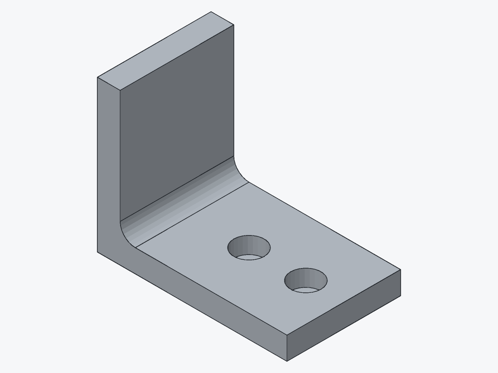 | 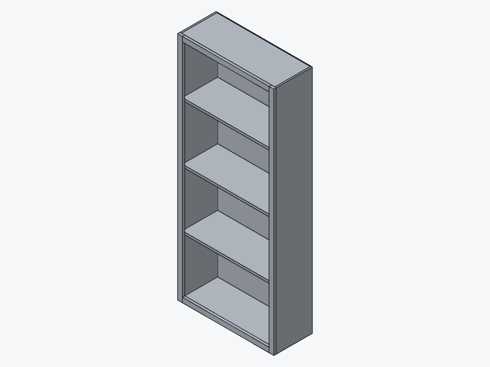 | 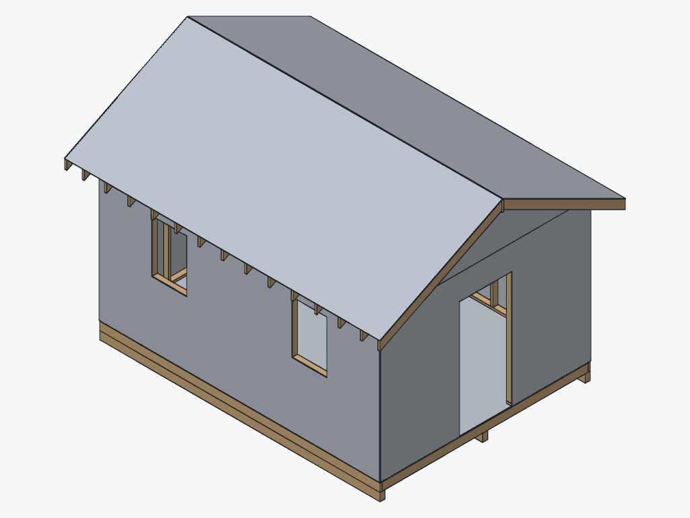 |

The shed's framing alone (layer bodies hidden), with the door's members highlighted by name (`extension#7:*`), and the house:

| Shed framing, door highlighted                                                 | House                                                   |
| ------------------------------------------------------------------------------ | ------------------------------------------------------- |
| 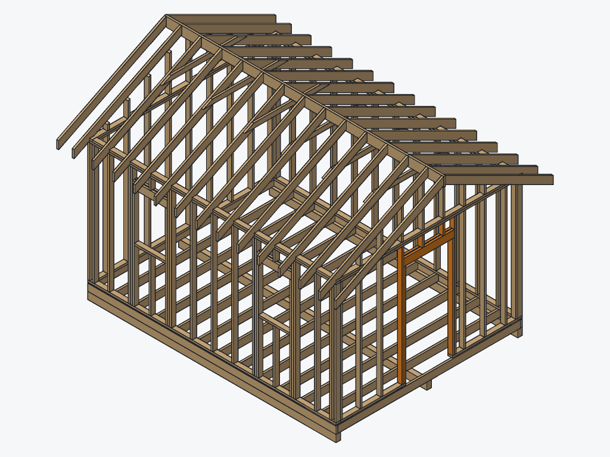 | 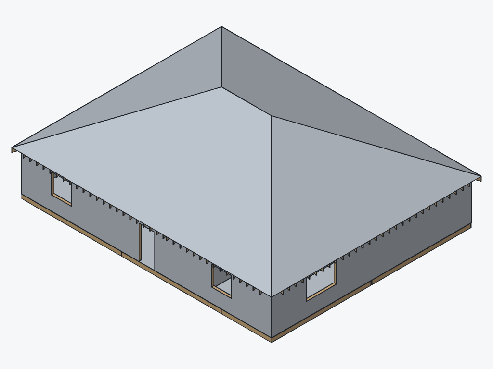 |

Highlighting is a colour per instance name; hiding layer bodies is a filter on the scene. Both cost nothing extra (68.7 and 60.7 ms, against 66.9 for the whole shed).

## Approach 2: hidden-line SVG from the drawing pipeline

`spikes/T8.0b-render/src/hlr.ts` uses the drawing pipeline exactly as a sheet does in the app: an `addDrawing` command adds one 400 x 300 mm sheet per view, `RegenEngine.drawingView` projects it (one `project` op, OCCT exact HLR, hidden lines off, smooth edges on), a second request with the scale and position that fit the bounds lays the sheet out (`drawingSheet`, served from the drawing stage's cache), the frame and the title block are dropped from the display list, and `drawingToSvg` writes the SVG. The SVG is then rasterised two ways: with sharp, and with 80 lines of TypeScript that stroke the display list's curves (flattened by `curvePoints`) with 3 x 3 supersampling.

### Time

Milliseconds per view. "Project" is the first, uncached projection after a regen (the case of a new head revision).

| Fixture   | View      | Project | Layout | SVG  | sharp (with its PNG) | TS stroke | TS encode, level 9 |
| --------- | --------- | ------- | ------ | ---- | -------------------- | --------- | ------------------ |
| Bracket   | iso       | 12.1    | 1.9    | 0.91 | 46.8                 | 12.1      | 70.4               |
| Bracket   | front     | 5.1     | 0.5    | 0.08 | 19.7                 | 9.6       | 34.9               |
| Bookshelf | iso       | 17.7    | 4.9    | 0.35 | 42.3                 | 11.0      | 52.5               |
| Bookshelf | top       | 24.5    | 3.3    | 0.10 | 18.0                 | 10.2      | 30.4               |
| Shed      | iso       | 8.4     | 4.2    | 0.35 | 62.1                 | 10.8      | 64.0               |
| Shed      | front     | 13.9    | 2.6    | 0.08 | 19.1                 | 10.0      | 32.2               |
| Shed      | elevation | 8.1     | 5.4    | 0.77 | 28.7                 | 19.0      | 38.0               |
| House     | iso       | 23.1    | 5.6    | 0.38 | 59.4                 | 11.6      | 68.8               |
| House     | elevation | 14.7    | 14.0   | 1.07 | 36.3                 | 14.8      | 41.5               |

The other views are in `hlr.json`; all projections took 3.0 to 28.8 ms. PNG sizes: 3.7 to 59.6 KB through sharp, 3.6 to 22.0 KB from the TypeScript stroker (flat ink on a flat background compresses better than librsvg's anti-aliasing).

### What it shows, and what it cannot

| Bracket (HLR, sharp)                              | Bookshelf (HLR, sharp)                                | Shed (HLR, sharp)                           |
| ------------------------------------------------- | ----------------------------------------------------- | ------------------------------------------- |
| 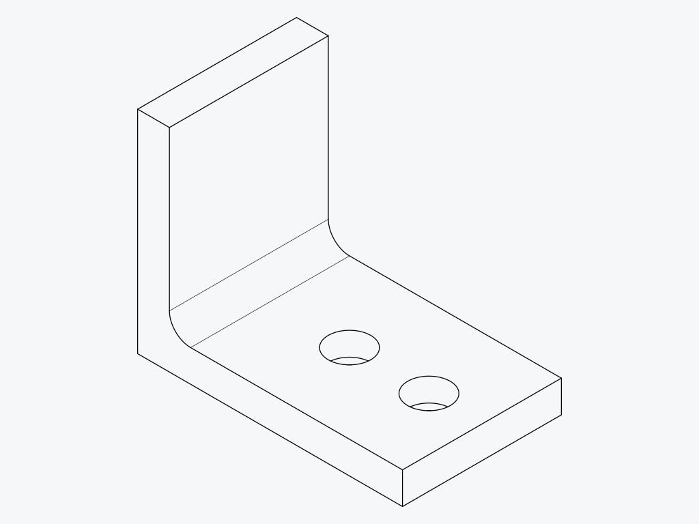 | 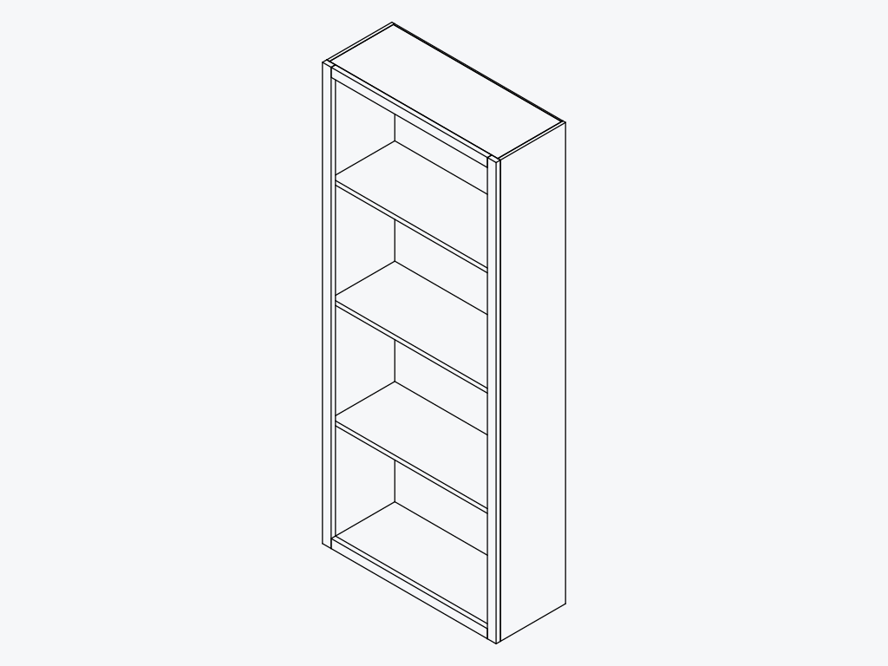 | 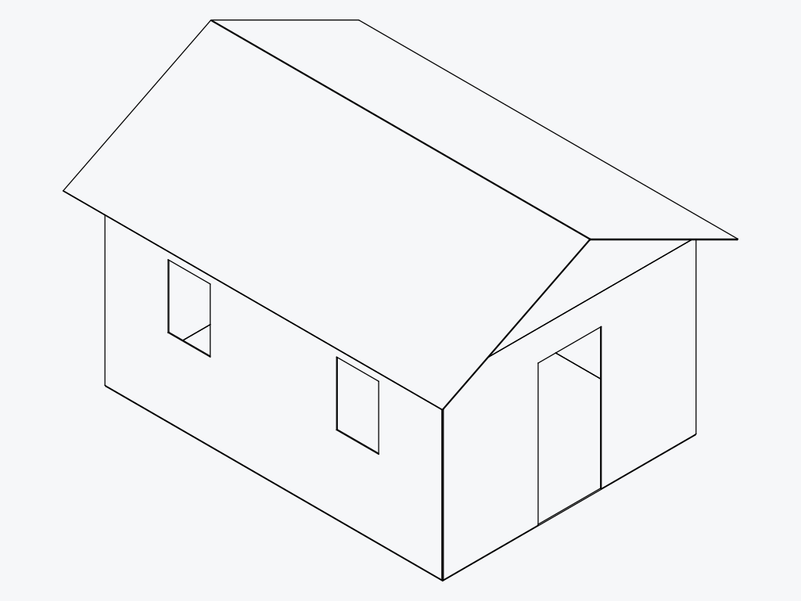 |

- **The lines are exact.** Circles are true ellipses, every visible edge is there once, nothing leaks.
- **No framing in 3D.** A part view projects the part's kernel bodies; framing members are not kernel bodies (they are meshes from the member stage, ADR 0015), so the shed's isometric is the sheathing shell with its openings. Members appear only in the construction domain's own views, here the shed's front wall as a framing elevation:

  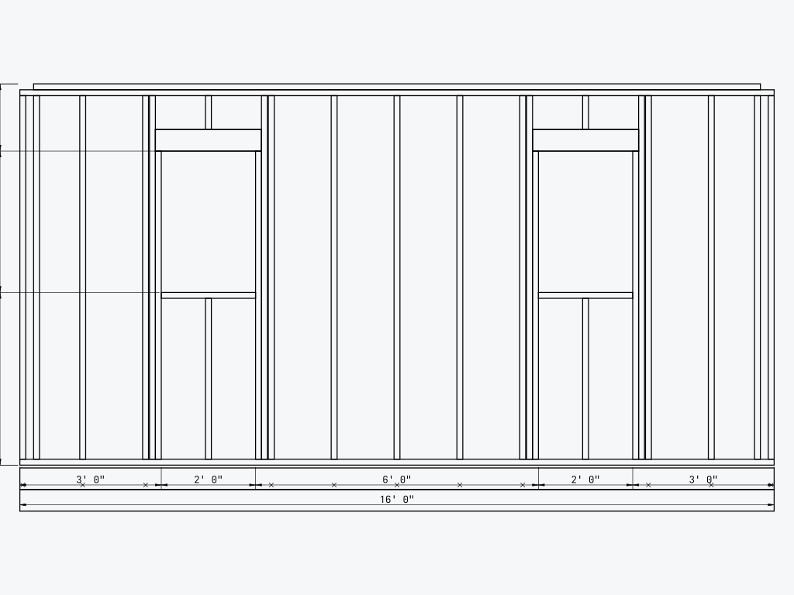

  Those views exist for construction only (plans, elevations, roof plans), not for an arbitrary camera.

- **No shading.** In an isometric, which faces point which way has to be read from the line junctions alone; the bookshelf's inside and outside faces are easy to confuse.
- **Text needs fonts.** librsvg draws SVG text with the system's fonts through fontconfig. In this container there were none, and every glyph of the elevation's dimension strings came out as a box until a font was provided (`FONTCONFIG_FILE`). The image then depends on which fonts the machine has, which is a determinism hazard for goldens. The TypeScript stroker draws no text at all.
- **A sharp trap**: for an SVG sized in mm, librsvg's output through sharp grows with density squared over 72 (72 dpi gave 1,134 px for 400 mm, 96 dpi gave 2,016, 144 dpi 4,535), so the density for a pixel width is the geometric mean of the wanted dpi and 72.
- **Licences**: sharp is Apache-2.0, but its prebuilt libvips and librsvg are LGPL-2.1-or-later native libraries; it is in the tree only as a transitive development dependency. The TypeScript stroker needs nothing.

Determinism: every rasterisation, by sharp and by the stroker, gave the same bytes in all 7 runs and in the second process (36 images).

## Approach 3, the reference: the viewer in headless Chromium

`spikes/T8.0b-render/src/chromium.ts` writes a `.mfkview` with `packages/io`'s `writeMfkview` from the same regen result (members baked into one body per member shape group, since a bundle carries bodies only), opens the viewer test build in Chrome Headless Shell with SwiftShader, serves page and bundle through `page.route`, pins the canvas at 1024 x 768, sets each standard view without animation, waits three frames and screenshots the canvas.

| Fixture   | Bundle (bytes, write ms) | Load to bodies shown (ms) | View change (ms) | Screenshot (ms) | PNG (KB), iso / front / top / right |
| --------- | ------------------------ | ------------------------- | ---------------- | --------------- | ----------------------------------- |
| Bracket   | 5,805, 25                | 191                       | 35 to 48         | 82 to 177       | 321 / 60 / 28 / 54                  |
| Bookshelf | 32,023, 8                | 131 to 133                | 36 to 50         | 81 to 150       | 426 / 128 / 18 / 125                |
| Shed      | 92,250, 23               | 144 to 150                | 37 to 44         | 80 to 118       | 227 / 49 / 18 / 47                  |
| House     | 374,626, 92              | 189 to 206                | 34 to 60         | 78 to 171       | 387 / 53 / 43 / 50                  |

`chromium.launch()` itself returned in 28 to 37 ms. Within a launch, the second shot of each view equalled the first; the second launch gave the same bytes for all 16 views, and so did a second process. That is SwiftShader on one machine; a different Chromium build or a GPU would give other pixels, and the e2e suite's screenshot tolerances (0.2 colour distance, 1 % of pixels) exist for that reason.

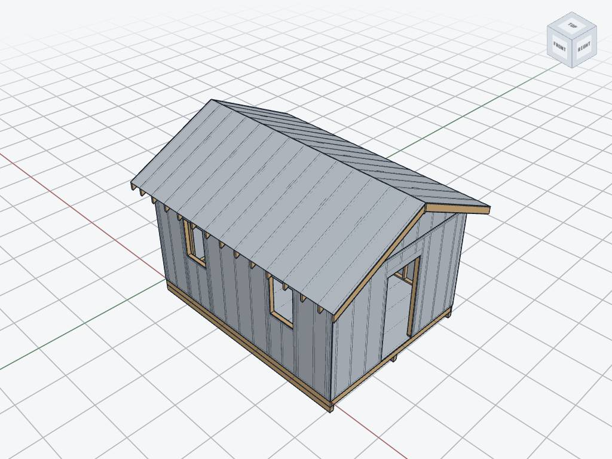

The reference shows what the app shows: perspective, the grid and the view cube, a lit material. It also shows the leak described above: stud and rafter edges drawn through the 11 mm sheathing (the vertical lines on the walls and the lines along the roof). Its isometric PNGs are 227 to 426 KB because of the grid's fine texture; the JPEG above is 88 KB. Running it needs Playwright's Chrome Headless Shell (114 MiB download, 261 MiB installed) and, in a minimal container, its shared libraries and a font unpacked without root (326 MiB, most of it Mesa).

## Legibility of small features at 1024 px

Model millimetres per output pixel in the isometric, and what the smallest features become (sizes from the fixtures; computed from the measured scale):

| Fixture   | mm per px, software / HLR | Feature, size                      | Pixels across |
| --------- | ------------------------- | ---------------------------------- | ------------- |
| Bracket   | 0.091 / 0.091             | M4 hole, 4.5 mm; counterbore, 8 mm | 50; 88        |
| Bracket   |                           | fillet, r 4 mm                     | 44            |
| Bookshelf | 2.68 / 2.69               | back, 7/32" (5.6 mm)               | 2.1           |
| Bookshelf |                           | face frame stick, 3/4" (19 mm)     | 7.1           |
| Shed      | 8.29 / 8.01               | 2x4, 1-1/2" x 3-1/2"               | 4.6 x 10.7    |
| Shed      |                           | sheathing, 7/16" (11.1 mm)         | 1.3           |
| Shed      |                           | stud spacing, 16"                  | 49            |
| House     | 20.8 / 20.8               | 2x4 narrow face; stud spacing      | 1.8; 20       |
| 16 houses | 91.8                      | 2x4 narrow face                    | 0.4           |

The detail crops below are the renders' own pixels, enlarged 2x (software left, HLR through sharp right):

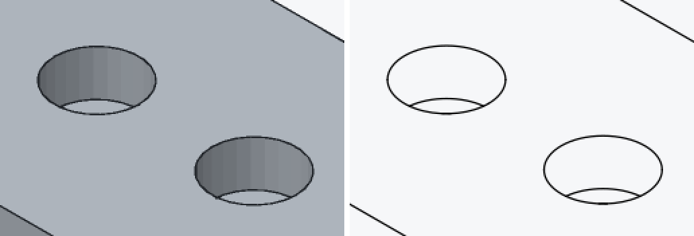

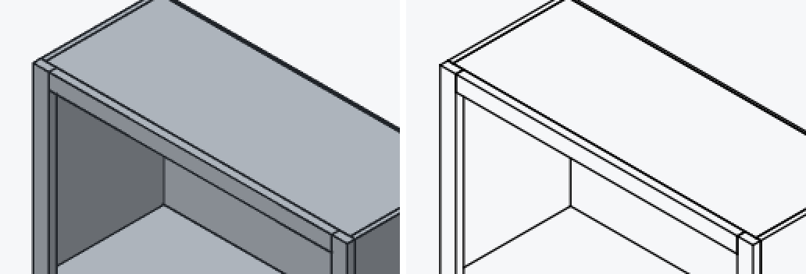

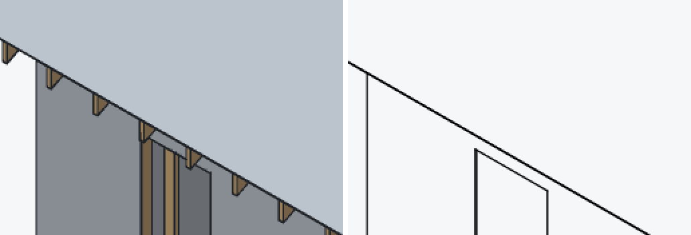

- **Bracket**: both show the counterbores clearly, with the hole's lower rim inside; shading makes the depth of the counterbore readable in the software render.
- **Bookshelf**: the face frame, the top's edge and the side are distinct in both; the shading tells inside from outside at a glance, the lines alone do not.
- **Shed**: the software render shows rafter tails, the window's king and jack studs and the skids; the HLR view shows a window opening in a plane. A reviewer judging framing changes needs the former.
- **House and beyond**: a 2x4 is under 2 px across the whole house; individual members are legible only in a view framed on a wall or a room. That is a camera question, not a renderer one.

## Recommendations

### 1. T8.2a builds approach 1, the software rasteriser

Reasons, all measured:

- **It shows what a reviewer must judge.** Framing members, in any view, with their own colours, highlightable by name. HLR shows none of them outside the construction domain's 2D views, and the review bundle's fixed views are isometric plus the three principal views of any part.
- **No new dependency, no native code, no browser.** fflate is already a dependency of `packages/io`; the rasteriser is plain TypeScript. Approach 2 needs an SVG rasteriser (sharp would add LGPL native libraries and system fonts); approach 3 needs a browser.
- **Deterministic to the byte.** 38 images, 7 runs each and a second process, all identical, which is what T8.2a's golden PNGs need.
- **Fast enough by far.** The shed's four views take about 425 ms with level 6 encoding, the house's about 575 ms; a review bundle's before and after renders of the shed (8 images) about 0.85 s (estimate from the per-view numbers). The 16-house grid draws in 244 ms.
- **The rest of T8.2a's scope is small in this design** (estimates): a section plane is a per-pixel clip in the scan loop plus a cap colour; preset and given cameras are a direction, an up and a fit; body colours from the document replace `BODY_COLOR`.

What to carry over from the spike:

| Decision                 | Value                                                                                                                                                                  |
| ------------------------ | ---------------------------------------------------------------------------------------------------------------------------------------------------------------------- |
| Projection               | Orthographic, directions as core's `STANDARD_VIEWS`; fit to projected vertices with a margin                                                                           |
| Image                    | 1024 x 768 default; 2 x 2 supersampling; 1.25 px lines                                                                                                                 |
| Scan conversion          | Per-row spans from the edge functions (not bounding boxes); `Float32Array` depth                                                                                       |
| Edge visibility          | Front-triangle plane test over 3 x 3 pixels, tolerance 0.05 px; never a depth bias                                                                                     |
| Member edges             | Crease edges at 20 degrees, computed once per member shape key and cached with the mesh                                                                                |
| Silhouettes              | Depth jumps over 4 pixels' worth, inked on the nearer side                                                                                                             |
| Shading                  | Flat per triangle, lights fixed in view space (ambient 0.42, key 0.4, headlight 0.2)                                                                                   |
| PNG                      | RGB, adaptive row filters, fflate zlib level 6 (half the encode time of level 9 for 6 to 9 % more bytes on the isometric)                                              |
| Determinism rule         | Only `+ - * /`, `Math.sqrt`, `floor`, `ceil`, `round` in the pipeline; no `Math.sin`, `cos`, `atan2` per pixel or vertex; a test that renders twice and compares bytes |
| Time budget for the shed | 1.5 s for four views on CI (estimate: about 3.5 times the 0.42 s measured here, for slower runners)                                                                    |

Two gaps for T8.2a's scope:

- **Given cameras need a fit to names.** At house scale a member is under 2 px; "frame these members" (fit the camera to the bounds of named instances or bodies, optionally hiding the layer bodies in front) is what makes a review image of a framing change legible. The spike's framing-only and highlight images show both work as scene filters.
- **Text.** Labels in the image (view names, a highlight legend) need glyph outlines; `packages/text` already turns fonts into outlines, so text would be filled polygons in the same rasteriser (not measured). Leaving text out of the images is also fine: the bundle carries labels as data.

### 2. Approach 2 stays for drawings, and could feed the bundle later

The drawing pipeline remains the way to make drawings. If a later bundle wants the construction domain's framing elevations as images, the TypeScript stroker (10 to 19 ms a view, no dependency) rasterises the display list; it would then need the text of the dimension strings, through the same glyph outlines as above. Do not add sharp for it.

### 3. The viewer's edge leak is a separate issue

The viewer (and so the app's viewport, which shares the engine) draws edges hidden behind thin parts: every stud and rafter shows through the shed's sheathing. That is the polygon-offset limit described above. It does not block M8, since T8.2a will not use the viewer, but it is worth a task of its own.

## Where this differs from the plan

- **The shed is not thousands of members.** It has 156. The risk was measured on the house (794) and on grids of up to 16 houses (12,704 members), which are synthetic scenes (one house's regen, instanced), not regenerated documents.
- **The M1 bracket is rebuilt with commands**, since the e2e tests build it through the UI; its volume and face count match the e2e test's.
- **The Chromium reference uses a bundle with baked members**, since a `.mfkview` carries bodies only; the app publishes bodies only too (`publishView.ts`), so a published shed would show no framing in the viewer today.

## Not measured

- Section planes, perspective, and text in the software renders (estimates above).
- Peak memory: the 38 MiB per image is computed from the buffer sizes.
- Determinism on another CPU or JavaScript engine (the argument above says it holds; one machine was measured), and between Node and Chromium meshes (T8.0a).
- Firefox and WebKit for the reference; GPU rendering.
