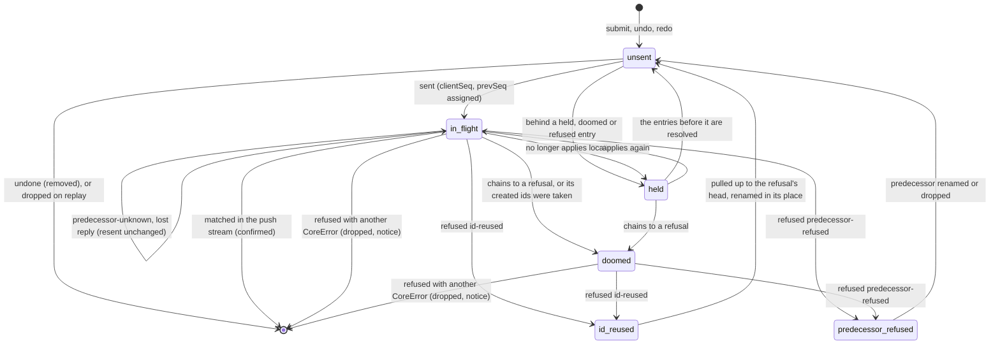

# @manufakture/sync

The sync algorithm of [ADR 0009](../../docs/adr/0009-sync-model.md) (accepted with the
amendment from the [T7.0b spike](../../docs/spikes/T7.0b-sync.md)) as a package with no transport
and no storage: the client engine (`SyncClient`), the reference server (`ReferenceServer` and
`judgeEntry`), the protocol's messages with their zod schemas, and the saveable queue state
(`SyncQueueState`). Plain TypeScript under GPL-3.0-or-later.

**Dependencies.** `@manufakture/core` (commands, `createdIds`, `remapIds`, `SyncEntrySchema`,
`restoredDocument`, ...; see the core README, "Sync") and `zod`, already core's. T7.1c's server
(SQLite, one bearer token per self-hosted instance, [product decision
0001](../../docs/decisions/0001-m7-hosting-accounts-and-sharing.md)) and T7.1d's app wiring build on
it; nothing here knows about accounts, HTTP or storage.

## The client

```ts
import { SyncClient } from '@manufakture/sync';

const client = new SyncClient(confirmedDocument, revision, { clientId });
client.on('remapped', ({ table }) => renameSelection(table)); // app state follows renames
client.on('dropped', ({ drops, before }) => keepAsBranch(before, drops)); // decision 6
client.submit({ command, label: 'Fillet 2' }); // made on client.document
client.submit({ restore: { document: past, version: 'v3' }, label: 'Restore v3' });
for (const m of client.takeOutgoing()) transport.send(m); // submits (with the floor) and pulls
transport.onMessage((raw) => client.handle(raw)); // validated before anything reads it
setInterval(() => client.retry().forEach((m) => transport.send(m)), timeout);
```

- `document` is what the user sees: the confirmed document plus the shown pending entries, with
  counters past every held entry's ids, so a new command never takes an id a held entry holds.
- `handle(raw)` parses every server message (`ServerMessageSchema`) and dispatches it: `push`
  entries are applied in revision order (buffered across gaps, duplicates ignored), and the
  client's own entries are matched to in-flight ones by `clientSeq` first, which is their
  acknowledgement, so a lost ack is recovered from the stream and a matched entry is never
  renamed. A verdict belongs to one `clientSeq`; a late one for a sequence no longer in flight is
  ignored. Pushed entries more than `PUSH_WINDOW` past the confirmed revision are not buffered (a
  pull fetches them), and a refusal's head or an ack's revision is clamped to the highest revision
  heard of plus `PUSH_WINDOW`, so a server cannot park an entry forever.
- When the server's log disagrees with the client (a confirmed entry does not apply, or the
  client's own entry comes back with another command), `handle` returns an error instead of
  throwing: what applied before it is kept and the queue rebased onto it, the bad entry is not
  kept, and the client stops as for a version mismatch (`incompatible`, code `server-fault`).
- `takeOutgoing()` returns newly sent entries and requested resends as one `submit` in
  `clientSeq` order, carrying the retention floor, and a `pull` when the client heard of a
  revision it has not seen (an `id-reused` refusal's head, a welcome, and on `retry()` an ack
  whose push is late).
  `retry()` marks every in-flight entry without a verdict for resending and asks for the pull
  again.
- `on('landed', ({ local, clientSeq, rev }))` reports each of the client's own entries as the push
  stream confirms it, with its revision: the server's document at `rev` holds it (T7.1e names a
  version made after it by that revision).
- `pushWindow` (option, default `PUSH_WINDOW`) is the window above; tests make it small, and
  `restore` must be given the same value. A delivery that holds entries beyond the window applies
  what fits and pulls the rest from where the client then is.
- `setOnline(false)` keeps new entries unsent, so a long offline queue is renamed locally on
  reconnect instead of being refused entry by entry.
- `undo()` and `redo()` (decision 8): undo acts on the newest shown command. An unsent one is
  removed from the queue; otherwise its inverse is submitted as an entry naming the entry before
  it, unless another client changed an object the command touched since it landed (`changed`).
  While a held entry follows the newest shown command, undo waits (`undoStatus()` is `waiting`),
  and `visibleUndo()` leaves held entries out. An inverse of a command that is dropped is
  removed with it, without a notice.

### Rebase

After anything that moves the confirmed document or a verdict (decisions 4 and 5, amendment
items 4 to 8):

1. Refusals whose head revision has been pulled are acted on: `id-reused` sends the entry back to
   unsent in its own place, `predecessor-refused` waits until its predecessor is renamed or
   dropped, any other code drops it.
2. In-flight entries that may still be accepted are replayed unchanged. One that chains through
   `prevSeq` to a known refusal is doomed; one whose created ids are below the confirmed counters
   is certain to be refused and doomed too (renamed in the client's naming at once, its sent copy
   kept); one that fails otherwise is held with everything after it.
3. One pass in queue order with one simultaneous rename table, keyed by scope and the client's
   current ids: every entry that may be renamed (unsent and doomed ones) gets the next free
   numbers for its own created ids and is rewritten with `remapIds`. Ids in a scope the queue
   created keep their numbers; a duplicated part's scope copies its source's renames and
   counters (amendment, item 8). A restore is re-derived as `restoredDocument(head, version,
highWater)`. Shown entries are replayed; an unsent one that no longer applies is dropped and
   its ids become tombstones, so an entry that names them fails instead of binding to whatever
   takes the number later.
4. The undo and redo stacks are rewritten with the same table, `remapped` and `dropped` are
   emitted, and unsent entries are sent in queue order up to the first held one, each with
   `prevSeq` by decision 2: the nearest entry before it that is neither refused nor doomed, else
   the latest accepted entry.

### Entry states



`unsent` and `in-flight` entries are shown; `held`, `doomed`, `predecessor-refused` and `id-reused`
ones are hidden from the document and the visible undo stack.

## The saved queue state

`client.save()` returns `SyncQueueState`, plain JSON validated by `SyncQueueStateSchema`;
`SyncClient.restore(state, confirmedDocument)` rebuilds the client exactly (the fuzz suite runs a
restored twin beside every client and compares states, documents and outgoing messages after
every input). `restore` refuses a state whose parts disagree (`checkQueueState`: duplicate local
ids or sequences, a sequence not below `nextSeq`, an `undoOf` not before its entry, a buffered
revision outside the window) or whose commands do not validate after migration (a held command
may name a dropped command's tombstones). Save it in one step with the confirmed document it belongs to (T7.1d); the document
is not in the state.

| Field                                     | What it holds                                                                                                                                                                                                                                                                                                                                                                                                                                           |
| ----------------------------------------- | ------------------------------------------------------------------------------------------------------------------------------------------------------------------------------------------------------------------------------------------------------------------------------------------------------------------------------------------------------------------------------------------------------------------------------------------------------- |
| `version`                                 | `SYNC_QUEUE_STATE_VERSION` (1)                                                                                                                                                                                                                                                                                                                                                                                                                          |
| `format`                                  | the `FORMAT_VERSION` its commands are written under; older ones are migrated with `migrateCommand` on restore                                                                                                                                                                                                                                                                                                                                           |
| `clientId`, `confirmedRev`                | the client and the revision of the confirmed document saved with it                                                                                                                                                                                                                                                                                                                                                                                     |
| `nextSeq`, `latestAccepted`               | the next `clientSeq` to hand out and the latest accepted one                                                                                                                                                                                                                                                                                                                                                                                            |
| `entries`                                 | every pending entry in queue order: `state` (above), `label`, `cause`, `at`, `command` and `created` in the client's current naming, `wire` (what was sent: `clientSeq`, `prevSeq`, `baseRev`, `format`, the command and created ids as sent), a refusal awaiting its pull (`verdict`), `predecessorRefused`, `certain`, `acceptedRev`, `undoOf` for an inverse, and `restore` (the version a restore restores: its intent, ADR 0009 amendment item 11) |
| `refusals`                                | known refusals, `clientSeq` to error, for sequences in-flight entries still name                                                                                                                                                                                                                                                                                                                                                                        |
| `pendingRenames`                          | tombstones not yet applied (the amendment's one table in the client's naming replaces per-entry tables; between rebases this is empty)                                                                                                                                                                                                                                                                                                                  |
| `highWater`                               | the high-water mark of every confirmed document's counters: the floor for restores                                                                                                                                                                                                                                                                                                                                                                      |
| `buffered`, `pullWanted`, `pullRequested` | pushes that arrived ahead of a gap, and the pull the client wants                                                                                                                                                                                                                                                                                                                                                                                       |
| `undo`, `redo`                            | the undo records (inverse, objects touched, whether another client changed them since) and the redo commands                                                                                                                                                                                                                                                                                                                                            |

## The reference server

`ReferenceServer` holds one document branch in memory: `handle(raw)` validates a client message
and answers it, returning the replies for the sender and a `push` of newly accepted entries for
every client. `judgeEntry(ctx, entry)` is the judgement alone, for any store: a recorded
`(clientId, clientSeq)` gets its recorded outcome; an unknown `prevSeq` gets the retryable
`predecessor-unknown` (not recorded); a refused `prevSeq` gives `predecessor-refused`; the command
is migrated from the entry's `format`; a created id below the head's counter is `id-reused` (the
takeover guard); then core's `applyCommand`; then a counter below the high-water mark is
`counter-regression`. Each submit carries the client's retention floor; the server keeps every
row from the highest floor a client sent plus its latest accepted entry, never lowers a floor,
and answers a late copy of an entry below it with `below-floor` instead of judging it again.

## Versions and branches

`records.ts` (T7.1e, ADR 0009 decision 9) holds the zod schemas of the records the server keeps
beside the logs, used by the server to validate what it is sent and by the app to validate what it
reads: `ServerVersionSchema` (`{ id, name, description, branch, rev, createdAt }`: a named revision
of one branch's log, append-only, keyed by the app's version id) and `ServerBranchSchema` (`{ id,
name, fromVersion, createdAt }`: a branch log starting at revision 0 from a version's document; main
has no record), the request bodies `CreateVersionSchema` and `CreateBranchSchema`, and `sameRecord`,
which tells a resend from a conflicting record under the same id.

## Protocol

`PROTOCOL_VERSION` (core) versions these shapes. Client to server: `hello { protocol, format,
clientId }`, `submit { entries, floor }` (one client's `SyncEntry`s, judged in order), `pull {
since }`. Server to client: `welcome { protocol, format, head }`, `ack { clientSeq, rev }`,
`refuse { clientSeq, error, headRev }`, `predecessor-unknown { clientSeq }`, `push { entries }`
and `error { code, message }` (`protocol-version`, `format-version`, `invalid-message`,
`below-floor`). A client and a server sync only with equal protocol and format versions: an
older app is told to update, a newer one that the server must be upgraded first.

## Tests

`client.test.ts` covers the acceptance cases of the M7 plan's T7.1b one by one, hand-delivering
messages through `lab.ts`. `fuzz.test.ts` runs the spike's scenarios, scaled down, on core's random
command generator with lost submits and verdicts, duplicated deliveries, reordered submits, a push
stream behind the head, an offline stretch, undo and redo, restores, and a save and restore at
random steps; a push window of 3 revisions (`small-window`: pushes running far behind overrun it, so revisions are
clamped and the head is reached pull by pull; it found a client that stopped pulling when one
delivery held more than a window), and the spike's fixed concurrent sequences (two sketch edits adding one entity id,
an in-flight collision followed by an edit of the remote feature, a dropped head with held
followers, a duplicated part taking remote features, a stale restore). `FUZZ_SEEDS=25` widens it
(225 runs: nine scenarios, 25 seeds each).

```bash
pnpm --filter @manufakture/sync test
pnpm --filter @manufakture/sync typecheck
```

## Known limitations

- Rebase replays the whole queue (`applyCommand` checks the whole document each time); the spike
  measured 0.5 s for 1,000 pending commands on a 200-feature part. Submits on a queue with no held
  entry skip the replay.
- The remap's resolver sees the confirmed document and the queue's earlier commands that define
  instances, setups and views; a name in a hidden entry whose instance only a later hidden entry
  defines stays unresolved (`RemapReport.unresolved`).
- Two concurrent whole-feature edits of one feature: the later wins whole (decision 7), and a
  stale edit that re-introduces a sub-id another edit removed is dropped (amendment, item 10).
